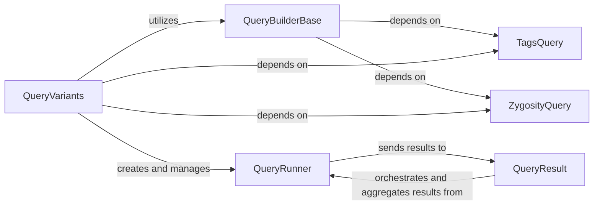

## Details

The `Variant Query Engine` is a crucial subsystem within the larger Bioinformatics Data Platform, responsible for efficiently retrieving and filtering genomic variant data. It acts as the primary interface for users and other system components to access and analyze genetic information stored across various backends. These components are fundamental because they collectively form a robust and scalable system for querying genomic variant data. `QueryVariants` provides the high-level interface, `QueryRunner` and `QueryResult` handle the concurrent execution and aggregation, and `QueryBuilderBase` along with `TagsQuery` and `ZygosityQuery` ensure accurate and optimized query construction for diverse and complex filtering criteria. This modular design aligns with the "Modular Monolith" and "Data Lake / Data Warehouse" architectural patterns, allowing for flexible integration with various storage backends while maintaining a clear separation of concerns.

### QueryVariants
This is the abstract base class that defines the public API for querying both summary and family variants. It provides a standardized interface for different variant storage implementations. It handles common query parameters like regions, genes, and effect types, and includes logic to transform tag-based queries into family IDs.

**Related Classes/Methods**:

- `QueryVariants` (-1:-1)

### QueryRunner
An abstract class representing a single, asynchronous query execution unit. Each `QueryRunner` manages its own lifecycle (started, closed, done) and pushes results into a shared queue. It's designed to be executed concurrently by an `Executor` (e.g., a thread pool) to enable parallel data retrieval from potentially multiple sources or partitions.

**Related Classes/Methods**:

- `QueryRunner` (-1:-1)

### QueryResult
This component orchestrates multiple `QueryRunner` instances. It initializes a shared result queue, submits the runners to an executor for parallel execution, and provides an iterable interface for consuming the aggregated results. It also manages query limits and collects any exceptions that occur during execution, ensuring robust error handling.

**Related Classes/Methods**:

- `QueryResult` (-1:-1)

### QueryBuilderBase
This base class is responsible for translating high-level variant query parameters into concrete SQL expressions, specifically for Schema2 data layouts. It integrates with genomic resources (gene models, reference genome) and data partitioning descriptors to optimize query construction, including calculating relevant region and coding bins.

**Related Classes/Methods**:

- `QueryBuilderBase` (-1:-1)

### TagsQuery
This Pydantic model defines a structured representation for complex query criteria related to family tags (e.g., "denovo", "rare"). It ensures that these specific query parameters are well-defined, validated, and consistently used throughout the query building process.

**Related Classes/Methods**:

- `TagsQuery` (-1:-1)

### ZygosityQuery
Similar to `TagsQuery`, this Pydantic model defines a structured representation for query criteria related to zygosity (e.g., "homozygous", "heterozygous"). It ensures that these parameters are well-defined and consistently applied.

**Related Classes/Methods**:

- `ZygosityQuery` (-1:-1)

### [FAQ](https://github.com/CodeBoarding/GeneratedOnBoardings/tree/main?tab=readme-ov-file#faq)