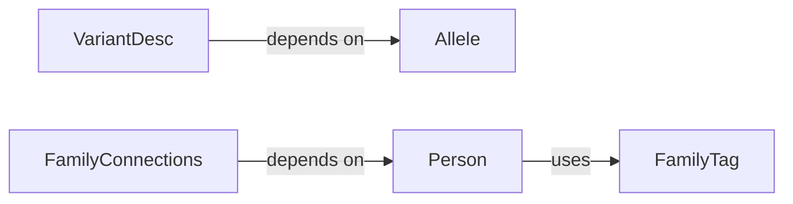

## Details

The `getClassHierarchy` tool did not return any class hierarchy information for the `dae` package. This could indicate that the package does not have a clearly defined class hierarchy that the tool can detect, or that the tool is unable to traverse the package structure effectively. Given this limitation, the analysis proceeds based on the provided `Related Classes/Methods` and the file structure, focusing on the conceptual roles of the identified classes within the `Variant and Pedigree Data Models` component. These components are fundamental because they establish the foundational data models for both genomic variants and family pedigrees. In a Bioinformatics Data Platform/Genomic Data Warehouse, consistent and well-defined data models are paramount for data integrity, interoperability, querying and analysis, and scalability. Without these core data models, the entire system would lack a common language for representing and manipulating genomic and pedigree information, leading to data silos, integration challenges, and unreliable analysis results.

### Allele
Represents a single genomic allele, capturing its fundamental properties such as chromosome, position, reference, and alternative sequences. This is the most granular unit of genetic variation.

**Related Classes/Methods**:

- `Allele` (0:0)

### VariantDesc
Provides a higher-level description of a genomic variant, potentially encompassing multiple alleles or more complex variant types (e.g., SNV, indel). It likely aggregates `Allele` information and adds context relevant to the variant as a whole.

**Related Classes/Methods**:

- `VariantDesc` (0:0)

### Person
Represents an individual within a pedigree, storing attributes such as ID, sex, phenotype, and parental relationships.

**Related Classes/Methods**:

- `Person` (0:0)

### FamilyTag
Likely represents specific tags or attributes associated with a family or individuals within a family, such as disease status, population group, or other relevant metadata.

**Related Classes/Methods**:

- `FamilyTag` (0:0)

### FamilyConnections
Manages the relationships and connections between `Person` objects to form a complete family pedigree structure. This component is responsible for defining the hierarchical and relational aspects of families.

**Related Classes/Methods**:

- `FamilyConnections` (0:0)

### [FAQ](https://github.com/CodeBoarding/GeneratedOnBoardings/tree/main?tab=readme-ov-file#faq)