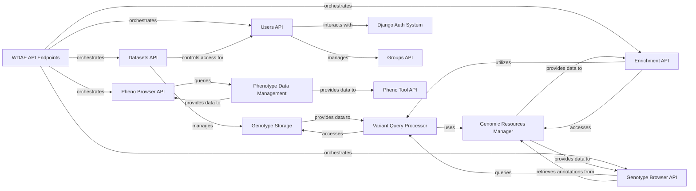

## Details

One paragraph explaining the functionality which is represented by this graph. What the main flow is and what is its purpose.

### WDAE API Endpoints [[Expand]](./WDAE_API_Endpoints.md)
This is the top-level aggregation component for all REST API endpoints exposed by WDAE. It acts as the central entry point for client applications, routing requests to the appropriate specialized API sub-components.

**Related Classes/Methods**:

- <a href="https://github.com/iossifovlab/gpf/wdae/wdae/wdae/urls.py#L0-L0" target="_blank" rel="noopener noreferrer">`wdae/wdae/urls.py` (0:0)</a>

### Datasets API
Manages API endpoints for interacting with genomic datasets. This includes functionalities for listing available datasets, retrieving detailed dataset configurations, and managing user permissions related to data access.

**Related Classes/Methods**:

- <a href="https://github.com/iossifovlab/gpf/wdae/wdae/datasets_api/views.py#L0-L0" target="_blank" rel="noopener noreferrer">`wdae/wdae/datasets_api/views.py` (0:0)</a>
- <a href="https://github.com/iossifovlab/gpf/wdae/wdae/datasets_api/urls.py#L0-L0" target="_blank" rel="noopener noreferrer">`wdae/wdae/datasets_api/urls.py` (0:0)</a>
- <a href="https://github.com/iossifovlab/gpf/wdae/wdae/datasets_api/models.py#L0-L0" target="_blank" rel="noopener noreferrer">`wdae/wdae/datasets_api/models.py` (0:0)</a>
- <a href="https://github.com/iossifovlab/gpf/wdae/wdae/datasets_api/permissions.py#L0-L0" target="_blank" rel="noopener noreferrer">`wdae/wdae/datasets_api/permissions.py` (0:0)</a>

### Users API
Provides API endpoints for comprehensive user management, including user authentication (login, logout), authorization, user registration, password management, and the administration of user groups and roles.

**Related Classes/Methods**:

- <a href="https://github.com/iossifovlab/gpf/wdae/wdae/users_api/views.py#L0-L0" target="_blank" rel="noopener noreferrer">`wdae/wdae/users_api/views.py` (0:0)</a>
- <a href="https://github.com/iossifovlab/gpf/wdae/wdae/users_api/urls.py#L0-L0" target="_blank" rel="noopener noreferrer">`wdae/wdae/users_api/urls.py` (0:0)</a>
- <a href="https://github.com/iossifovlab/gpf/wdae/wdae/users_api/models.py#L0-L0" target="_blank" rel="noopener noreferrer">`wdae/wdae/users_api/models.py` (0:0)</a>
- <a href="https://github.com/iossifovlab/gpf/wdae/wdae/users_api/serializers.py#L0-L0" target="_blank" rel="noopener noreferrer">`wdae/wdae/users_api/serializers.py` (0:0)</a>
- <a href="https://github.com/iossifovlab/gpf/wdae/wdae/users_api/forms.py#L0-L0" target="_blank" rel="noopener noreferrer">`wdae/wdae/users_api/forms.py` (0:0)</a>

### Genotype Browser API
Offers API endpoints specifically designed for querying and interactively browsing genomic variants within selected datasets. This includes functionalities for applying various filters, retrieving detailed variant information, and facilitating the download of query results.

**Related Classes/Methods**:

- <a href="https://github.com/iossifovlab/gpf/wdae/wdae/genotype_browser/views.py#L0-L0" target="_blank" rel="noopener noreferrer">`wdae/wdae/genotype_browser/views.py` (0:0)</a>
- <a href="https://github.com/iossifovlab/gpf/wdae/wdae/genotype_browser/urls.py#L0-L0" target="_blank" rel="noopener noreferrer">`wdae/wdae/genotype_browser/urls.py` (0:0)</a>

### Enrichment API
Provides API endpoints for performing gene set enrichment analyses. Users can submit variant sets or gene lists to identify statistically significant associations with predefined gene sets.

**Related Classes/Methods**:

- <a href="https://github.com/iossifovlab/gpf/wdae/wdae/enrichment_api/views.py#L0-L0" target="_blank" rel="noopener noreferrer">`wdae/wdae/enrichment_api/views.py` (0:0)</a>
- <a href="https://github.com/iossifovlab/gpf/wdae/wdae/enrichment_api/urls.py#L0-L0" target="_blank" rel="noopener noreferrer">`wdae/wdae/enrichment_api/urls.py` (0:0)</a>

### Pheno Browser API
Manages API endpoints for browsing and querying phenotypic data associated with individuals and families within the platform.

**Related Classes/Methods**:

- <a href="https://github.com/iossifovlab/gpf/wdae/wdae/pheno_browser_api/views.py#L0-L0" target="_blank" rel="noopener noreferrer">`wdae/wdae/pheno_browser_api/views.py` (0:0)</a>
- <a href="https://github.com/iossifovlab/gpf/wdae/wdae/pheno_browser_api/urls.py#L0-L0" target="_blank" rel="noopener noreferrer">`wdae/wdae/pheno_browser_api/urls.py` (0:0)</a>

### Variant Query Processor
This component is responsible for executing complex genomic variant queries, translating high-level API requests into efficient data retrieval operations against the underlying genotype storage. It handles filtering, aggregation, and data transformation.

**Related Classes/Methods**:

- <a href="https://github.com/iossifovlab/gpf/wdae/wdae/studies/query_transformer.py#L0-L0" target="_blank" rel="noopener noreferrer">`wdae/wdae/studies/query_transformer.py` (0:0)</a>
- <a href="https://github.com/iossifovlab/gpf/wdae/wdae/studies/response_transformer.py#L0-L0" target="_blank" rel="noopener noreferrer">`wdae/wdae/studies/response_transformer.py` (0:0)</a>
- <a href="https://github.com/iossifovlab/gpf/wdae/wdae/studies/study_wrapper.py#L0-L0" target="_blank" rel="noopener noreferrer">`wdae/wdae/studies/study_wrapper.py` (0:0)</a>
- <a href="https://github.com/iossifovlab/gpf/wdae/wdae/query_base/query_base.py#L0-L0" target="_blank" rel="noopener noreferrer">`wdae/wdae/query_base/query_base.py` (0:0)</a>

### Genotype Storage
This component represents the underlying system responsible for the persistent storage and efficient retrieval of raw and processed genotype data. It abstracts the specific storage technologies (e.g., Impala, BigQuery, DuckDB).

**Related Classes/Methods**:

- <a href="https://github.com/iossifovlab/gpf/wdae/wdae/studies/study_wrapper.py#L0-L0" target="_blank" rel="noopener noreferrer">`wdae/wdae/studies/study_wrapper.py` (0:0)</a>

### Phenotype Data Management
Manages the storage, retrieval, and organization of phenotypic data associated with individuals and families. It provides structured access to clinical and demographic information.

**Related Classes/Methods**:

- <a href="https://github.com/iossifovlab/gpf/wdae/wdae/pheno_browser_api/views.py#L0-L0" target="_blank" rel="noopener noreferrer">`wdae/wdae/pheno_browser_api/views.py` (0:0)</a>

### Genomic Resources Manager
Manages access to and retrieval of various genomic reference data, including gene sets, gene scores, and other annotation resources critical for analysis and interpretation.

**Related Classes/Methods**:

- <a href="https://github.com/iossifovlab/gpf/wdae/wdae/gene_sets/views.py#L0-L0" target="_blank" rel="noopener noreferrer">`wdae/wdae/gene_sets/views.py` (0:0)</a>
- <a href="https://github.com/iossifovlab/gpf/wdae/wdae/gene_scores/views.py#L0-L0" target="_blank" rel="noopener noreferrer">`wdae/wdae/gene_scores/views.py` (0:0)</a>
- <a href="https://github.com/iossifovlab/gpf/wdae/wdae/genomes_api/views.py#L0-L0" target="_blank" rel="noopener noreferrer">`wdae/wdae/genomes_api/views.py` (0:0)</a>
- <a href="https://github.com/iossifovlab/gpf/wdae/wdae/genomic_scores_api/views.py#L0-L0" target="_blank" rel="noopener noreferrer">`wdae/wdae/genomic_scores_api/views.py` (0:0)</a>

### Django Auth System
External system for user authentication.

**Related Classes/Methods**: _None_

### Groups API
API for managing user groups and roles.

**Related Classes/Methods**: _None_

### Pheno Tool API
API for phenotypic tools.

**Related Classes/Methods**: _None_

### [FAQ](https://github.com/CodeBoarding/GeneratedOnBoardings/tree/main?tab=readme-ov-file#faq)