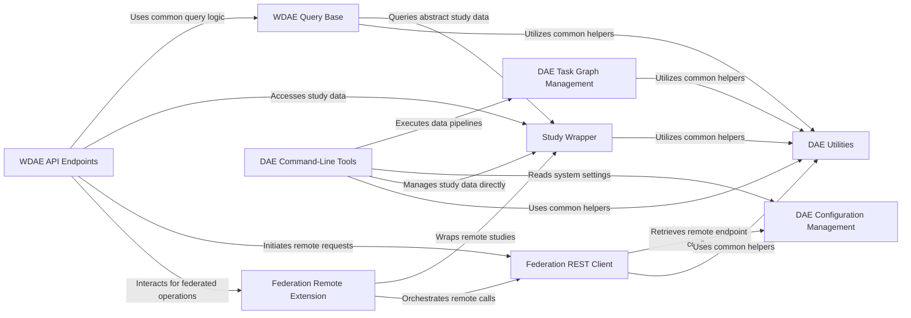

## Details

The `Web API & External Interfaces` subsystem serves as the primary gateway for users and other systems to interact with the GPF platform. It provides a comprehensive set of REST API endpoints, a web interface, and command-line utilities. The core functionality revolves around data querying, visualization, user management, and seamless integration with distributed GPF deployments through a federation service.

### WDAE API Endpoints [[Expand]](./WDAE_API_Endpoints.md)
This component aggregates all the REST API endpoints exposed by WDAE. It is the direct interface for users and external systems to perform operations such as querying genomic data, managing datasets, handling user authentication, and initiating various analyses (enrichment, gene profiles, etc.). It acts as the central point of interaction for the web interface.

**Related Classes/Methods**:

- <a href="https://github.com/iossifovlab/gpf/wdae/wdae/gpf_instance/views.py#L1-L1" target="_blank" rel="noopener noreferrer">`wdae/wdae/gpf_instance/views.py` (1:1)</a>
- <a href="https://github.com/iossifovlab/gpf/wdae/wdae/datasets_api/views.py#L1-L1" target="_blank" rel="noopener noreferrer">`wdae/wdae/datasets_api/views.py` (1:1)</a>
- <a href="https://github.com/iossifovlab/gpf/wdae/wdae/users_api/views.py#L1-L1" target="_blank" rel="noopener noreferrer">`wdae/wdae/users_api/views.py` (1:1)</a>
- `wdae/wdae/enrichment_api.py` (1:1)
- `wdae/wdae/gene_profiles_api.py` (1:1)
- `wdae/wdae/gene_scores.py` (1:1)
- `wdae/wdae/gene_sets.py` (1:1)
- `wdae/wdae/genomes_api.py` (1:1)
- `wdae/wdae/genomic_scores_api.py` (1:1)
- `wdae/wdae/genotype_browser.py` (1:1)
- `wdae/wdae/measures_api.py` (1:1)
- `wdae/wdae/person_sets_api.py` (1:1)
- `wdae/wdae/pheno_browser_api.py` (1:1)
- `wdae/wdae/pheno_tool_api.py` (1:1)
- `wdae/wdae/common_reports_api.py` (1:1)
- `wdae/wdae/family_api.py` (1:1)

### WDAE Query Base
Provides foundational functionalities and common utilities for various data querying API endpoints within WDAE. It abstracts common query patterns, data validation, and result formatting, ensuring consistency and reusability across different data access APIs.

**Related Classes/Methods**:

- `wdae/wdae/query_base.py` (1:1)

### Federation REST Client [[Expand]](./Federation_REST_Client.md)
The core client responsible for making HTTP requests to remote GPF instances. It forms the backbone of the federation service's communication, enabling seamless access to distributed GPF deployments by abstracting the complexities of remote API calls.

**Related Classes/Methods**:

- <a href="https://github.com/iossifovlab/gpf/federation/federation/rest_api_client.py#L1-L1" target="_blank" rel="noopener noreferrer">`federation/rest_api_client.py` (1:1)</a>

### Federation Remote Extension [[Expand]](./Federation_Remote_Extension.md)
This module within the `federation` package orchestrates and extends various remote functionalities. It manages how local GPF services (like studies, gene sets, or enrichment analyses) can be accessed and utilized from remote federated instances, providing a unified view of distributed data.

**Related Classes/Methods**:

- <a href="https://github.com/iossifovlab/gpf/federation/federation/remote_extension.py#L1-L1" target="_blank" rel="noopener noreferrer">`federation/remote_extension.py` (1:1)</a>

### DAE Command-Line Tools [[Expand]](./DAE_Command_Line_Tools.md)
Contains a suite of command-line utilities for administrative tasks, data import, data processing, and other system-level operations. These tools provide a non-API interface for managing and interacting with the GPF system, often used for batch operations or system maintenance.

**Related Classes/Methods**:

- <a href="https://github.com/iossifovlab/gpf/dae/dae/tools/__init__.py#L1-L1" target="_blank" rel="noopener noreferrer">`dae/tools/__init__.py` (1:1)</a>

### Study Wrapper [[Expand]](./Study_Wrapper.md)
Abstracts the underlying data structures and access mechanisms for genomic studies. It provides a consistent interface for the WDAE API endpoints and other components to interact with study data, regardless of its storage backend or format.

**Related Classes/Methods**:

- <a href="https://github.com/iossifovlab/gpf/wdae/wdae/studies/study_wrapper.py#L1-L1" target="_blank" rel="noopener noreferrer">`wdae/wdae/studies/study_wrapper.py` (1:1)</a>

### DAE Configuration Management [[Expand]](./DAE_Configuration_Management.md)
Handles the loading, parsing, and management of system-wide configurations for the entire GPF platform. This includes database connections, file paths, security settings, and other operational parameters, ensuring that all components operate with the correct settings.

**Related Classes/Methods**:

- `dae/configuration/gpf_configuration.py` (1:1)

### DAE Task Graph Management [[Expand]](./DAE_Task_Graph_Management.md)
Manages the definition, execution, and monitoring of complex, multi-step data processing tasks as a directed acyclic graph (DAG). This component is vital for orchestrating data pipelines and analytical workflows, especially for computationally intensive operations.

**Related Classes/Methods**:

- <a href="https://github.com/iossifovlab/gpf/dae/dae/task_graph/__init__.py#L1-L1" target="_blank" rel="noopener noreferrer">`dae/task_graph/__init__.py` (1:1)</a>

### DAE Utilities [[Expand]](./DAE_Utilities.md)
A collection of general-purpose utility functions and helper classes used across various modules within the DAE and WDAE projects. These include common data manipulation routines, file system operations, logging helpers, and other reusable functionalities.

**Related Classes/Methods**:

- <a href="https://github.com/iossifovlab/gpf/dae/dae/utils/__init__.py#L1-L1" target="_blank" rel="noopener noreferrer">`dae/utils/__init__.py` (1:1)</a>

### [FAQ](https://github.com/CodeBoarding/GeneratedOnBoardings/tree/main?tab=readme-ov-file#faq)