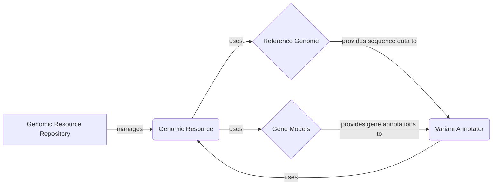

**Component: Genomic Resource Repository**
*Description*: Manages access to genomic resources. It provides methods to build and retrieve resources from different sources (filesystem, HTTP, etc.). It also handles resource groups. It relates to the Genomic Resource by managing and providing access to them. It interacts with Variant Annotator by providing the resources needed for annotation.
*Relevant source files*:
- `dae.genomic_resources.repository_factory`
- `dae.genomic_resources.group_repository`
- `dae.genomic_resources.repository`

**Component: Genomic Resource**
*Description*: Represents a single genomic resource, providing access to its metadata and data. It defines the basic interface for all genomic resources. It is used by the Genomic Resource Repository to represent and manage individual resources. It provides data to the Variant Annotator.
*Relevant source files*:
- `dae.genomic_resources.genomic_resource`

**Component: Reference Genome**
*Description*: Represents the reference genome and provides methods to open and access sequence data. It supports different sequence formats and provides efficient access to genomic sequences. It is a type of Genomic Resource. It provides sequence data to the Variant Annotator.
*Relevant source files*:
- `dae.genomic_resources.reference_genome`

**Component: Gene Models**
*Description*: Represents gene models and provides methods to load and access gene annotations for a specific genome build. It handles different gene model formats and provides efficient access to gene structures. It is a type of Genomic Resource. It provides gene annotations to the Variant Annotator.
*Relevant source files*:
- `dae.genomic_resources.gene_models.gene_models`
- `dae.genomic_resources.gene_models.exon`
- `dae.genomic_resources.gene_models.transcript`
- `dae.genomic_resources.gene_models.gene`

**Component: Variant Annotator**
*Description*: Annotates genetic variants using data from the Reference Genome, Gene Models, and other Genomic Resources. It uses the data provided by these components to add information to variants.
*Relevant source files*: (This component is external, assuming it exists and interacts with the GRR)
- `variant_annotator` (example)
