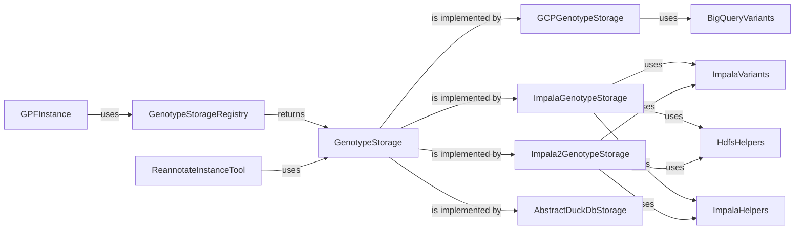

## Genotype Storage Overview

This document provides an overview of the Genotype Storage subsystem, which is responsible for managing and accessing variant data from different storage backends. The system uses a registry to manage available storage implementations and provides abstract classes for defining common storage operations.

### Data Flow Diagram

### Component Descriptions

*   **GPFInstance**: Represents a GPF instance, providing access to genotype data, phenotype data, and configurations. It serves as a central access point for data and metadata within the GPF framework. It uses `GenotypeStorageRegistry` to retrieve available genotype storages.
    *   Relevant source files:
        *   `dae.gpf_instance.gpf_instance.GPFInstance`

*   **GenotypeStorageRegistry**: Manages the registration and retrieval of different genotype storage implementations. It acts as a central point for accessing available storage backends. It is used by `GPFInstance` to get the correct storage.
    *   Relevant source files:
        *   `dae.genotype_storage.genotype_storage_registry.GenotypeStorageRegistry`

*   **GenotypeStorage**: Abstract base class for genotype storage implementations. Defines common methods for configuration, validation, and accessing study-related tables. It is implemented by different storage backends like `GCPGenotypeStorage`, `ImpalaGenotypeStorage`, `Impala2GenotypeStorage` and `AbstractDuckDbStorage`.
    *   Relevant source files:
        *   `dae.genotype_storage.genotype_storage.GenotypeStorage`

*   **GCPGenotypeStorage**: Implementation of genotype storage for Google Cloud Platform (GCP). Handles data import and loading into BigQuery, leveraging GCP services for scalable storage and analysis. It uses `BigQueryVariants` to access the data.
    *   Relevant source files:
        *   `repos.gpf.gcp_storage.gcp_storage.gcp_genotype_storage.GcpGenotypeStorage`

*   **ImpalaGenotypeStorage**: Implementation of genotype storage for Impala. Supports data upload and import into Impala tables, utilizing HDFS for storage and Impala for querying. It uses `ImpalaVariants` to access the data, and `HdfsHelpers` and `ImpalaHelpers` for interacting with HDFS and Impala.
    *   Relevant source files:
        *   `repos.gpf.impala_storage.impala_storage.schema1.impala_genotype_storage.ImpalaGenotypeStorage`

*   **Impala2GenotypeStorage**: Another implementation of genotype storage for Impala, likely with a different schema or approach compared to ImpalaGenotypeStorage. It also supports data upload and import into Impala tables. It uses `ImpalaVariants` to access the data, and `HdfsHelpers` and `ImpalaHelpers` for interacting with HDFS and Impala.
    *   Relevant source files:
        *   `repos.gpf.impala2_storage.impala2_storage.schema2.impala2_genotype_storage.Impala2GenotypeStorage`

*   **AbstractDuckDbStorage**: Abstract base class for DuckDB storage implementations. It likely defines common methods for interacting with DuckDB databases.
    *   Relevant source files:
        *   `repos.gpf.dae.dae.duckdb_storage.duckdb_genotype_storage.AbstractDuckDbStorage`

*   **BigQueryVariants**: Represents variants stored in Google BigQuery. Provides an interface for querying and accessing variant data within the BigQuery environment. It is used by `GCPGenotypeStorage`.
    *   Relevant source files:
        *   `gcp_storage.bigquery_variants.BigQueryVariants`

*   **ImpalaVariants**: Represents variants stored in Impala. Provides an interface for querying and accessing variant data within the Impala environment. It is used by `ImpalaGenotypeStorage` and `Impala2GenotypeStorage`.
    *   Relevant source files:
        *   `impala_storage.schema1.impala_variants.ImpalaVariants`
        *   `impala2_storage.schema2.impala_variants.ImpalaVariants`

*   **HdfsHelpers**: Helper class for interacting with HDFS (Hadoop Distributed File System). Provides utility functions for file system operations like creating directories, deleting files, and uploading data. It is used by `ImpalaGenotypeStorage` and `Impala2GenotypeStorage`.
    *   Relevant source files:
        *   `impala_storage.helpers.hdfs_helpers.HdfsHelpers`
        *   `impala2_storage.helpers.hdfs_helpers.HdfsHelpers`

*   **ImpalaHelpers**: Helper class for interacting with Impala. Provides utility functions for database operations like dropping tables, importing pedigree data, and importing variant data. It is used by `ImpalaGenotypeStorage` and `Impala2GenotypeStorage`.
    *   Relevant source files:
        *   `impala_storage.helpers.impala_helpers.ImpalaHelpers`

*   **ReannotateInstanceTool**: Tool for reannotating instances, utilizing GPFInstance and genotype storage. It orchestrates the reannotation process by fetching data from storage and applying annotation logic. It uses `GenotypeStorage` to access the data.
    *   Relevant source files:
        *   `dae.annotation.reannotate_instance.ReannotateInstanceTool`
