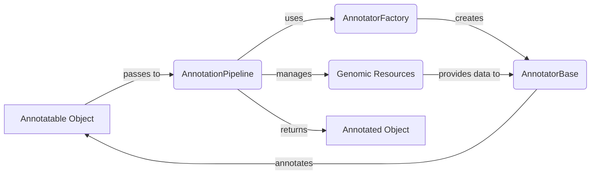

## Annotation Engine Overview

The Annotation Engine orchestrates the process of adding relevant information to genomic variants using a configurable pipeline of annotators and genomic resources. It leverages the `AnnotationPipeline` to manage the sequence of annotations, the `AnnotationFactory` to create annotator instances, and `AnnotatorBase` as the foundation for all annotators.

Here's a high-level data flow diagram illustrating the process:

### Component Descriptions:

*   **Annotatable Object:** Represents the genomic variant or object that needs to be annotated. It serves as the input to the annotation process and is enriched with information by the annotators. Relevant source files: N/A (Represents the input data structure).

*   **AnnotationPipeline:** Manages the sequence of annotators and applies them to the annotatable object. It also handles genomic context and resource management. It uses the `AnnotationFactory` to create annotator instances and orchestrates the annotation process. Relevant source file: `dae.annotation.annotation_pipeline.AnnotationPipeline`

*   **AnnotatorFactory:** Creates annotator instances based on the configuration. It uses a registry of annotator types and their corresponding factory functions. The `AnnotationPipeline` uses it to instantiate the annotators defined in the pipeline configuration. Relevant source file: `dae.annotation.annotation_factory`

*   **AnnotatorBase:** Abstract base class for annotators, providing a common interface for annotation. It defines the basic structure for annotators and manages the work directory. The `AnnotationPipeline` uses instances of classes derived from `AnnotatorBase` to perform the actual annotation. Relevant source file: `dae.annotation.annotator_base.AnnotatorBase`

*   **Genomic Resources:** Provides access to genomic data and resources required by the annotators. The annotators use these resources to retrieve information and enrich the annotatable object. Relevant source files: N/A (Represents external data sources).

*   **Annotated Object:** Represents the genomic variant or object after it has been annotated with relevant information. It is the output of the annotation process. Relevant source files: N/A (Represents the output data structure).
