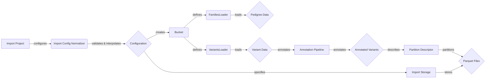

## Import Pipeline Overview

The Import Pipeline handles the ingestion and transformation of variant data from various formats into the GPF ecosystem. It orchestrates the process of loading, converting, annotating, and partitioning data for efficient storage and analysis.

### Component Descriptions:

*   **User Interface:** The entry point for users to initiate the import process. It sends requests to the API Gateway.
    *   **Relevant source files:** N/A (External to the system)
*   **API Gateway:** Routes incoming requests to the appropriate service. In this case, it directs import-related requests to the Import Controller.
    *   **Relevant source files:** N/A (External to the system)
*   **Import Controller:** Receives requests from the API Gateway and orchestrates the import process by calling the `ImportProject`.
    *   **Relevant source files:** N/A (Likely part of the API layer)
*   **ImportProject:** Encapsulates the import configuration and orchestrates the import process, creating loaders and handling file parsing. It uses `ImportConfigNormalizer` to process the configuration.
    *   **Relevant source files:** `dae/import_tools/import_tools.py`
*   **ImportConfigNormalizer:** Normalizes the import configuration by validating, interpolating, and embedding external files. It outputs a validated configuration.
    *   **Relevant source files:** `dae/import_tools/import_tools.py`
*   **Configuration:** The validated and normalized configuration used to drive the import process. It specifies parameters for data loading, annotation, and partitioning.
    *   **Relevant source files:** N/A (Data structure)
*   **Bucket:** Represents a region of the input data used for processing, defining the type, region bin, regions, and index. It defines the scope for loading pedigree and variant data.
    *   **Relevant source files:** `dae/import_tools/import_tools.py`
*   **FamiliesLoader:** Loads pedigree data from a file and provides access to family relationships. It's used by the `ImportProject` to load pedigree information.
    *   **Relevant source files:** `dae/pedigrees/loader.py`
*   **VariantsLoader:** Abstract base class for variant loaders, responsible for loading variant data from various formats. It's used by the `ImportProject` to load variant data.
    *   **Relevant source files:** `dae/variants_loaders/raw/loader.py`
*   **Pedigree Data:** The loaded pedigree information, representing family relationships. It's used during variant annotation and analysis.
    *   **Relevant source files:** N/A (Data structure)
*   **Variant Data:** The loaded variant data from various formats (VCF, DAE, CNV). It's the raw data that needs to be annotated and partitioned.
    *   **Relevant source files:** N/A (Data structure)
*   **AnnotationPipeline:** Applies annotations to variants using a configured pipeline. It enriches the variant data with additional information.
    *   **Relevant source files:** `dae/annotation/annotation_factory.py`
*   **Annotated Variants:** The variant data after annotation, containing additional information. It's ready for partitioning and storage.
    *   **Relevant source files:** N/A (Data structure)
*   **PartitionDescriptor:** Describes how a dataset is partitioned, including chromosomes and region lengths. It's used to divide the data into smaller, manageable chunks.
    *   **Relevant source files:** `dae/parquet/partition_descriptor.py`
*   **Parquet Files:** The final output of the import pipeline, containing the partitioned and annotated variant data in Parquet format. It's stored in the `ImportStorage`.
    *   **Relevant source files:** N/A (Data files)
*   **ImportStorage:** Abstract base class for import storages, defining the interface for generating task graphs for importing projects. It stores the final Parquet files.
    *   **Relevant source files:** `dae/import_tools/import_tools.py`
