# GPF Project Overview

GPF (Genomic Prediction Framework) is a comprehensive framework designed for managing, analyzing, and querying large-scale genomic data. It provides tools for importing, annotating, storing, and querying genetic variants, as well as managing related phenotype data. GPF aims to facilitate research in genetics and genomics by providing a scalable and efficient platform for data analysis.

## Data Flow Diagram

```mermaid
graph LR
    A[Data Sources] -- Imports Data --> B(Import Pipeline)
    B -- Stores Data --> C(Genotype Storage)
    D(GPF Instance & Configuration) -- Provides Configuration --> E(Genomic Resources Repository)
    E -- Provides Resources --> F(Annotation Engine)
    B -- Uses --> F
    C -- Queries Data --> G(Query Engine)
    F -- Annotates Data --> C
    G -- Returns Results --> H[Analysis & Reporting]

click A href "https://github.com/CodeBoarding/GeneratedOnBoardings/blob/main/gpf//RelevantFile.md"
click B href "https://github.com/CodeBoarding/GeneratedOnBoardings/blob/main/gpf//Import%20Pipeline.md"
click C href "https://github.com/CodeBoarding/GeneratedOnBoardings/blob/main/gpf//Genotype%20Storage.md"
click D href "https://github.com/CodeBoarding/GeneratedOnBoardings/blob/main/gpf//GPF%20Instance%20&%20Configuration.md"
click E href "https://github.com/CodeBoarding/GeneratedOnBoardings/blob/main/gpf//Genomic%20Resources%20Repository.md"
click F href "https://github.com/CodeBoarding/GeneratedOnBoardings/blob/main/gpf//Annotation%20Engine.md"
click G href "https://github.com/CodeBoarding/GeneratedOnBoardings/blob/main/gpf//RelevantFile.md"
click H href "https://github.com/CodeBoarding/GeneratedOnBoardings/blob/main/gpf//RelevantFile.md"

```

## Component Descriptions

**A. Data Sources:** Represents the various sources of genomic data that are imported into the GPF ecosystem. This includes VCF files, DAE summary files, and other formats containing variant and pedigree information.

**B. Import Pipeline:** Responsible for importing and converting data from various formats into the GPF ecosystem. It uses the Annotation Engine to annotate the data and stores the processed data into the Genotype Storage. It relates to the Data Sources by importing data from them, uses the Annotation Engine to annotate the data, and stores the processed data into the Genotype Storage.

**C. Genotype Storage:** Abstracts the underlying storage of genotype data, allowing for different storage backends (e.g., DuckDB, Impala). It receives annotated data from the Import Pipeline and provides data to the Query Engine. It relates to the Import Pipeline by storing the processed data, and provides data to the Query Engine for querying.

**D. GPF Instance & Configuration:** Manages the GPF instance lifecycle, including configuration loading and access to core resources. It provides configuration to the Genomic Resources Repository. It relates to the Genomic Resources Repository by providing configuration.

**E. Genomic Resources Repository:** Provides access to genomic resources like reference genomes, gene models, and annotation scores. It provides resources to the Annotation Engine. It relates to the GPF Instance & Configuration by receiving configuration, and provides resources to the Annotation Engine.

**F. Annotation Engine:** Orchestrates the annotation of genomic variants by utilizing configured annotators and genomic resources. It receives data from the Import Pipeline and uses resources from the Genomic Resources Repository to annotate the data, then sends the annotated data to the Genotype Storage. It relates to the Import Pipeline by receiving data, uses resources from the Genomic Resources Repository, and sends the annotated data to the Genotype Storage.

**G. Query Engine:** Provides the base classes and utilities for querying variants from different storage backends. It queries data from the Genotype Storage and returns results to Analysis & Reporting. It relates to the Genotype Storage by querying data, and returns results to Analysis & Reporting.

**H. Analysis & Reporting:** Represents the downstream analysis and reporting tools that utilize the queried data from the GPF ecosystem.