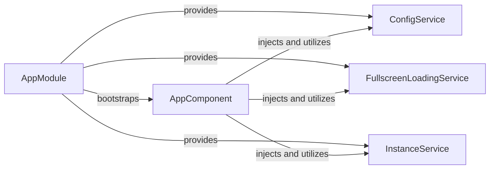

## Details

The application's main flow begins with AppModule bootstrapping the AppComponent. The AppComponent then utilizes ConfigService for application-wide settings, FullscreenLoadingService for managing UI loading states, and InstanceService for global application state. These services are provided at the AppModule level, ensuring their singleton availability throughout the application.

### AppModule
The primary Angular module that bootstraps the entire application. It acts as the root module, orchestrating the loading of other modules, declaring the root AppComponent, and making application-wide singleton services available through its providers. This is fundamental for an Angular application's startup.

**Related Classes/Methods**:

- <a href="https://github.com/iossifovlab/gpfjs/blob/master/src/app/app.module.ts" target="_blank" rel="noopener noreferrer">`app.AppModule`</a>

### AppComponent
The root component of the application, serving as the main UI entry point. It defines the application's main layout, navigation structure, and contains the router outlet where other components are rendered. It's the initial view presented to the user.

**Related Classes/Methods**:

- <a href="https://github.com/iossifovlab/gpfjs/blob/master/src/app/app.component.ts" target="_blank" rel="noopener noreferrer">`app.AppComponent`</a>

### ConfigService
A service responsible for managing and providing global application configuration settings. It ensures that configuration data, essential for various parts of the application, is consistently accessible. This is a common pattern for centralizing configuration.

**Related Classes/Methods**:

- <a href="https://github.com/iossifovlab/gpfjs/blob/master/src/app/config/config.service.ts" target="_blank" rel="noopener noreferrer">`app.config.ConfigService`</a>

### FullscreenLoadingService
Manages the state and display of a global fullscreen loading indicator. It provides methods to show and hide the loading overlay, ensuring a consistent user experience during asynchronous operations across the application. This service centralizes UI feedback for loading states.

**Related Classes/Methods**:

- <a href="https://github.com/iossifovlab/gpfjs/blob/master/src/app/fullscreen-loading/fullscreen-loading.service.ts" target="_blank" rel="noopener noreferrer">`app.fullscreen_loading.FullscreenLoadingService`</a>

### InstanceService
Manages application-specific instance data or state that needs to be globally accessible and consistent throughout the application lifecycle. This could involve managing user sessions, application context, or other singleton data, providing a centralized point for critical application state.

**Related Classes/Methods**:

- <a href="https://github.com/iossifovlab/gpfjs/blob/master/src/app/instance.service.ts" target="_blank" rel="noopener noreferrer">`app.InstanceService`</a>

### [FAQ](https://github.com/CodeBoarding/GeneratedOnBoardings/tree/main?tab=readme-ov-file#faq)