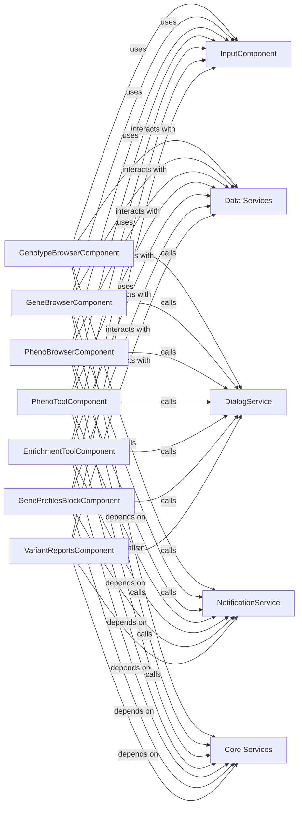

## Details

The GPFJS application is a web-based platform for genetic data analysis, primarily focused on displaying and analyzing genotype, gene, and phenotypic data. The core functionality revolves around various "browser" and "tool" components that allow users to explore and query genetic information. These components heavily rely on shared "services" for data retrieval, user interface interactions (like dialogs and notifications), and core functionalities such as authentication. The application appears to follow a component-based architecture, where specialized components handle specific data views and analysis tasks, while common functionalities are encapsulated in shared services.

The GPFJS application's architecture is centered around a set of specialized "browser" and "tool" components, each responsible for a distinct aspect of genetic data analysis (genotype, gene, phenotype, enrichment, gene profiles, variant reports). These components form the primary user-facing modules, handling data display, user input, and initiating data queries. Underlying these specialized components are shared "services" that provide common functionalities. The `Data Services` component acts as the primary interface for all data interactions with the backend, ensuring consistent data fetching and submission. `DialogService` and `NotificationService` provide standardized mechanisms for user feedback and interaction, while `Core Services` handles cross-cutting concerns like authentication, which is crucial for securing data access across the application. This modular design promotes reusability and separation of concerns, allowing for independent development and maintenance of different functional areas.

### GenotypeBrowserComponent
Responsible for displaying and interacting with genotype data, likely fetching data from backend services, managing filters, and rendering genotype-specific visualizations. It initializes default filter states (e.g., `presentInParent`, `presentInChild`, `genders`, `effectTypes`, `variantTypes`, `inheritanceTypes`) based on the selected dataset's configuration. It also manages the display of genotype preview variants and handles query submissions, including canceling ongoing streams on navigation changes.

**Related Classes/Methods**:

- <a href="https://github.com/iossifovlab/gpfjs/blob/master/src/app/genotype-browser/genotype-browser.component.ts" target="_blank" rel="noopener noreferrer">`GenotypeBrowserComponent`</a>

### GeneBrowserComponent
Manages the display and exploration of gene-related information, including gene details, expression data, and associated variants. It handles gene symbol searches, displays summary and family variants, and allows filtering based on affected status, effect types, and variant types. It also manages the URL state based on selected gene and filters.

**Related Classes/Methods**:

- <a href="https://github.com/iossifovlab/gpfjs/blob/master/src/app/gene-browser/gene-browser.component.ts" target="_blank" rel="noopener noreferrer">`GeneBrowserComponent`</a>

### PhenoBrowserComponent
Provides an interface for browsing and analyzing phenotypic data, including instrument selection and measure searching. It dynamically updates the displayed measures based on user input and selected instruments, and allows downloading of phenotypic data.

**Related Classes/Methods**:

- <a href="https://github.com/iossifovlab/gpfjs/blob/master/src/app/pheno-browser/pheno-browser.component.ts" target="_blank" rel="noopener noreferrer">`PhenoBrowserComponent`</a>

### PhenoToolComponent
Offers specialized tools for phenotypic analysis, such as statistical tests or data comparisons. It manages the state of various filters (gene symbols, gene sets, gene scores, phenotypic measures, effect types, present in parent, family tags, family IDs, person filters, genomic scores) and submits queries to the pheno tool service to retrieve and display analysis results.

**Related Classes/Methods**:

- <a href="https://github.com/iossifovlab/gpfjs/blob/master/src/app/pheno-tool/pheno-tool.component.ts" target="_blank" rel="noopener noreferrer">`PhenoToolComponent`</a>

### EnrichmentToolComponent
Handles the execution and display of enrichment analysis results, often involving gene sets or pathways. It collects gene-related filters (gene symbols, gene sets, gene scores, enrichment models) and submits them to the enrichment query service to obtain and present enrichment results.

**Related Classes/Methods**:

- <a href="https://github.com/iossifovlab/gpfjs/blob/master/src/app/enrichment-tool/enrichment-tool.component.ts" target="_blank" rel="noopener noreferrer">`EnrichmentToolComponent`</a>

### GeneProfilesBlockComponent
Displays detailed profiles for specific genes, aggregating various data points like annotations, variants, and expression. It configures and manages the gene profiles table, including columns for gene sets, gene scores, and dataset-specific statistics, and provides functionality to navigate to specific queries.

**Related Classes/Methods**:

- <a href="https://github.com/iossifovlab/gpfjs/blob/master/src/app/gene-profiles-block/gene-profiles-block.component.ts" target="_blank" rel="noopener noreferrer">`GeneProfilesBlockComponent`</a>

### VariantReportsComponent
Generates and presents reports related to genetic variants, summarizing findings and relevant clinical information. It displays family counters, pedigree tables, and de novo reports, and allows filtering families based on tags. It also provides functionality to download variant reports.

**Related Classes/Methods**:

- <a href="https://github.com/iossifovlab/gpfjs/blob/master/src/app/variant-reports/variant-reports.component.ts" target="_blank" rel="noopener noreferrer">`VariantReportsComponent`</a>

### InputComponent
A common UI component for standardized user input handling, specifically for person and family filters. It manages the state of categorical and continuous filters and ensures at least one continuous filter is selected.

**Related Classes/Methods**:

- <a href="https://github.com/iossifovlab/gpfjs/blob/master/src/app/person-filters/person-filters.component.ts" target="_blank" rel="noopener noreferrer">`InputComponent`</a>

### Data Services
A service for fetching and submitting domain-specific data to the backend API, primarily for managing and retrieving dataset information, including hierarchies, descriptions, and permissions.

**Related Classes/Methods**:

- <a href="https://github.com/iossifovlab/gpfjs/blob/master/src/app/datasets/datasets.service.ts" target="_blank" rel="noopener noreferrer">`Data Services`</a>

### DialogService
A service for displaying modal dialogs, including helper modals that can display either template-based content or markdown.

**Related Classes/Methods**:

- <a href="https://github.com/iossifovlab/gpfjs/blob/master/src/app/helper-modal/helper-modal.component.ts" target="_blank" rel="noopener noreferrer">`DialogService`</a>

### NotificationService
A service for providing user feedback, specifically for displaying error messages to the user.

**Related Classes/Methods**:

- <a href="https://github.com/iossifovlab/gpfjs/blob/master/src/app/errors-alert/errors-alert.component.ts" target="_blank" rel="noopener noreferrer">`NotificationService`</a>

### Core Services
A service for fundamental functionalities such as authentication and token management, including generating PKCE, requesting and revoking access tokens, and refreshing tokens.

**Related Classes/Methods**:

- <a href="https://github.com/iossifovlab/gpfjs/blob/master/src/app/auth.service.ts" target="_blank" rel="noopener noreferrer">`Core Services`</a>

### [FAQ](https://github.com/CodeBoarding/GeneratedOnBoardings/tree/main?tab=readme-ov-file#faq)