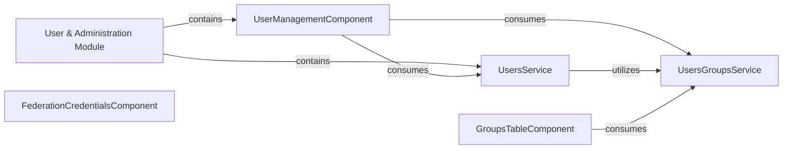

## Details

The User & Administration Module acts as the primary entry point for managing user and administrative functions within the application. It encompasses the UserManagementComponent, which serves as the user interface for administrative tasks, and various services that handle the underlying data and business logic. The UserManagementComponent interacts with both the UsersService for general user data management and the UsersGroupsService for handling user-to-group assignments. The UsersService further leverages the UsersGroupsService for comprehensive user and group management. Additionally, the GroupsTableComponent directly consumes the UsersGroupsService to display and manage group-related information. The FederationCredentialsComponent operates as a specialized administrative component, focusing on external authentication settings. This architecture promotes a clear separation of concerns, with components handling UI and services managing data and business logic, all coordinated by the central User & Administration Module.

### User & Administration Module [[Expand]](./User_Administration_Module.md)
The overarching module that encapsulates all user and administrative functionalities. It serves as a logical grouping for related components and services, adhering to the Angular modular structure.

**Related Classes/Methods**:

- <a href="https://github.com/iossifovlab/gpfjs/blob/master/src/app/management/management.component.ts" target="_blank" rel="noopener noreferrer">`src/app/management/management.component.ts`</a>

### UserManagementComponent
A container component responsible for orchestrating the user administration user interface. It displays user lists, handles user interactions (add, edit, delete), and delegates data operations to services.

**Related Classes/Methods**:

- <a href="https://github.com/iossifovlab/gpfjs/blob/master/src/app/user-management/user-management.component.ts" target="_blank" rel="noopener noreferrer">`src/app/user-management/user-management.component.ts`</a>

### UsersService
An Angular service that encapsulates the core business logic and data access for user-related operations. It handles fetching, creating, updating, and deleting user data, abstracting interactions with the backend API.

**Related Classes/Methods**:

- <a href="https://github.com/iossifovlab/gpfjs/blob/master/src/app/users/users.service.ts" target="_blank" rel="noopener noreferrer">`src/app/users/users.service.ts`</a>

### UsersGroupsService
An Angular service dedicated to managing the relationships between users and groups. It handles operations like assigning users to groups, removing users from groups, and retrieving group memberships.

**Related Classes/Methods**:

- <a href="https://github.com/iossifovlab/gpfjs/blob/master/src/app/users-groups/users-groups.service.ts" target="_blank" rel="noopener noreferrer">`src/app/users-groups/users-groups.service.ts`</a>

### GroupsTableComponent
A presentational or container component focused on displaying and managing groups. It provides the UI for listing groups and potentially initiating group-related actions.

**Related Classes/Methods**:

- <a href="https://github.com/iossifovlab/gpfjs/blob/master/src/app/groups-table/groups-table.component.ts" target="_blank" rel="noopener noreferrer">`src/app/groups-table/groups-table.component.ts`</a>

### FederationCredentialsComponent
A specialized administrative component responsible for managing settings and credentials related to federated identity or external authentication providers.

**Related Classes/Methods**:

- <a href="https://github.com/iossifovlab/gpfjs/blob/master/src/app/federation-credentials/federation-credentials.component.ts" target="_blank" rel="noopener noreferrer">`src/app/federation-credentials/federation-credentials.component.ts`</a>

### [FAQ](https://github.com/CodeBoarding/GeneratedOnBoardings/tree/main?tab=readme-ov-file#faq)