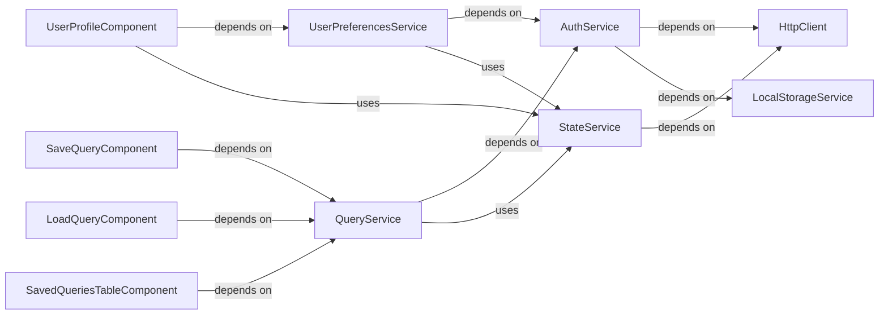

## Details

The `gpfjs` project's user and query management subsystem is designed around a service-oriented architecture, typical for Angular applications. User interface components like `UserProfileComponent`, `SaveQueryComponent`, `LoadQueryComponent`, and `SavedQueriesTableComponent` serve as the entry points for user interaction, delegating complex operations to specialized services. The `QueryService` centralizes all operations related to saved user queries, while `UserPreferencesService` handles user profile settings. Both these domain-specific services depend on the `AuthService` to ensure authenticated access to backend resources and leverage the `StateService` for managing application-wide persistent data. All external communication with the backend is abstracted through the `HttpClient`, and `LocalStorageService` provides client-side data persistence, particularly for authentication tokens managed by the `AuthService`. This structure promotes modularity, reusability, and maintainability by clearly defining responsibilities and interaction patterns.

### UserProfileComponent
Manages the user interface for profile settings.

**Related Classes/Methods**: _None_

### SaveQueryComponent
Manages the UI and logic for saving user-defined queries.

**Related Classes/Methods**: _None_

### LoadQueryComponent
Manages the UI and logic for loading saved queries.

**Related Classes/Methods**: _None_

### SavedQueriesTableComponent
Displays saved queries in a tabular format.

**Related Classes/Methods**: _None_

### QueryService
Handles all CRUD operations for saved user queries.

**Related Classes/Methods**: _None_

### UserPreferencesService
Encapsulates business logic for user preferences.

**Related Classes/Methods**: _None_

### AuthService
Manages user authentication and authorization.

**Related Classes/Methods**: _None_

### StateService
Provides centralized management for the application's persistent state.

**Related Classes/Methods**: _None_

### HttpClient
Facilitates all HTTP communications with the backend.

**Related Classes/Methods**: _None_

### LocalStorageService
Manages client-side data storage.

**Related Classes/Methods**: _None_

### [FAQ](https://github.com/CodeBoarding/GeneratedOnBoardings/tree/main?tab=readme-ov-file#faq)