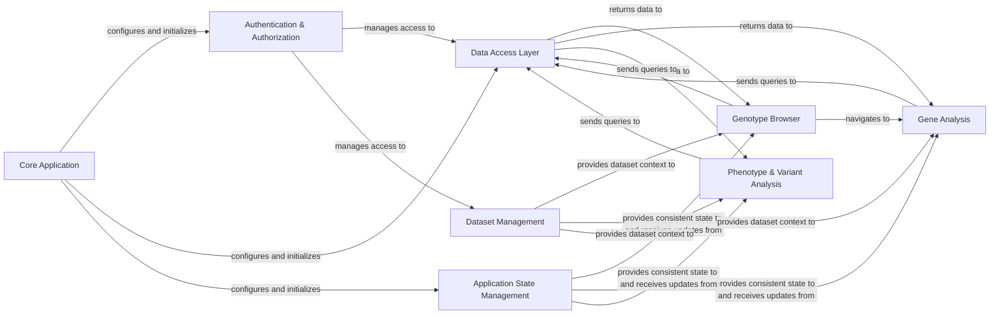

## Details

The feedback is valid and requires architectural changes to include source code references for each component. The original analysis provided abstract components without concrete links to the codebase, which is a crucial aspect of a comprehensive architectural overview.

### Core Application
Initializes the application, handles global routing, and provides foundational services.

**Related Classes/Methods**:

- <a href="https://github.com/iossifovlab/gpfjs/blob/master/src/app/app.component.ts#L1-L1" target="_blank" rel="noopener noreferrer">`src/app/app.component.ts` (1:1)</a>
- <a href="https://github.com/iossifovlab/gpfjs/blob/master/src/app/app.module.ts#L1-L1" target="_blank" rel="noopener noreferrer">`src/app/app.module.ts` (1:1)</a>

### Authentication & Authorization
Manages user login, logout, session, and access control to application features and datasets.

**Related Classes/Methods**:

- <a href="https://github.com/iossifovlab/gpfjs/blob/master/src/app/auth.service.ts#L1-L1" target="_blank" rel="noopener noreferrer">`src/app/auth.service.ts` (1:1)</a>
- <a href="https://github.com/iossifovlab/gpfjs/blob/master/src/app/auth-interceptor.service.ts#L1-L1" target="_blank" rel="noopener noreferrer">`src/app/auth-interceptor.service.ts` (1:1)</a>

### Data Access Layer
Centralized service for all backend data retrieval, query management, and data streaming.

**Related Classes/Methods**:

- <a href="https://github.com/iossifovlab/gpfjs/blob/master/src/app/query/query.service.ts#L1-L1" target="_blank" rel="noopener noreferrer">`src/app/query/query.service.ts` (1:1)</a>
- `src/app/api/api.service.ts` (1:1)

### Application State Management
Centralized state management system (e.g., NgRx) for consistent application state across components.

**Related Classes/Methods**:

- `src/app/store/` (1:1)
- `src/app/common/common.state.ts` (1:1)

### Dataset Management
Provides structured access to available datasets, their hierarchy, and associated tools.

**Related Classes/Methods**:

- <a href="https://github.com/iossifovlab/gpfjs/blob/master/src/app/datasets/datasets.component.ts#L1-L1" target="_blank" rel="noopener noreferrer">`src/app/datasets/datasets.component.ts` (1:1)</a>
- <a href="https://github.com/iossifovlab/gpfjs/blob/master/src/app/datasets/datasets.service.ts#L1-L1" target="_blank" rel="noopener noreferrer">`src/app/datasets/datasets.service.ts` (1:1)</a>

### Genotype Browser
Enables filtering, querying, and previewing genotype variants.

**Related Classes/Methods**:

- <a href="https://github.com/iossifovlab/gpfjs/blob/master/src/app/genotype-browser/genotype-browser.component.ts#L1-L1" target="_blank" rel="noopener noreferrer">`src/app/genotype-browser/genotype-browser.component.ts` (1:1)</a>
- `src/app/genotype-browser/genotype-browser.module.ts` (1:1)

### Gene Analysis
Consolidates functionalities for gene structure visualization, summary variant data, gene profiles, and enrichment analysis.

**Related Classes/Methods**:

- <a href="https://github.com/iossifovlab/gpfjs/blob/master/src/app/gene-browser/gene-browser.component.ts#L1-L1" target="_blank" rel="noopener noreferrer">`src/app/gene-browser/gene-browser.component.ts` (1:1)</a>
- `src/app/gene-browser/gene-browser.module.ts` (1:1)

### Phenotype & Variant Analysis
Provides interfaces for browsing phenotype measures, performing statistical analyses, and generating detailed variant reports.

**Related Classes/Methods**:

- <a href="https://github.com/iossifovlab/gpfjs/blob/master/src/app/pheno-browser/pheno-browser.component.ts#L1-L1" target="_blank" rel="noopener noreferrer">`src/app/pheno-browser/pheno-browser.component.ts` (1:1)</a>
- `src/app/pheno-browser/pheno-browser.module.ts` (1:1)

### [FAQ](https://github.com/CodeBoarding/GeneratedOnBoardings/tree/main?tab=readme-ov-file#faq)