```mermaid
graph LR
    Core_Module["Core Module"]
    Authentication_Authorization_Module["Authentication & Authorization Module"]
    Data_Access_API_Layer["Data Access & API Layer"]
    Dataset_Management_Module["Dataset Management Module"]
    User_Administration_Module["User & Administration Module"]
    Shared_UI_Utility_Module["Shared UI & Utility Module"]
    Feature_Modules["Feature Modules"]
    User_Preferences_Saved_State_Module["User Preferences & Saved State Module"]
    Core_Module -- "interacts with" --> Authentication_Authorization_Module
    Data_Access_API_Layer -- "uses" --> Authentication_Authorization_Module
    Data_Access_API_Layer -- "provides data to" --> Feature_Modules
    Data_Access_API_Layer -- "consumes context from" --> Dataset_Management_Module
    Dataset_Management_Module -- "interacts with" --> User_Administration_Module
    User_Administration_Module -- "uses" --> Authentication_Authorization_Module
    Feature_Modules -- "consume reusable UI components from" --> Shared_UI_Utility_Module
    User_Preferences_Saved_State_Module -- "uses" --> Data_Access_API_Layer
    click Core_Module href "https://github.com/CodeBoarding/GeneratedOnBoardings/blob/main/gpfjs/Core_Module.md" "Details"
    click User_Administration_Module href "https://github.com/CodeBoarding/GeneratedOnBoardings/blob/main/gpfjs/User_Administration_Module.md" "Details"
    click Feature_Modules href "https://github.com/CodeBoarding/GeneratedOnBoardings/blob/main/gpfjs/Feature_Modules.md" "Details"
    click User_Preferences_Saved_State_Module href "https://github.com/CodeBoarding/GeneratedOnBoardings/blob/main/gpfjs/User_Preferences_Saved_State_Module.md" "Details"
```

## Details

The GPF (Genotypes and Phenotypes in Families) project is an Angular-based web application designed for exploring and analyzing genomic and phenotypic data.

### Core Module [[Expand]](./Core_Module.md)
The foundational layer responsible for application bootstrapping, global configuration, and managing application-wide concerns like loading states.

**Related Classes/Methods**:

- <a href="https://github.com/iossifovlab/gpfjs/blob/master/src/app/app.component.ts" target="_blank" rel="noopener noreferrer">`app.app.component.AppComponent`</a>
- <a href="https://github.com/iossifovlab/gpfjs/blob/master/src/app/app.module.ts" target="_blank" rel="noopener noreferrer">`app.app.module.AppModule`</a>
- <a href="https://github.com/iossifovlab/gpfjs/blob/master/src/app/instance.service.ts" target="_blank" rel="noopener noreferrer">`app.instance.service.InstanceService`</a>
- <a href="https://github.com/iossifovlab/gpfjs/blob/master/src/app/config/config.service.ts" target="_blank" rel="noopener noreferrer">`app.config.config.service.ConfigService`</a>
- <a href="https://github.com/iossifovlab/gpfjs/blob/master/src/app/fullscreen-loading/fullscreen-loading.service.ts" target="_blank" rel="noopener noreferrer">`app.fullscreen_loading.fullscreen_loading.service.FullscreenLoadingService`</a>

### Authentication & Authorization Module
Manages user login, session management, token handling, and secures application routes and API calls.

**Related Classes/Methods**:

- <a href="https://github.com/iossifovlab/gpfjs/blob/master/src/app/auth.service.ts" target="_blank" rel="noopener noreferrer">`app.auth.service.AuthService`</a>
- <a href="https://github.com/iossifovlab/gpfjs/blob/master/src/app/auth-interceptor.service.ts" target="_blank" rel="noopener noreferrer">`app.auth_interceptor.service.AuthInterceptorService`</a>

### Data Access & API Layer
Centralizes all communication with the backend API, handling data requests, responses, and potentially caching. Acts as the single source of truth for data retrieval.

**Related Classes/Methods**:

- <a href="https://github.com/iossifovlab/gpfjs/blob/master/src/app/query/query.service.ts" target="_blank" rel="noopener noreferrer">`app.query.query.service.QueryService`</a>

### Dataset Management Module
Handles the retrieval, caching, and provision of dataset-specific information, including hierarchical structures and metadata, and manages dataset permissions.

**Related Classes/Methods**:

- <a href="https://github.com/iossifovlab/gpfjs/blob/master/src/app/datasets/datasets.service.ts" target="_blank" rel="noopener noreferrer">`app.datasets.datasets.service.DatasetsService`</a>
- <a href="https://github.com/iossifovlab/gpfjs/blob/master/src/app/datasets/datasets-tree.service.ts" target="_blank" rel="noopener noreferrer">`app.datasets.datasets_tree.service.DatasetsTreeService`</a>
- <a href="https://github.com/iossifovlab/gpfjs/blob/master/src/app/datasets/datasets.component.ts" target="_blank" rel="noopener noreferrer">`app.datasets.datasets.component.DatasetsComponent`</a>
- <a href="https://github.com/iossifovlab/gpfjs/blob/master/src/app/dataset-node/dataset-node.component.ts" target="_blank" rel="noopener noreferrer">`app.dataset_node.dataset_node.component.DatasetNodeComponent`</a>
- <a href="https://github.com/iossifovlab/gpfjs/blob/master/src/app/dataset-description/dataset-description.component.ts" target="_blank" rel="noopener noreferrer">`app.dataset_description.dataset_description.component.DatasetDescriptionComponent`</a>
- <a href="https://github.com/iossifovlab/gpfjs/blob/master/src/app/datasets-table/datasets-table.component.ts" target="_blank" rel="noopener noreferrer">`app.datasets_table.datasets_table.component.DatasetsTableComponent`</a>

### User & Administration Module [[Expand]](./User_Administration_Module.md)
Manages user accounts, groups, permissions, and related administrative functionalities.

**Related Classes/Methods**:

- <a href="https://github.com/iossifovlab/gpfjs/blob/master/src/app/users/users.service.ts" target="_blank" rel="noopener noreferrer">`app.users.users.service.UsersService`</a>
- <a href="https://github.com/iossifovlab/gpfjs/blob/master/src/app/user-management/user-management.component.ts" target="_blank" rel="noopener noreferrer">`app.user_management.user_management.component.UserManagementComponent`</a>
- <a href="https://github.com/iossifovlab/gpfjs/blob/master/src/app/groups-table/groups-table.component.ts" target="_blank" rel="noopener noreferrer">`app.groups_table.groups_table.component.GroupsTableComponent`</a>
- <a href="https://github.com/iossifovlab/gpfjs/blob/master/src/app/federation-credentials/federation-credentials.component.ts" target="_blank" rel="noopener noreferrer">`app.federation_credentials.federation_credentials.component.FederationCredentialsComponent`</a>
- <a href="https://github.com/iossifovlab/gpfjs/blob/master/src/app/users-groups/users-groups.service.ts" target="_blank" rel="noopener noreferrer">`app.users_groups.users_groups.service.UsersGroupsService`</a>

### Shared UI & Utility Module
Contains reusable UI components (e.g., filters, buttons, data visualizations) and common utility services that are used across multiple feature modules.

**Related Classes/Methods**:

- <a href="https://github.com/iossifovlab/gpfjs/blob/master/src/app/person-filters/person-filters.component.ts" target="_blank" rel="noopener noreferrer">`app.person_filters.person_filters.component.PersonFiltersComponent`</a>
- <a href="https://github.com/iossifovlab/gpfjs/blob/master/src/app/regions-block/regions-block.component.ts" target="_blank" rel="noopener noreferrer">`app.regions_block.regions_block.component.RegionsBlockComponent`</a>
- <a href="https://github.com/iossifovlab/gpfjs/blob/master/src/app/gene-plot/gene-plot.component.ts" target="_blank" rel="noopener noreferrer">`app.gene_plot.gene_plot.component.GenePlotComponent`</a>
- <a href="https://github.com/iossifovlab/gpfjs/blob/master/src/app/histogram/histogram.component.ts" target="_blank" rel="noopener noreferrer">`app.histogram.histogram.component.HistogramComponent`</a>
- <a href="https://github.com/iossifovlab/gpfjs/blob/master/src/app/pedigree-chart/pedigree-chart.component.ts" target="_blank" rel="noopener noreferrer">`app.pedigree_chart.pedigree_chart.component.PedigreeChartComponent`</a>

### Feature Modules [[Expand]](./Feature_Modules.md)
A collection of specialized modules providing core application functionalities for exploring and analyzing genomic and phenotypic data (e.g., Genotype Browser, Gene Browser, Phenotype Tool, Enrichment Tool, Gene Profiles, Variant Reports).

**Related Classes/Methods**:

- <a href="https://github.com/iossifovlab/gpfjs/blob/master/src/app/genotype-browser/genotype-browser.component.ts" target="_blank" rel="noopener noreferrer">`app.genotype_browser.genotype_browser.component.GenotypeBrowserComponent`</a>
- <a href="https://github.com/iossifovlab/gpfjs/blob/master/src/app/gene-browser/gene-browser.component.ts" target="_blank" rel="noopener noreferrer">`app.gene_browser.gene_browser.component.GeneBrowserComponent`</a>
- <a href="https://github.com/iossifovlab/gpfjs/blob/master/src/app/pheno-browser/pheno-browser.component.ts" target="_blank" rel="noopener noreferrer">`app.pheno_browser.pheno_browser.component.PhenoBrowserComponent`</a>
- <a href="https://github.com/iossifovlab/gpfjs/blob/master/src/app/pheno-tool/pheno-tool.component.ts" target="_blank" rel="noopener noreferrer">`app.pheno_tool.pheno_tool.component.PhenoToolComponent`</a>
- <a href="https://github.com/iossifovlab/gpfjs/blob/master/src/app/enrichment-tool/enrichment-tool.component.ts" target="_blank" rel="noopener noreferrer">`app.enrichment_tool.enrichment_tool.component.EnrichmentToolComponent`</a>
- <a href="https://github.com/iossifovlab/gpfjs/blob/master/src/app/gene-profiles-block/gene-profiles-block.component.ts" target="_blank" rel="noopener noreferrer">`app.gene_profiles_block.gene_profiles_block.component.GeneProfilesBlockComponent`</a>
- <a href="https://github.com/iossifovlab/gpfjs/blob/master/src/app/variant-reports/variant-reports.component.ts" target="_blank" rel="noopener noreferrer">`app.variant_reports.variant_reports.component.VariantReportsComponent`</a>

### User Preferences & Saved State Module [[Expand]](./User_Preferences_Saved_State_Module.md)
Manages the persistence and retrieval of user-defined query configurations and user profile settings.

**Related Classes/Methods**:

- <a href="https://github.com/iossifovlab/gpfjs/blob/master/src/app/save-query/save-query.component.ts" target="_blank" rel="noopener noreferrer">`app.save_query.save_query.component.SaveQueryComponent`</a>
- <a href="https://github.com/iossifovlab/gpfjs/blob/master/src/app/load-query/load-query.component.ts" target="_blank" rel="noopener noreferrer">`app.load_query.load_query.component.LoadQueryComponent`</a>
- <a href="https://github.com/iossifovlab/gpfjs/blob/master/src/app/saved-queries-table/saved-queries-table.component.ts" target="_blank" rel="noopener noreferrer">`app.saved_queries_table.saved_queries_table.component.SavedQueriesTableComponent`</a>
- <a href="https://github.com/iossifovlab/gpfjs/blob/master/src/app/user-profile/user-profile.component.ts" target="_blank" rel="noopener noreferrer">`app.user_profile.user_profile.component.UserProfileComponent`</a>

### [FAQ](https://github.com/CodeBoarding/GeneratedOnBoardings/tree/main?tab=readme-ov-file#faq)