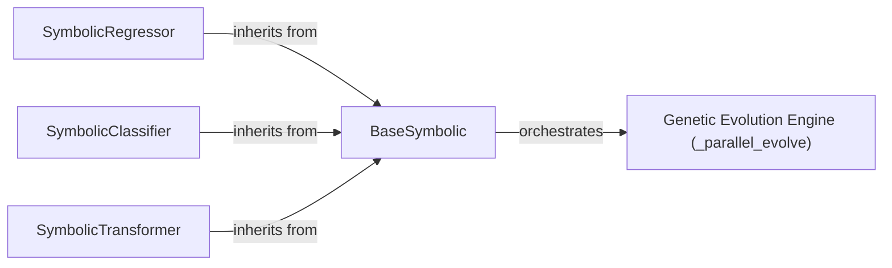

## Details

One paragraph explaining the functionality which is represented by this graph. What the main flow is and what is its purpose.

### BaseSymbolic
This is the foundational abstract base class for all symbolic estimators. It initializes genetic programming parameters, manages the overall `fit` process, and orchestrates the population evolution via internal methods like `_parallel_evolve`. It also defines the common `predict` and `transform` interfaces, ensuring adherence to scikit-learn conventions.

**Related Classes/Methods**:

- <a href="https://github.com/trevorstephens/gplearn/blob/main/gplearn/genetic.py#L157-L589" target="_blank" rel="noopener noreferrer">`gplearn.genetic.BaseSymbolic`:157-589</a>

### SymbolicRegressor
A concrete estimator specializing in symbolic regression tasks. It inherits from `BaseSymbolic` and provides the `fit` and `predict` methods tailored for regression, adhering strictly to the scikit-learn estimator interface.

**Related Classes/Methods**:

- <a href="https://github.com/trevorstephens/gplearn/blob/main/gplearn/genetic.py#L592-L871" target="_blank" rel="noopener noreferrer">`gplearn.genetic.SymbolicRegressor`:592-871</a>

### SymbolicClassifier
A concrete estimator designed for symbolic classification tasks. It extends `BaseSymbolic` by implementing `fit`, `predict`, and `predict_proba` methods, making it compatible with scikit-learn's classification API.

**Related Classes/Methods**:

- <a href="https://github.com/trevorstephens/gplearn/blob/main/gplearn/genetic.py#L874-L1186" target="_blank" rel="noopener noreferrer">`gplearn.genetic.SymbolicClassifier`:874-1186</a>

### SymbolicTransformer
A concrete estimator for symbolic transformation tasks. It inherits from `BaseSymbolic` and implements `fit`, `transform`, and `fit_transform` methods, aligning with scikit-learn's transformer interface for feature engineering or dimensionality reduction.

**Related Classes/Methods**:

- <a href="https://github.com/trevorstephens/gplearn/blob/main/gplearn/genetic.py#L1189-L1520" target="_blank" rel="noopener noreferrer">`gplearn.genetic.SymbolicTransformer`:1189-1520</a>

### Genetic Evolution Engine (_parallel_evolve)
This component encapsulates the core evolutionary algorithm logic. It is responsible for the iterative process of population evolution, including selection, crossover, and mutation, which drives the genetic programming. It utilizes internal mechanisms like `_tournament` for individual selection.

**Related Classes/Methods**:

- <a href="https://github.com/trevorstephens/gplearn/blob/main/gplearn/genetic.py" target="_blank" rel="noopener noreferrer">`gplearn.genetic.BaseSymbolic:_parallel_evolve`</a>

### [FAQ](https://github.com/CodeBoarding/GeneratedOnBoardings/tree/main?tab=readme-ov-file#faq)