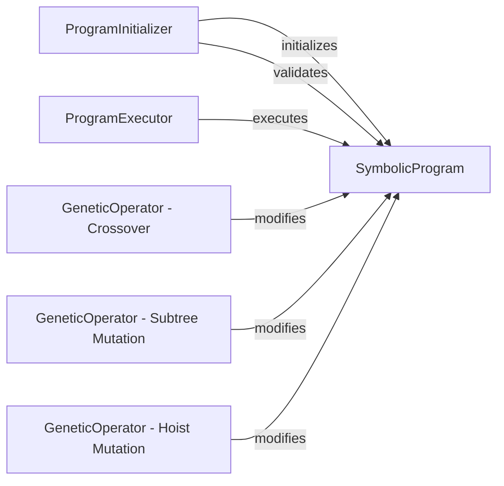

## Details

The `gplearn` program subsystem centers around the `SymbolicProgram`, which serves as the fundamental representation of an evolving genetic program. The `ProgramInitializer` is responsible for the initial creation and structural validation of these programs, ensuring their integrity before execution. Once initialized, the `ProgramExecutor` takes charge of evaluating the `SymbolicProgram` to produce results. Genetic diversity and evolution are driven by specialized `GeneticOperator` components, including `Crossover`, `Subtree Mutation`, and `Hoist Mutation`. These operators directly interact with and modify `SymbolicProgram` instances, facilitating the evolutionary process by generating new program variations. This architecture highlights a clear separation of concerns: program representation, initialization, execution, and genetic manipulation, all revolving around the `SymbolicProgram` as the core data structure.

### SymbolicProgram
The central component representing an individual genetic program as an executable expression tree. It encapsulates the program's structure (nodes, arity, depth) and manages its lifecycle, including initialization, execution, and genetic manipulation. It acts as the primary data structure and orchestrator for program-specific operations.

**Related Classes/Methods**:

- <a href="https://github.com/trevorstephens/gplearn/blob/main/gplearn/_program.py#L21-L670" target="_blank" rel="noopener noreferrer">`gplearn._program._Program`:21-670</a>

### ProgramInitializer
Responsible for the initial construction and structural validation of `SymbolicProgram` instances. It ensures the integrity of the program's expression tree and builds its executable internal representation.

**Related Classes/Methods**:

- <a href="https://github.com/trevorstephens/gplearn/blob/main/gplearn/_program.py" target="_blank" rel="noopener noreferrer">`gplearn._program._Program.build_program`</a>
- <a href="https://github.com/trevorstephens/gplearn/blob/main/gplearn/_program.py" target="_blank" rel="noopener noreferrer">`gplearn._program._Program.validate_program`</a>

### ProgramExecutor
Evaluates the program's expression tree to produce an output. This component is responsible for the actual "running" or "prediction" phase of the genetic program, taking input data and applying the program's logic.

**Related Classes/Methods**:

- <a href="https://github.com/trevorstephens/gplearn/blob/main/gplearn/_program.py" target="_blank" rel="noopener noreferrer">`gplearn._program._Program.execute`</a>

### GeneticOperator - Crossover
Implements the genetic crossover operation, combining genetic material (subtrees) from two parent `SymbolicProgram` instances to create new offspring programs.

**Related Classes/Methods**:

### GeneticOperator - Subtree Mutation
Implements the subtree mutation operation, replacing a randomly selected subtree within a `SymbolicProgram` with a newly generated one, introducing diversity.

**Related Classes/Methods**:

### GeneticOperator - Hoist Mutation
Implements the hoist mutation operation, which replaces a subtree within a `SymbolicProgram` with one of its own sub-subtrees, often simplifying the program.

**Related Classes/Methods**:

### [FAQ](https://github.com/CodeBoarding/GeneratedOnBoardings/tree/main?tab=readme-ov-file#faq)