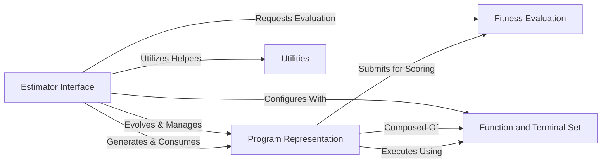

## Details

The `gplearn` architecture is designed as a scikit-learn compatible ML toolkit for symbolic regression, centered around an `Estimator Interface` that orchestrates the genetic programming workflow. This interface manages the evolution of `Program Representation` instances, which are executable expression trees. The performance of these programs is quantitatively assessed by the `Fitness Evaluation` component. Programs are dynamically constructed from a predefined `Function and Terminal Set`, which provides the fundamental building blocks. Throughout the evolutionary process, a `Utilities` component offers essential support functions, ensuring efficient execution and data handling. This modular design facilitates clear data and control flow, making it suitable for pipeline-oriented diagrammatic representation.

### Estimator Interface [[Expand]](./Estimator_Interface.md)
The primary scikit-learn-compatible entry point. Orchestrates the entire genetic programming lifecycle, including population evolution, selection, and application of genetic operations.

**Related Classes/Methods**:

- <a href="https://github.com/trevorstephens/gplearn/blob/main/gplearn/genetic.py#L592-L871" target="_blank" rel="noopener noreferrer">`gplearn.genetic.SymbolicRegressor`:592-871</a>
- <a href="https://github.com/trevorstephens/gplearn/blob/main/gplearn/genetic.py#L874-L1186" target="_blank" rel="noopener noreferrer">`gplearn.genetic.SymbolicClassifier`:874-1186</a>
- <a href="https://github.com/trevorstephens/gplearn/blob/main/gplearn/genetic.py#L1189-L1520" target="_blank" rel="noopener noreferrer">`gplearn.genetic.SymbolicTransformer`:1189-1520</a>
- <a href="https://github.com/trevorstephens/gplearn/blob/main/gplearn/genetic.py#L157-L589" target="_blank" rel="noopener noreferrer">`gplearn.genetic.BaseSymbolic`:157-589</a>

### Program Representation [[Expand]](./Program_Representation.md)
Represents an individual genetic program as an executable expression tree. Encapsulates the program's structure and provides methods for execution and genetic manipulation (crossover, mutation).

**Related Classes/Methods**:

- <a href="https://github.com/trevorstephens/gplearn/blob/main/gplearn/_program.py" target="_blank" rel="noopener noreferrer">`gplearn._program.SymbolicProgram`</a>
- <a href="https://github.com/trevorstephens/gplearn/blob/main/gplearn/_program.py#L225-L236" target="_blank" rel="noopener noreferrer">`gplearn._program.validate_program`:225-236</a>
- <a href="https://github.com/trevorstephens/gplearn/blob/main/gplearn/_program.py#L165-L223" target="_blank" rel="noopener noreferrer">`gplearn._program.build_program`:165-223</a>
- <a href="https://github.com/trevorstephens/gplearn/blob/main/gplearn/_program.py#L342-L388" target="_blank" rel="noopener noreferrer">`gplearn._program.execute`:342-388</a>
- <a href="https://github.com/trevorstephens/gplearn/blob/main/gplearn/_program.py#L530-L561" target="_blank" rel="noopener noreferrer">`gplearn._program.crossover`:530-561</a>
- <a href="https://github.com/trevorstephens/gplearn/blob/main/gplearn/_program.py#L563-L587" target="_blank" rel="noopener noreferrer">`gplearn._program.subtree_mutation`:563-587</a>
- <a href="https://github.com/trevorstephens/gplearn/blob/main/gplearn/_program.py#L589-L617" target="_blank" rel="noopener noreferrer">`gplearn._program.hoist_mutation`:589-617</a>

### Fitness Evaluation
Defines and calculates the performance (fitness) of symbolic programs based on specified metrics. Provides the mechanism to quantify how well a program solves the problem.

**Related Classes/Methods**:

- <a href="https://github.com/trevorstephens/gplearn/blob/main/gplearn/fitness.py#L52-L101" target="_blank" rel="noopener noreferrer">`gplearn.fitness.make_fitness`:52-101</a>
- <a href="https://github.com/trevorstephens/gplearn/blob/main/gplearn/fitness.py#L20-L49" target="_blank" rel="noopener noreferrer">`gplearn.fitness._Fitness`:20-49</a>
- <a href="https://github.com/trevorstephens/gplearn/blob/main/gplearn/fitness.py" target="_blank" rel="noopener noreferrer">`gplearn.fitness.mean_squared_error`</a>
- <a href="https://github.com/trevorstephens/gplearn/blob/main/gplearn/fitness.py" target="_blank" rel="noopener noreferrer">`gplearn.fitness.accuracy_score`</a>

### Function and Terminal Set
Manages the collection of mathematical functions and input terminals (variables, constants) that can be used to construct symbolic programs.

**Related Classes/Methods**:

- <a href="https://github.com/trevorstephens/gplearn/blob/main/gplearn/functions.py#L49-L121" target="_blank" rel="noopener noreferrer">`gplearn.functions.make_function`:49-121</a>
- <a href="https://github.com/trevorstephens/gplearn/blob/main/gplearn/functions.py#L18-L46" target="_blank" rel="noopener noreferrer">`gplearn.functions._Function`:18-46</a>
- <a href="https://github.com/trevorstephens/gplearn/blob/main/gplearn/functions.py" target="_blank" rel="noopener noreferrer">`gplearn.functions.add`</a>
- <a href="https://github.com/trevorstephens/gplearn/blob/main/gplearn/functions.py" target="_blank" rel="noopener noreferrer">`gplearn.functions.mul`</a>
- <a href="https://github.com/trevorstephens/gplearn/blob/main/gplearn/functions.py" target="_blank" rel="noopener noreferrer">`gplearn.functions.sub`</a>
- <a href="https://github.com/trevorstephens/gplearn/blob/main/gplearn/functions.py" target="_blank" rel="noopener noreferrer">`gplearn.functions.div`</a>

### Utilities
Provides general helper functions supporting the main components, such as parallel processing setup, data partitioning, and random state management.

**Related Classes/Methods**:

- <a href="https://github.com/trevorstephens/gplearn/blob/main/gplearn/utils.py#L65-L76" target="_blank" rel="noopener noreferrer">`gplearn.utils._partition_estimators`:65-76</a>
- <a href="https://github.com/trevorstephens/gplearn/blob/main/gplearn/utils.py#L37-L62" target="_blank" rel="noopener noreferrer">`gplearn.utils._get_n_jobs`:37-62</a>
- <a href="https://github.com/trevorstephens/gplearn/blob/main/gplearn/utils.py#L15-L34" target="_blank" rel="noopener noreferrer">`gplearn.utils.check_random_state`:15-34</a>

### [FAQ](https://github.com/CodeBoarding/GeneratedOnBoardings/tree/main?tab=readme-ov-file#faq)