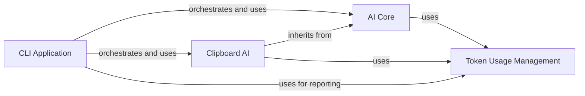

## Component Details

This graph illustrates the architecture of the AI Communication subsystem within the `gpt-engineer` project. It details how the core AI interaction, clipboard-based AI, and token usage tracking components are structured and how they interact, primarily orchestrated by the CLI Application for managing AI conversations and reporting resource consumption.

### AI Core
This component provides the core functionalities for interacting with external AI models, including message formatting, API calls, and implementing robust backoff strategies for API calls. It serves as a foundational interface for various language model providers and integrates with the Token Usage Management component for tracking token consumption.

**Related Classes/Methods**:

- <a href="https://github.com/gpt-engineer-org/gpt-engineer/blob/master/gpt_engineer/core/ai.py#L50-L379" target="_blank" rel="noopener noreferrer">`gpt-engineer.gpt_engineer.core.ai.AI` (50:379)</a>
- <a href="https://github.com/gpt-engineer-org/gpt-engineer/blob/master/gpt_engineer/core/ai.py#L88-L118" target="_blank" rel="noopener noreferrer">`gpt-engineer.gpt_engineer.core.ai.AI:__init__` (88:118)</a>
- <a href="https://github.com/gpt-engineer-org/gpt-engineer/blob/master/gpt_engineer/core/ai.py#L120-L143" target="_blank" rel="noopener noreferrer">`gpt-engineer.gpt_engineer.core.ai.AI:start` (120:143)</a>
- <a href="https://github.com/gpt-engineer-org/gpt-engineer/blob/master/gpt_engineer/core/ai.py#L165-L204" target="_blank" rel="noopener noreferrer">`gpt-engineer.gpt_engineer.core.ai.AI:_collapse_text_messages` (165:204)</a>
- <a href="https://github.com/gpt-engineer-org/gpt-engineer/blob/master/gpt_engineer/core/ai.py#L206-L251" target="_blank" rel="noopener noreferrer">`gpt-engineer.gpt_engineer.core.ai.AI:next` (206:251)</a>
- <a href="https://github.com/gpt-engineer-org/gpt-engineer/blob/master/gpt_engineer/core/ai.py#L382-L383" target="_blank" rel="noopener noreferrer">`gpt-engineer.gpt_engineer.core.ai:serialize_messages` (382:383)</a>
- <a href="https://github.com/gpt-engineer-org/gpt-engineer/blob/master/gpt_engineer/core/ai.py#L254-L287" target="_blank" rel="noopener noreferrer">`gpt-engineer.gpt_engineer.core.ai.AI:backoff_inference` (254:287)</a>
- <a href="https://github.com/gpt-engineer-org/gpt-engineer/blob/master/gpt_engineer/core/ai.py#L145-L163" target="_blank" rel="noopener noreferrer">`gpt-engineer.gpt_engineer.core.ai.AI._extract_content` (145:163)</a>
- <a href="https://github.com/gpt-engineer-org/gpt-engineer/blob/master/gpt_engineer/core/ai.py#L307-L328" target="_blank" rel="noopener noreferrer">`gpt-engineer.gpt_engineer.core.ai.AI.deserialize_messages` (307:328)</a>
- <a href="https://github.com/gpt-engineer-org/gpt-engineer/blob/master/gpt_engineer/core/ai.py#L330-L379" target="_blank" rel="noopener noreferrer">`gpt-engineer.gpt_engineer.core.ai.AI._create_chat_model` (330:379)</a>

### Clipboard AI
This component offers a specialized AI interface that leverages the system clipboard for both input and output, primarily used for debugging or manual interaction scenarios. It extends the AI Core functionality by overriding the 'next' method to facilitate clipboard operations instead of direct language model calls, while still utilizing Token Usage Management.

**Related Classes/Methods**:

- <a href="https://github.com/gpt-engineer-org/gpt-engineer/blob/master/gpt_engineer/core/ai.py#L386-L437" target="_blank" rel="noopener noreferrer">`gpt-engineer.gpt_engineer.core.ai.ClipboardAI` (386:437)</a>
- <a href="https://github.com/gpt-engineer-org/gpt-engineer/blob/master/gpt_engineer/core/ai.py#L388-L390" target="_blank" rel="noopener noreferrer">`gpt-engineer.gpt_engineer.core.ai.ClipboardAI:__init__` (388:390)</a>
- <a href="https://github.com/gpt-engineer-org/gpt-engineer/blob/master/gpt_engineer/core/ai.py#L408-L437" target="_blank" rel="noopener noreferrer">`gpt-engineer.gpt_engineer.core.ai.ClipboardAI:next` (408:437)</a>
- <a href="https://github.com/gpt-engineer-org/gpt-engineer/blob/master/gpt_engineer/core/ai.py#L393-L394" target="_blank" rel="noopener noreferrer">`gpt-engineer.gpt_engineer.core.ai.ClipboardAI:serialize_messages` (393:394)</a>
- <a href="https://github.com/gpt-engineer-org/gpt-engineer/blob/master/gpt_engineer/core/ai.py#L397-L406" target="_blank" rel="noopener noreferrer">`gpt-engineer.gpt_engineer.core.ai.ClipboardAI:multiline_input` (397:406)</a>

### Token Usage Management
This component is responsible for accurately tracking and logging token usage across AI conversations. It includes a tokenizer for counting tokens in messages and images, a comprehensive log for storing usage statistics, and functionalities to calculate the monetary cost associated with OpenAI model usage.

**Related Classes/Methods**:

- <a href="https://github.com/gpt-engineer-org/gpt-engineer/blob/master/gpt_engineer/core/token_usage.py#L67-L177" target="_blank" rel="noopener noreferrer">`gpt-engineer.gpt_engineer.core.token_usage.Tokenizer` (67:177)</a>
- <a href="https://github.com/gpt-engineer-org/gpt-engineer/blob/master/gpt_engineer/core/token_usage.py#L72-L78" target="_blank" rel="noopener noreferrer">`gpt-engineer.gpt_engineer.core.token_usage.Tokenizer:__init__` (72:78)</a>
- <a href="https://github.com/gpt-engineer-org/gpt-engineer/blob/master/gpt_engineer/core/token_usage.py#L80-L94" target="_blank" rel="noopener noreferrer">`gpt-engineer.gpt_engineer.core.token_usage.Tokenizer:num_tokens` (80:94)</a>
- <a href="https://github.com/gpt-engineer-org/gpt-engineer/blob/master/gpt_engineer/core/token_usage.py#L96-L140" target="_blank" rel="noopener noreferrer">`gpt-engineer.gpt_engineer.core.token_usage.Tokenizer:num_tokens_for_base64_image` (96:140)</a>
- <a href="https://github.com/gpt-engineer-org/gpt-engineer/blob/master/gpt_engineer/core/token_usage.py#L142-L177" target="_blank" rel="noopener noreferrer">`gpt-engineer.gpt_engineer.core.token_usage.Tokenizer:num_tokens_from_messages` (142:177)</a>
- <a href="https://github.com/gpt-engineer-org/gpt-engineer/blob/master/gpt_engineer/core/token_usage.py#L180-L297" target="_blank" rel="noopener noreferrer">`gpt-engineer.gpt_engineer.core.token_usage.TokenUsageLog` (180:297)</a>
- <a href="https://github.com/gpt-engineer-org/gpt-engineer/blob/master/gpt_engineer/core/token_usage.py#L185-L191" target="_blank" rel="noopener noreferrer">`gpt-engineer.gpt_engineer.core.token_usage.TokenUsageLog:__init__` (185:191)</a>
- <a href="https://github.com/gpt-engineer-org/gpt-engineer/blob/master/gpt_engineer/core/token_usage.py#L193-L224" target="_blank" rel="noopener noreferrer">`gpt-engineer.gpt_engineer.core.token_usage.TokenUsageLog:update_log` (193:224)</a>
- <a href="https://github.com/gpt-engineer-org/gpt-engineer/blob/master/gpt_engineer/core/token_usage.py#L226-L235" target="_blank" rel="noopener noreferrer">`gpt-engineer.gpt_engineer.core.token_usage.TokenUsageLog:log` (226:235)</a>
- <a href="https://github.com/gpt-engineer-org/gpt-engineer/blob/master/gpt_engineer/core/token_usage.py#L237-L249" target="_blank" rel="noopener noreferrer">`gpt-engineer.gpt_engineer.core.token_usage.TokenUsageLog:format_log` (237:249)</a>
- <a href="https://github.com/gpt-engineer-org/gpt-engineer/blob/master/gpt_engineer/core/token_usage.py#L251-L260" target="_blank" rel="noopener noreferrer">`gpt-engineer.gpt_engineer.core.token_usage.TokenUsageLog.is_openai_model` (251:260)</a>
- <a href="https://github.com/gpt-engineer-org/gpt-engineer/blob/master/gpt_engineer/core/token_usage.py#L262-L271" target="_blank" rel="noopener noreferrer">`gpt-engineer.gpt_engineer.core.token_usage.TokenUsageLog.total_tokens` (262:271)</a>
- <a href="https://github.com/gpt-engineer-org/gpt-engineer/blob/master/gpt_engineer/core/token_usage.py#L273-L297" target="_blank" rel="noopener noreferrer">`gpt-engineer.gpt_engineer.core.token_usage.TokenUsageLog.usage_cost` (273:297)</a>
- <a href="https://github.com/gpt-engineer-org/gpt-engineer/blob/master/gpt_engineer/core/token_usage.py#L32-L64" target="_blank" rel="noopener noreferrer">`gpt-engineer.gpt_engineer.core.token_usage.TokenUsage` (32:64)</a>

### CLI Application
This component represents the main command-line interface application, acting as the orchestrator for interactions with the AI and token usage logging. It dynamically initializes either the standard AI Core or the Clipboard AI based on user configuration and extensively utilizes the Token Usage Management component for comprehensive reporting and cost calculation.

**Related Classes/Methods**:

- <a href="https://github.com/gpt-engineer-org/gpt-engineer/blob/master/gpt_engineer/applications/cli/main.py#L281-L557" target="_blank" rel="noopener noreferrer">`gpt-engineer.gpt_engineer.applications.cli.main.main` (281:557)</a>

### [FAQ](https://github.com/CodeBoarding/GeneratedOnBoardings/tree/main?tab=readme-ov-file#faq)