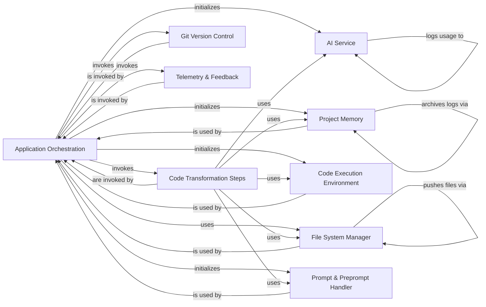

## Component Details

This graph illustrates the core components and their interactions within the Application Orchestration subsystem of GPT-Engineer. The Application Orchestration component serves as the central coordinator, managing the overall CLI application flow, user interactions, project setup, and orchestrating AI-driven code generation and improvement processes. It initializes and utilizes various other components such as AI Service, Project Memory, Code Execution Environment, and interacts with File System Manager, Code Transformation Steps, Git Version Control, and Telemetry & Feedback to achieve its functionality.

### Application Orchestration
Manages the overall flow of the GPT-Engineer CLI application, including user interaction, project setup, AI agent initialization, and orchestrating code generation and improvement steps. It integrates various core functionalities and handles different operational modes (e.g., clarify, lite, self-heal). It also encapsulates the core logic for driving the AI-powered code generation and improvement process, orchestrating interactions between the AI, memory, execution environment, and specific code transformation steps.

**Related Classes/Methods**:

- <a href="https://github.com/gpt-engineer-org/gpt-engineer/blob/master/gpt_engineer/applications/cli/main.py#L281-L557" target="_blank" rel="noopener noreferrer">`gpt-engineer.gpt_engineer.applications.cli.main` (281:557)</a>
- <a href="https://github.com/gpt-engineer-org/gpt-engineer/blob/master/gpt_engineer/applications/cli/main.py#L281-L557" target="_blank" rel="noopener noreferrer">`gpt-engineer.gpt_engineer.applications.cli.main:main` (281:557)</a>
- <a href="https://github.com/gpt-engineer-org/gpt-engineer/blob/master/gpt_engineer/applications/cli/main.py#L71-L90" target="_blank" rel="noopener noreferrer">`gpt-engineer.gpt_engineer.applications.cli.main:load_env_if_needed` (71:90)</a>
- <a href="https://github.com/gpt-engineer-org/gpt-engineer/blob/master/gpt_engineer/applications/cli/main.py#L105-L170" target="_blank" rel="noopener noreferrer">`gpt-engineer.gpt_engineer.applications.cli.main:load_prompt` (105:170)</a>
- <a href="https://github.com/gpt-engineer-org/gpt-engineer/blob/master/gpt_engineer/applications/cli/main.py#L173-L200" target="_blank" rel="noopener noreferrer">`gpt-engineer.gpt_engineer.applications.cli.main:get_preprompts_path` (173:200)</a>
- <a href="https://github.com/gpt-engineer-org/gpt-engineer/blob/master/gpt_engineer/applications/cli/main.py#L203-L229" target="_blank" rel="noopener noreferrer">`gpt-engineer.gpt_engineer.applications.cli.main:compare` (203:229)</a>
- <a href="https://github.com/gpt-engineer-org/gpt-engineer/blob/master/gpt_engineer/applications/cli/main.py#L232-L240" target="_blank" rel="noopener noreferrer">`gpt-engineer.gpt_engineer.applications.cli.main:prompt_yesno` (232:240)</a>
- <a href="https://github.com/gpt-engineer-org/gpt-engineer/blob/master/gpt_engineer/applications/cli/main.py#L243-L251" target="_blank" rel="noopener noreferrer">`gpt-engineer.gpt_engineer.applications.cli.main:get_system_info` (243:251)</a>
- <a href="https://github.com/gpt-engineer-org/gpt-engineer/blob/master/gpt_engineer/applications/cli/main.py#L254-L264" target="_blank" rel="noopener noreferrer">`gpt-engineer.gpt_engineer.applications.cli.main:get_installed_packages` (254:264)</a>
- <a href="https://github.com/gpt-engineer-org/gpt-engineer/blob/master/gpt_engineer/applications/cli/main.py#L267-L268" target="_blank" rel="noopener noreferrer">`gpt-engineer.gpt_engineer.applications.cli.main:format_installed_packages` (267:268)</a>
- <a href="https://github.com/gpt-engineer-org/gpt-engineer/blob/master/gpt_engineer/applications/cli/main.py#L93-L102" target="_blank" rel="noopener noreferrer">`gpt-engineer.gpt_engineer.applications.cli.main.concatenate_paths` (93:102)</a>
- <a href="https://github.com/gpt-engineer-org/gpt-engineer/blob/master/gpt_engineer/applications/cli/cli_agent.py#L36-L232" target="_blank" rel="noopener noreferrer">`gpt-engineer.gpt_engineer.applications.cli.cli_agent.CliAgent` (36:232)</a>
- <a href="https://github.com/gpt-engineer-org/gpt-engineer/blob/master/gpt_engineer/applications/cli/cli_agent.py#L84-L100" target="_blank" rel="noopener noreferrer">`gpt-engineer.gpt_engineer.applications.cli.cli_agent.CliAgent:__init__` (84:100)</a>
- <a href="https://github.com/gpt-engineer-org/gpt-engineer/blob/master/gpt_engineer/applications/cli/cli_agent.py#L103-L150" target="_blank" rel="noopener noreferrer">`gpt-engineer.gpt_engineer.applications.cli.cli_agent.CliAgent:with_default_config` (103:150)</a>
- <a href="https://github.com/gpt-engineer-org/gpt-engineer/blob/master/gpt_engineer/applications/cli/cli_agent.py#L152-L183" target="_blank" rel="noopener noreferrer">`gpt-engineer.gpt_engineer.applications.cli.cli_agent.CliAgent:init` (152:183)</a>
- <a href="https://github.com/gpt-engineer-org/gpt-engineer/blob/master/gpt_engineer/applications/cli/cli_agent.py#L185-L232" target="_blank" rel="noopener noreferrer">`gpt-engineer.gpt_engineer.applications.cli.cli_agent.CliAgent:improve` (185:232)</a>

### AI Service
Provides an interface for interacting with large language models, handling model selection, configuration (e.g., temperature, Azure endpoint), and managing the logging of token usage and associated costs. It abstracts the underlying AI provider details.

**Related Classes/Methods**:

- <a href="https://github.com/gpt-engineer-org/gpt-engineer/blob/master/gpt_engineer/core/ai.py#L50-L379" target="_blank" rel="noopener noreferrer">`gpt-engineer.gpt_engineer.core.ai.AI` (50:379)</a>
- <a href="https://github.com/gpt-engineer-org/gpt-engineer/blob/master/gpt_engineer/core/ai.py#L386-L437" target="_blank" rel="noopener noreferrer">`gpt-engineer.gpt_engineer.core.ai.ClipboardAI` (386:437)</a>
- <a href="https://github.com/gpt-engineer-org/gpt-engineer/blob/master/gpt_engineer/core/token_usage.py#L180-L297" target="_blank" rel="noopener noreferrer">`gpt-engineer.gpt_engineer.core.token_usage.TokenUsageLog` (180:297)</a>
- <a href="https://github.com/gpt-engineer-org/gpt-engineer/blob/master/gpt_engineer/core/token_usage.py#L251-L260" target="_blank" rel="noopener noreferrer">`gpt-engineer.gpt_engineer.core.token_usage.TokenUsageLog.is_openai_model` (251:260)</a>
- <a href="https://github.com/gpt-engineer-org/gpt-engineer/blob/master/gpt_engineer/core/token_usage.py#L273-L297" target="_blank" rel="noopener noreferrer">`gpt-engineer.gpt_engineer.core.token_usage.TokenUsageLog.usage_cost` (273:297)</a>
- <a href="https://github.com/gpt-engineer-org/gpt-engineer/blob/master/gpt_engineer/core/token_usage.py#L262-L271" target="_blank" rel="noopener noreferrer">`gpt-engineer.gpt_engineer.core.token_usage.TokenUsageLog.total_tokens` (262:271)</a>

### Project Memory
Manages the persistent storage and retrieval of project-related data, including prompts, generated files, and logs. It provides disk-based memory capabilities and handles archiving of historical data.

**Related Classes/Methods**:

- <a href="https://github.com/gpt-engineer-org/gpt-engineer/blob/master/gpt_engineer/core/default/disk_memory.py#L36-L326" target="_blank" rel="noopener noreferrer">`gpt-engineer.gpt_engineer.core.default.disk_memory.DiskMemory` (36:326)</a>
- <a href="https://github.com/gpt-engineer-org/gpt-engineer/blob/master/gpt_engineer/core/default/disk_memory.py#L116-L142" target="_blank" rel="noopener noreferrer">`gpt-engineer.gpt_engineer.core.default.disk_memory.DiskMemory.get` (116:142)</a>
- <a href="https://github.com/gpt-engineer-org/gpt-engineer/blob/master/gpt_engineer/core/default/disk_memory.py#L318-L326" target="_blank" rel="noopener noreferrer">`gpt-engineer.gpt_engineer.core.default.disk_memory.DiskMemory.archive_logs` (318:326)</a>
- <a href="https://github.com/gpt-engineer-org/gpt-engineer/blob/master/gpt_engineer/core/default/paths.py#L55-L69" target="_blank" rel="noopener noreferrer">`gpt-engineer.gpt_engineer.core.default.paths.memory_path` (55:69)</a>

### Code Execution Environment
Provides a sandboxed environment for executing the generated or improved code. It abstracts the details of running code, typically on the local disk, allowing the agent to test and validate its outputs.

**Related Classes/Methods**:

- <a href="https://github.com/gpt-engineer-org/gpt-engineer/blob/master/gpt_engineer/core/default/disk_execution_env.py#L36-L111" target="_blank" rel="noopener noreferrer">`gpt-engineer.gpt_engineer.core.default.disk_execution_env.DiskExecutionEnv` (36:111)</a>

### Code Transformation Steps
A collection of modular functions that define the distinct phases of the code generation and improvement pipeline. These steps include generating initial code, creating entry points, executing code, and applying iterative improvements based on AI feedback.

**Related Classes/Methods**:

- <a href="https://github.com/gpt-engineer-org/gpt-engineer/blob/master/gpt_engineer/core/default/steps.py#L121-L150" target="_blank" rel="noopener noreferrer">`gpt-engineer.gpt_engineer.core.default.steps.gen_code` (121:150)</a>
- <a href="https://github.com/gpt-engineer-org/gpt-engineer/blob/master/gpt_engineer/core/default/steps.py#L153-L202" target="_blank" rel="noopener noreferrer">`gpt-engineer.gpt_engineer.core.default.steps.gen_entrypoint` (153:202)</a>
- <a href="https://github.com/gpt-engineer-org/gpt-engineer/blob/master/gpt_engineer/core/default/steps.py#L205-L268" target="_blank" rel="noopener noreferrer">`gpt-engineer.gpt_engineer.core.default.steps.execute_entrypoint` (205:268)</a>
- <a href="https://github.com/gpt-engineer-org/gpt-engineer/blob/master/gpt_engineer/core/default/steps.py#L271-L312" target="_blank" rel="noopener noreferrer">`gpt-engineer.gpt_engineer.core.default.steps.improve_fn` (271:312)</a>
- <a href="https://github.com/gpt-engineer-org/gpt-engineer/blob/master/gpt_engineer/core/default/steps.py#L376-L397" target="_blank" rel="noopener noreferrer">`gpt-engineer.gpt_engineer.core.default.steps.handle_improve_mode` (376:397)</a>

### File System Manager
Handles the representation and manipulation of project files, treating them as a dictionary-like structure (`FilesDict`). It also provides functionalities for storing files to disk, performing code linting, and enabling interactive file selection for improvement modes.

**Related Classes/Methods**:

- <a href="https://github.com/gpt-engineer-org/gpt-engineer/blob/master/gpt_engineer/core/files_dict.py#L19-L89" target="_blank" rel="noopener noreferrer">`gpt-engineer.gpt_engineer.core.files_dict.FilesDict` (19:89)</a>
- <a href="https://github.com/gpt-engineer-org/gpt-engineer/blob/master/gpt_engineer/core/default/file_store.py#L10-L62" target="_blank" rel="noopener noreferrer">`gpt-engineer.gpt_engineer.core.default.file_store.FileStore` (10:62)</a>
- <a href="https://github.com/gpt-engineer-org/gpt-engineer/blob/master/gpt_engineer/core/default/file_store.py#L47-L50" target="_blank" rel="noopener noreferrer">`gpt-engineer.gpt_engineer.core.default.file_store.FileStore.linting` (47:50)</a>
- <a href="https://github.com/gpt-engineer-org/gpt-engineer/blob/master/gpt_engineer/core/default/file_store.py#L39-L45" target="_blank" rel="noopener noreferrer">`gpt-engineer.gpt_engineer.core.default.file_store.FileStore.push` (39:45)</a>
- <a href="https://github.com/gpt-engineer-org/gpt-engineer/blob/master/gpt_engineer/applications/cli/file_selector.py#L35-L416" target="_blank" rel="noopener noreferrer">`gpt-engineer.gpt_engineer.applications.cli.file_selector.FileSelector` (35:416)</a>
- <a href="https://github.com/gpt-engineer-org/gpt-engineer/blob/master/gpt_engineer/applications/cli/file_selector.py#L79-L121" target="_blank" rel="noopener noreferrer">`gpt-engineer.gpt_engineer.applications.cli.file_selector.FileSelector.ask_for_files` (79:121)</a>

### Prompt & Preprompt Handler
Manages the creation, loading, and utilization of prompts and predefined 'preprompts' that guide the AI's behavior. It ensures that the AI receives the necessary contextual information for effective code generation.

**Related Classes/Methods**:

- <a href="https://github.com/gpt-engineer-org/gpt-engineer/blob/master/gpt_engineer/core/prompt.py#L6-L44" target="_blank" rel="noopener noreferrer">`gpt-engineer.gpt_engineer.core.prompt.Prompt` (6:44)</a>
- <a href="https://github.com/gpt-engineer-org/gpt-engineer/blob/master/gpt_engineer/core/preprompts_holder.py#L7-L29" target="_blank" rel="noopener noreferrer">`gpt-engineer.gpt_engineer.core.preprompts_holder.PrepromptsHolder` (7:29)</a>
- `gpt-engineer.gpt_engineer.core.default.paths.PREPROMPTS_PATH` (full file reference)

### Git Version Control
Integrates with Git to manage version control for the generated or improved code. It specifically handles staging uncommitted changes to ensure that the project's history is maintained.

**Related Classes/Methods**:

- <a href="https://github.com/gpt-engineer-org/gpt-engineer/blob/master/gpt_engineer/core/git.py#L71-L85" target="_blank" rel="noopener noreferrer">`gpt-engineer.gpt_engineer.core.git.stage_uncommitted_to_git` (71:85)</a>

### Telemetry & Feedback
Responsible for collecting and sending human review data and other telemetry, contributing to the ongoing improvement and analysis of the `gpt-engineer` system's performance.

**Related Classes/Methods**:

- <a href="https://github.com/gpt-engineer-org/gpt-engineer/blob/master/gpt_engineer/applications/cli/collect.py#L141-L177" target="_blank" rel="noopener noreferrer">`gpt-engineer.gpt_engineer.applications.cli.collect.collect_and_send_human_review` (141:177)</a>

### [FAQ](https://github.com/CodeBoarding/GeneratedOnBoardings/tree/main?tab=readme-ov-file#faq)