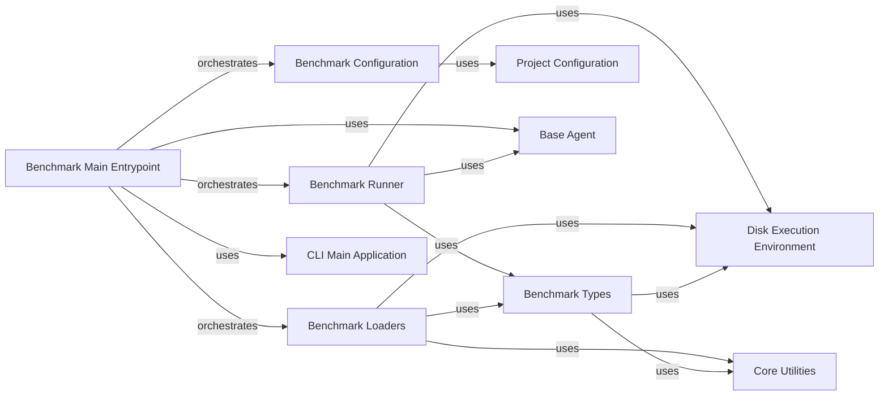

## Component Details

The Benchmarking System provides a comprehensive framework for evaluating the performance of AI agents in code generation tasks. Its main flow involves loading benchmark configurations, retrieving specific benchmark datasets, initializing an AI agent, executing benchmark tasks within a controlled environment, and finally, reporting and exporting the results. This system aims to offer a standardized and repeatable process for assessing agent capabilities.

### Benchmark Runner
This component is responsible for executing the benchmarks. It orchestrates the setup of the execution environment, uploads necessary files, runs the benchmark tasks, and processes the results.

**Related Classes/Methods**:

- <a href="https://github.com/gpt-engineer-org/gpt-engineer/blob/master/gpt_engineer/benchmark/run.py#L26-L87" target="_blank" rel="noopener noreferrer">`gpt-engineer.gpt_engineer.benchmark.run:run` (26:87)</a>
- <a href="https://github.com/gpt-engineer-org/gpt-engineer/blob/master/gpt_engineer/benchmark/run.py#L90-L136" target="_blank" rel="noopener noreferrer">`gpt-engineer.gpt_engineer.benchmark.run:print_results` (90:136)</a>
- <a href="https://github.com/gpt-engineer-org/gpt-engineer/blob/master/gpt_engineer/benchmark/run.py#L139-L150" target="_blank" rel="noopener noreferrer">`gpt-engineer.gpt_engineer.benchmark.run.export_yaml_results` (139:150)</a>

### Benchmark Configuration
This component handles the loading and parsing of benchmark configurations from TOML files and dictionaries. It defines the structure for different types of benchmarks (Apps, Mbpp, Gptme) and provides methods for resolving and converting configurations.

**Related Classes/Methods**:

- <a href="https://github.com/gpt-engineer-org/gpt-engineer/blob/master/gpt_engineer/benchmark/bench_config.py#L32-L69" target="_blank" rel="noopener noreferrer">`gpt-engineer.gpt_engineer.benchmark.bench_config.BenchConfig` (32:69)</a>
- <a href="https://github.com/gpt-engineer-org/gpt-engineer/blob/master/gpt_engineer/benchmark/bench_config.py#L40-L44" target="_blank" rel="noopener noreferrer">`gpt-engineer.gpt_engineer.benchmark.bench_config.BenchConfig:from_toml` (40:44)</a>
- <a href="https://github.com/gpt-engineer-org/gpt-engineer/blob/master/gpt_engineer/benchmark/bench_config.py#L47-L52" target="_blank" rel="noopener noreferrer">`gpt-engineer.gpt_engineer.benchmark.bench_config.BenchConfig:from_dict` (47:52)</a>
- <a href="https://github.com/gpt-engineer-org/gpt-engineer/blob/master/gpt_engineer/benchmark/bench_config.py#L55-L60" target="_blank" rel="noopener noreferrer">`gpt-engineer.gpt_engineer.benchmark.bench_config.BenchConfig:recursive_resolve` (55:60)</a>
- <a href="https://github.com/gpt-engineer-org/gpt-engineer/blob/master/gpt_engineer/benchmark/bench_config.py#L62-L69" target="_blank" rel="noopener noreferrer">`gpt-engineer.gpt_engineer.benchmark.bench_config.BenchConfig:to_dict` (62:69)</a>
- <a href="https://github.com/gpt-engineer-org/gpt-engineer/blob/master/gpt_engineer/benchmark/bench_config.py#L10-L16" target="_blank" rel="noopener noreferrer">`gpt-engineer.gpt_engineer.benchmark.bench_config.AppsConfig` (10:16)</a>
- <a href="https://github.com/gpt-engineer-org/gpt-engineer/blob/master/gpt_engineer/benchmark/bench_config.py#L20-L23" target="_blank" rel="noopener noreferrer">`gpt-engineer.gpt_engineer.benchmark.bench_config.MbppConfig` (20:23)</a>
- <a href="https://github.com/gpt-engineer-org/gpt-engineer/blob/master/gpt_engineer/benchmark/bench_config.py#L27-L28" target="_blank" rel="noopener noreferrer">`gpt-engineer.gpt_engineer.benchmark.bench_config.GptmeConfig` (27:28)</a>

### Benchmark Main Entrypoint
This is the primary entry point for the benchmark subsystem. It loads environment variables, configures the benchmark, retrieves the appropriate benchmark and agent, runs the benchmark, and handles result reporting and export.

**Related Classes/Methods**:

- <a href="https://github.com/gpt-engineer-org/gpt-engineer/blob/master/gpt_engineer/benchmark/__main__.py#L71-L150" target="_blank" rel="noopener noreferrer">`gpt-engineer.gpt_engineer.benchmark.__main__:main` (71:150)</a>
- <a href="https://github.com/gpt-engineer-org/gpt-engineer/blob/master/gpt_engineer/benchmark/__main__.py#L43-L60" target="_blank" rel="noopener noreferrer">`gpt-engineer.gpt_engineer.benchmark.__main__.get_agent` (43:60)</a>

### Benchmark Types
This component defines the fundamental data structures used throughout the benchmark system, including Assertable for defining assertions, TaskResult for storing benchmark outcomes, Task for individual benchmark tasks, and Benchmark for a collection of tasks.

**Related Classes/Methods**:

- <a href="https://github.com/gpt-engineer-org/gpt-engineer/blob/master/gpt_engineer/benchmark/types.py#L33-L49" target="_blank" rel="noopener noreferrer">`gpt-engineer.gpt_engineer.benchmark.types.Assertable` (33:49)</a>
- <a href="https://github.com/gpt-engineer-org/gpt-engineer/blob/master/gpt_engineer/benchmark/types.py#L74-L94" target="_blank" rel="noopener noreferrer">`gpt-engineer.gpt_engineer.benchmark.types.TaskResult` (74:94)</a>
- <a href="https://github.com/gpt-engineer-org/gpt-engineer/blob/master/gpt_engineer/benchmark/types.py#L56-L61" target="_blank" rel="noopener noreferrer">`gpt-engineer.gpt_engineer.benchmark.types.Task` (56:61)</a>
- <a href="https://github.com/gpt-engineer-org/gpt-engineer/blob/master/gpt_engineer/benchmark/types.py#L65-L70" target="_blank" rel="noopener noreferrer">`gpt-engineer.gpt_engineer.benchmark.types.Benchmark` (65:70)</a>

### Benchmark Loaders
This component is responsible for loading specific benchmark datasets and converting them into a standardized format for execution. It includes loaders for 'Apps', 'Mbpp', and 'Gptme' benchmarks, each with its own assertion logic.

**Related Classes/Methods**:

- <a href="https://github.com/gpt-engineer-org/gpt-engineer/blob/master/gpt_engineer/benchmark/benchmarks/apps/load.py#L64-L118" target="_blank" rel="noopener noreferrer">`gpt-engineer.gpt_engineer.benchmark.benchmarks.apps.load:load_apps` (64:118)</a>
- <a href="https://github.com/gpt-engineer-org/gpt-engineer/blob/master/gpt_engineer/benchmark/benchmarks/apps/load.py#L30-L32" target="_blank" rel="noopener noreferrer">`gpt-engineer.gpt_engineer.benchmark.benchmarks.apps.load.AppsAssertion:__init__` (30:32)</a>
- <a href="https://github.com/gpt-engineer-org/gpt-engineer/blob/master/gpt_engineer/benchmark/benchmarks/apps/load.py#L34-L46" target="_blank" rel="noopener noreferrer">`gpt-engineer.gpt_engineer.benchmark.benchmarks.apps.load.AppsAssertion:evaluate` (34:46)</a>
- <a href="https://github.com/gpt-engineer-org/gpt-engineer/blob/master/gpt_engineer/benchmark/benchmarks/apps/load.py#L48-L49" target="_blank" rel="noopener noreferrer">`gpt-engineer.gpt_engineer.benchmark.benchmarks.apps.load.AppsAssertion._format` (48:49)</a>
- <a href="https://github.com/gpt-engineer-org/gpt-engineer/blob/master/gpt_engineer/benchmark/benchmarks/apps/load.py#L52-L61" target="_blank" rel="noopener noreferrer">`gpt-engineer.gpt_engineer.benchmark.benchmarks.apps.load._get_dataset` (52:61)</a>
- <a href="https://github.com/gpt-engineer-org/gpt-engineer/blob/master/gpt_engineer/benchmark/benchmarks/gptme/load.py#L19-L104" target="_blank" rel="noopener noreferrer">`gpt-engineer.gpt_engineer.benchmark.benchmarks.gptme.load:load_gptme` (19:104)</a>
- <a href="https://github.com/gpt-engineer-org/gpt-engineer/blob/master/gpt_engineer/benchmark/benchmarks/mbpp/load.py#L33-L49" target="_blank" rel="noopener noreferrer">`gpt-engineer.gpt_engineer.benchmark.benchmarks.mbpp.load.MbppAssertion:evaluate` (33:49)</a>
- <a href="https://github.com/gpt-engineer-org/gpt-engineer/blob/master/gpt_engineer/benchmark/benchmarks/mbpp/load.py#L64-L114" target="_blank" rel="noopener noreferrer">`gpt-engineer.gpt_engineer.benchmark.benchmarks.mbpp.load:load_mbpp` (64:114)</a>
- <a href="https://github.com/gpt-engineer-org/gpt-engineer/blob/master/gpt_engineer/benchmark/benchmarks/mbpp/load.py#L52-L61" target="_blank" rel="noopener noreferrer">`gpt-engineer.gpt_engineer.benchmark.benchmarks.mbpp.load._get_dataset` (52:61)</a>
- <a href="https://github.com/gpt-engineer-org/gpt-engineer/blob/master/gpt_engineer/benchmark/benchmarks/mbpp/load.py#L29-L49" target="_blank" rel="noopener noreferrer">`gpt-engineer.gpt_engineer.benchmark.benchmarks.mbpp.load.MbppAssertion` (29:49)</a>
- <a href="https://github.com/gpt-engineer-org/gpt-engineer/blob/master/gpt_engineer/benchmark/benchmarks/load.py#L25-L48" target="_blank" rel="noopener noreferrer">`gpt-engineer.gpt_engineer.benchmark.benchmarks.load:get_benchmark` (25:48)</a>

### Disk Execution Environment
This core component provides an interface for executing code within a disk-based environment. It allows for uploading files and running processes, which is crucial for testing the generated code in a controlled setting.

**Related Classes/Methods**:

- `gpt-engineer.core.default.disk_execution_env.DiskExecutionEnv` (full file reference)
- `gpt-engineer.core.default.disk_execution_env.DiskExecutionEnv:upload` (full file reference)
- `gpt-engineer.core.default.disk_execution_env.DiskExecutionEnv:popen` (full file reference)

### Project Configuration
This core component is responsible for reading project-level configurations, which can influence how benchmarks are set up or how the GPT-Engineer agent operates.

**Related Classes/Methods**:

- `gpt-engineer.core.project_config:read_config` (full file reference)

### CLI Main Application
This component represents the main command-line interface application. It includes functionality for loading environment variables, which is a prerequisite for running the benchmark.

**Related Classes/Methods**:

- `gpt-engineer.applications.cli.main:load_env_if_needed` (full file reference)

### Core Utilities
This component encompasses fundamental utility classes used across the GPT-Engineer project, including Prompt for managing prompts and FilesDict for handling file structures.

**Related Classes/Methods**:

- `gpt-engineer.core.prompt.Prompt` (full file reference)
- `gpt-engineer.core.files_dict.FilesDict` (full file reference)

### Base Agent
This component defines the abstract base class for AI agents, providing an interface for their interaction with the execution environment and memory.

**Related Classes/Methods**:

- `gpt-engineer.core.base_agent.BaseAgent` (full file reference)

### [FAQ](https://github.com/CodeBoarding/GeneratedOnBoardings/tree/main?tab=readme-ov-file#faq)