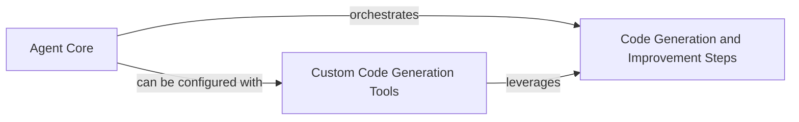

## Component Details

The Code Generation and Improvement system forms the intelligent core of gpt-engineer, responsible for the entire lifecycle of software creation and refinement. It encompasses the AI agents that orchestrate the process, the fundamental steps for generating and modifying code, and specialized tools for advanced functionalities like self-healing and interactive clarification. This system defines how an AI agent translates high-level prompts into functional code, iteratively improves it, and handles execution feedback.

### Agent Core
This component represents the fundamental intelligence and operational capabilities of the gpt-engineer system, primarily through the `SimpleAgent` and its base `BaseAgent`. It manages the core processes of initiating code generation and iteratively improving existing code by delegating to specialized steps.

**Related Classes/Methods**:

- <a href="https://github.com/gpt-engineer-org/gpt-engineer/blob/master/gpt_engineer/core/default/simple_agent.py#L27-L88" target="_blank" rel="noopener noreferrer">`gpt-engineer.gpt_engineer.core.default.simple_agent.SimpleAgent` (27:88)</a>
- <a href="https://github.com/gpt-engineer-org/gpt-engineer/blob/master/gpt_engineer/core/base_agent.py#L17-L31" target="_blank" rel="noopener noreferrer">`gpt-engineer.gpt_engineer.core.base_agent.BaseAgent` (17:31)</a>
- <a href="https://github.com/gpt-engineer-org/gpt-engineer/blob/master/gpt_engineer/applications/cli/cli_agent.py#L36-L232" target="_blank" rel="noopener noreferrer">`gpt-engineer.gpt_engineer.applications.cli.cli_agent.CliAgent` (36:232)</a>

### Code Generation and Improvement Steps
This component provides a collection of atomic functions and routines that constitute the building blocks for the gpt-engineer's code generation and improvement pipeline. It includes functionalities for generating code, creating executable entry points, executing generated code, and managing the iterative refinement process, including salvaging correct code hunks.

**Related Classes/Methods**:

- <a href="https://github.com/gpt-engineer-org/gpt-engineer/blob/master/gpt_engineer/core/default/steps.py#L121-L150" target="_blank" rel="noopener noreferrer">`gpt-engineer.gpt_engineer.core.default.steps:gen_code` (121:150)</a>
- <a href="https://github.com/gpt-engineer-org/gpt-engineer/blob/master/gpt_engineer/core/default/steps.py#L153-L202" target="_blank" rel="noopener noreferrer">`gpt-engineer.gpt_engineer.core.default.steps:gen_entrypoint` (153:202)</a>
- <a href="https://github.com/gpt-engineer-org/gpt-engineer/blob/master/gpt_engineer/core/default/steps.py#L271-L312" target="_blank" rel="noopener noreferrer">`gpt-engineer.gpt_engineer.core.default.steps:improve_fn` (271:312)</a>
- <a href="https://github.com/gpt-engineer-org/gpt-engineer/blob/master/gpt_engineer/core/default/steps.py#L315-L338" target="_blank" rel="noopener noreferrer">`gpt-engineer.gpt_engineer.core.default.steps:_improve_loop` (315:338)</a>
- <a href="https://github.com/gpt-engineer-org/gpt-engineer/blob/master/gpt_engineer/core/default/steps.py#L341-L360" target="_blank" rel="noopener noreferrer">`gpt-engineer.gpt_engineer.core.default.steps:salvage_correct_hunks` (341:360)</a>
- <a href="https://github.com/gpt-engineer-org/gpt-engineer/blob/master/gpt_engineer/core/default/steps.py#L376-L397" target="_blank" rel="noopener noreferrer">`gpt-engineer.gpt_engineer.core.default.steps:handle_improve_mode` (376:397)</a>
- <a href="https://github.com/gpt-engineer-org/gpt-engineer/blob/master/gpt_engineer/core/default/steps.py#L205-L268" target="_blank" rel="noopener noreferrer">`gpt-engineer.gpt_engineer.core.default.steps:execute_entrypoint` (205:268)</a>

### Custom Code Generation Tools
This component contains specialized utility functions that extend the code generation and improvement capabilities of the gpt-engineer system. These tools provide advanced or alternative methods for code generation and refinement, such as self-healing or clarified generation.

**Related Classes/Methods**:

- <a href="https://github.com/gpt-engineer-org/gpt-engineer/blob/master/gpt_engineer/tools/custom_steps.py#L40-L119" target="_blank" rel="noopener noreferrer">`gpt-engineer.gpt_engineer.tools.custom_steps:self_heal` (40:119)</a>
- <a href="https://github.com/gpt-engineer-org/gpt-engineer/blob/master/gpt_engineer/tools/custom_steps.py#L122-L195" target="_blank" rel="noopener noreferrer">`gpt-engineer.gpt_engineer.tools.custom_steps:clarified_gen` (122:195)</a>
- <a href="https://github.com/gpt-engineer-org/gpt-engineer/blob/master/gpt_engineer/tools/custom_steps.py#L198-L233" target="_blank" rel="noopener noreferrer">`gpt-engineer.gpt_engineer.tools.custom_steps:lite_gen` (198:233)</a>

### [FAQ](https://github.com/CodeBoarding/GeneratedOnBoardings/tree/main?tab=readme-ov-file#faq)