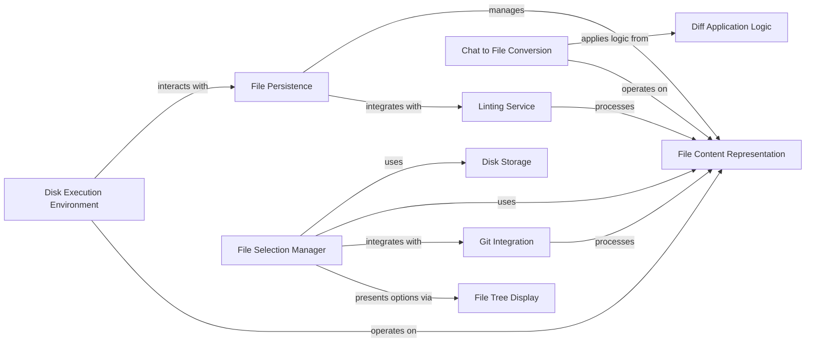

## Component Details

The 'File and Environment Management' subsystem provides a comprehensive set of functionalities for handling files, directories, and the execution environment. It encompasses data structures for file content representation, mechanisms for persistent storage on disk, and services for reading/writing files. The subsystem also includes capabilities for applying code differences, interacting with Git repositories, and executing generated code within a controlled environment. Additionally, it offers utilities for interactive file selection and code linting to ensure quality and proper project setup.

### File Content Representation
A fundamental data structure, FilesDict, that maps file paths to their content, enabling efficient transfer and manipulation of file data across various components. It also provides utilities for converting file content to a chat-friendly format.

**Related Classes/Methods**:

- <a href="https://github.com/gpt-engineer-org/gpt-engineer/blob/master/gpt_engineer/core/files_dict.py#L19-L89" target="_blank" rel="noopener noreferrer">`gpt-engineer.gpt_engineer.core.files_dict.FilesDict` (19:89)</a>
- <a href="https://github.com/gpt-engineer-org/gpt-engineer/blob/master/gpt_engineer/core/files_dict.py#L55-L72" target="_blank" rel="noopener noreferrer">`gpt-engineer.gpt_engineer.core.files_dict.FilesDict:to_chat` (55:72)</a>
- <a href="https://github.com/gpt-engineer-org/gpt-engineer/blob/master/gpt_engineer/core/files_dict.py#L92-L115" target="_blank" rel="noopener noreferrer">`gpt-engineer.gpt_engineer.core.files_dict.file_to_lines_dict` (92:115)</a>

### Disk Storage
Implements a disk-based key-value store, DiskMemory, for persistent storage of various data, including configuration and logs. It provides methods for retrieving, storing, and managing data on the file system.

**Related Classes/Methods**:

- <a href="https://github.com/gpt-engineer-org/gpt-engineer/blob/master/gpt_engineer/core/default/disk_memory.py#L36-L326" target="_blank" rel="noopener noreferrer">`gpt-engineer.gpt_engineer.core.default.disk_memory.DiskMemory` (36:326)</a>
- <a href="https://github.com/gpt-engineer-org/gpt-engineer/blob/master/gpt_engineer/core/default/disk_memory.py#L116-L142" target="_blank" rel="noopener noreferrer">`gpt-engineer.gpt_engineer.core.default.disk_memory.DiskMemory:get` (116:142)</a>
- <a href="https://github.com/gpt-engineer-org/gpt-engineer/blob/master/gpt_engineer/core/default/disk_memory.py#L216-L226" target="_blank" rel="noopener noreferrer">`gpt-engineer.gpt_engineer.core.default.disk_memory.DiskMemory:__len__` (216:226)</a>
- <a href="https://github.com/gpt-engineer-org/gpt-engineer/blob/master/gpt_engineer/core/default/disk_memory.py#L243-L262" target="_blank" rel="noopener noreferrer">`gpt-engineer.gpt_engineer.core.default.disk_memory.DiskMemory:to_path_list_string` (243:262)</a>
- <a href="https://github.com/gpt-engineer-org/gpt-engineer/blob/master/gpt_engineer/core/default/disk_memory.py#L276-L286" target="_blank" rel="noopener noreferrer">`gpt-engineer.gpt_engineer.core.default.disk_memory.DiskMemory:to_json` (276:286)</a>
- <a href="https://github.com/gpt-engineer-org/gpt-engineer/blob/master/gpt_engineer/core/default/disk_memory.py#L318-L326" target="_blank" rel="noopener noreferrer">`gpt-engineer.gpt_engineer.core.default.disk_memory.DiskMemory.archive_logs` (318:326)</a>

### File Persistence
Manages the reading and writing of FilesDict objects to and from the disk. It acts as an abstraction layer for file system interactions and integrates with the linting service to ensure code quality during file operations.

**Related Classes/Methods**:

- <a href="https://github.com/gpt-engineer-org/gpt-engineer/blob/master/gpt_engineer/core/default/file_store.py#L10-L62" target="_blank" rel="noopener noreferrer">`gpt-engineer.gpt_engineer.core.default.file_store.FileStore` (10:62)</a>
- <a href="https://github.com/gpt-engineer-org/gpt-engineer/blob/master/gpt_engineer/core/default/file_store.py#L47-L50" target="_blank" rel="noopener noreferrer">`gpt-engineer.gpt_engineer.core.default.file_store.FileStore:linting` (47:50)</a>
- <a href="https://github.com/gpt-engineer-org/gpt-engineer/blob/master/gpt_engineer/core/default/file_store.py#L52-L62" target="_blank" rel="noopener noreferrer">`gpt-engineer.gpt_engineer.core.default.file_store.FileStore:pull` (52:62)</a>
- <a href="https://github.com/gpt-engineer-org/gpt-engineer/blob/master/gpt_engineer/core/default/file_store.py#L39-L45" target="_blank" rel="noopener noreferrer">`gpt-engineer.gpt_engineer.core.default.file_store.FileStore:push` (39:45)</a>

### Disk Execution Environment
Provides a controlled environment for executing code and managing files directly on the disk. It facilitates uploading and downloading files, and executing shell commands within the project context.

**Related Classes/Methods**:

- <a href="https://github.com/gpt-engineer-org/gpt-engineer/blob/master/gpt_engineer/core/default/disk_execution_env.py#L36-L111" target="_blank" rel="noopener noreferrer">`gpt-engineer.gpt_engineer.core.default.disk_execution_env.DiskExecutionEnv` (36:111)</a>
- <a href="https://github.com/gpt-engineer-org/gpt-engineer/blob/master/gpt_engineer/core/default/disk_execution_env.py#L52-L53" target="_blank" rel="noopener noreferrer">`gpt-engineer.gpt_engineer.core.default.disk_execution_env.DiskExecutionEnv:__init__` (52:53)</a>
- <a href="https://github.com/gpt-engineer-org/gpt-engineer/blob/master/gpt_engineer/core/default/disk_execution_env.py#L55-L57" target="_blank" rel="noopener noreferrer">`gpt-engineer.gpt_engineer.core.default.disk_execution_env.DiskExecutionEnv:upload` (55:57)</a>
- <a href="https://github.com/gpt-engineer-org/gpt-engineer/blob/master/gpt_engineer/core/default/disk_execution_env.py#L59-L60" target="_blank" rel="noopener noreferrer">`gpt-engineer.gpt_engineer.core.default.disk_execution_env.DiskExecutionEnv:download` (59:60)</a>
- <a href="https://github.com/gpt-engineer-org/gpt-engineer/blob/master/gpt_engineer/core/default/disk_execution_env.py#L62-L70" target="_blank" rel="noopener noreferrer">`gpt-engineer.gpt_engineer.core.default.disk_execution_env.DiskExecutionEnv.popen` (62:70)</a>

### Chat to File Conversion
Responsible for interpreting chat responses, specifically extracting and applying code differences (diffs) to existing files or converting the chat content into a FilesDict representation. It handles the parsing of diff blocks and hunk headers.

**Related Classes/Methods**:

- <a href="https://github.com/gpt-engineer-org/gpt-engineer/blob/master/gpt_engineer/core/chat_to_files.py#L38-L66" target="_blank" rel="noopener noreferrer">`gpt-engineer.gpt_engineer.core.chat_to_files:chat_to_files_dict` (38:66)</a>
- <a href="https://github.com/gpt-engineer-org/gpt-engineer/blob/master/gpt_engineer/core/chat_to_files.py#L69-L120" target="_blank" rel="noopener noreferrer">`gpt-engineer.gpt_engineer.core.chat_to_files:apply_diffs` (69:120)</a>
- <a href="https://github.com/gpt-engineer-org/gpt-engineer/blob/master/gpt_engineer/core/chat_to_files.py#L123-L161" target="_blank" rel="noopener noreferrer">`gpt-engineer.gpt_engineer.core.chat_to_files:parse_diffs` (123:161)</a>
- <a href="https://github.com/gpt-engineer-org/gpt-engineer/blob/master/gpt_engineer/core/chat_to_files.py#L164-L218" target="_blank" rel="noopener noreferrer">`gpt-engineer.gpt_engineer.core.chat_to_files:parse_diff_block` (164:218)</a>
- <a href="https://github.com/gpt-engineer-org/gpt-engineer/blob/master/gpt_engineer/core/chat_to_files.py#L221-L245" target="_blank" rel="noopener noreferrer">`gpt-engineer.gpt_engineer.core.chat_to_files.parse_hunk_header` (221:245)</a>

### Diff Application Logic
Encapsulates the core functionalities for representing, validating, and applying diff hunks to file content. It includes methods for checking similarity between lines and managing the structure of diff hunks.

**Related Classes/Methods**:

- <a href="https://github.com/gpt-engineer-org/gpt-engineer/blob/master/gpt_engineer/core/diff.py#L44-L309" target="_blank" rel="noopener noreferrer">`gpt-engineer.gpt_engineer.core.diff.Hunk` (44:309)</a>
- <a href="https://github.com/gpt-engineer-org/gpt-engineer/blob/master/gpt_engineer/core/diff.py#L58-L78" target="_blank" rel="noopener noreferrer">`gpt-engineer.gpt_engineer.core.diff.Hunk:__init__` (58:78)</a>
- <a href="https://github.com/gpt-engineer-org/gpt-engineer/blob/master/gpt_engineer/core/diff.py#L122-L131" target="_blank" rel="noopener noreferrer">`gpt-engineer.gpt_engineer.core.diff.Hunk:check_start_line` (122:131)</a>
- <a href="https://github.com/gpt-engineer-org/gpt-engineer/blob/master/gpt_engineer/core/diff.py#L133-L198" target="_blank" rel="noopener noreferrer">`gpt-engineer.gpt_engineer.core.diff.Hunk:find_start_line` (133:198)</a>
- <a href="https://github.com/gpt-engineer-org/gpt-engineer/blob/master/gpt_engineer/core/diff.py#L200-L286" target="_blank" rel="noopener noreferrer">`gpt-engineer.gpt_engineer.core.diff.Hunk:validate_lines` (200:286)</a>
- <a href="https://github.com/gpt-engineer-org/gpt-engineer/blob/master/gpt_engineer/core/diff.py#L288-L309" target="_blank" rel="noopener noreferrer">`gpt-engineer.gpt_engineer.core.diff.Hunk:validate_and_correct` (288:309)</a>
- <a href="https://github.com/gpt-engineer-org/gpt-engineer/blob/master/gpt_engineer/core/diff.py#L98-L102" target="_blank" rel="noopener noreferrer">`gpt-engineer.gpt_engineer.core.diff.Hunk.add_lines` (98:102)</a>
- <a href="https://github.com/gpt-engineer-org/gpt-engineer/blob/master/gpt_engineer/core/diff.py#L104-L112" target="_blank" rel="noopener noreferrer">`gpt-engineer.gpt_engineer.core.diff.Hunk.hunk_to_string` (104:112)</a>
- <a href="https://github.com/gpt-engineer-org/gpt-engineer/blob/master/gpt_engineer/core/diff.py#L80-L83" target="_blank" rel="noopener noreferrer">`gpt-engineer.gpt_engineer.core.diff.Hunk.add_retained_line` (80:83)</a>
- <a href="https://github.com/gpt-engineer-org/gpt-engineer/blob/master/gpt_engineer/core/diff.py#L85-L90" target="_blank" rel="noopener noreferrer">`gpt-engineer.gpt_engineer.core.diff.Hunk.relabel_line` (85:90)</a>
- <a href="https://github.com/gpt-engineer-org/gpt-engineer/blob/master/gpt_engineer/core/diff.py#L114-L120" target="_blank" rel="noopener noreferrer">`gpt-engineer.gpt_engineer.core.diff.Hunk.make_forward_block` (114:120)</a>
- <a href="https://github.com/gpt-engineer-org/gpt-engineer/blob/master/gpt_engineer/core/diff.py#L92-L96" target="_blank" rel="noopener noreferrer">`gpt-engineer.gpt_engineer.core.diff.Hunk.pop_line` (92:96)</a>
- <a href="https://github.com/gpt-engineer-org/gpt-engineer/blob/master/gpt_engineer/core/diff.py#L312-L378" target="_blank" rel="noopener noreferrer">`gpt-engineer.gpt_engineer.core.diff.Diff` (312:378)</a>
- <a href="https://github.com/gpt-engineer-org/gpt-engineer/blob/master/gpt_engineer/core/diff.py#L381-L398" target="_blank" rel="noopener noreferrer">`gpt-engineer.gpt_engineer.core.diff:is_similar` (381:398)</a>
- <a href="https://github.com/gpt-engineer-org/gpt-engineer/blob/master/gpt_engineer/core/diff.py#L401-L419" target="_blank" rel="noopener noreferrer">`gpt-engineer.gpt_engineer.core.diff:count_ratio` (401:419)</a>

### Git Integration
Provides a set of utility functions for interacting with Git repositories, including checking Git installation and repository status, filtering files based on .gitignore, and staging changes.

**Related Classes/Methods**:

- <a href="https://github.com/gpt-engineer-org/gpt-engineer/blob/master/gpt_engineer/core/git.py#L71-L85" target="_blank" rel="noopener noreferrer">`gpt-engineer.gpt_engineer.core.git:stage_uncommitted_to_git` (71:85)</a>
- <a href="https://github.com/gpt-engineer-org/gpt-engineer/blob/master/gpt_engineer/core/git.py#L10-L11" target="_blank" rel="noopener noreferrer">`gpt-engineer.gpt_engineer.core.git.is_git_installed` (10:11)</a>
- <a href="https://github.com/gpt-engineer-org/gpt-engineer/blob/master/gpt_engineer/core/git.py#L14-L23" target="_blank" rel="noopener noreferrer">`gpt-engineer.gpt_engineer.core.git.is_git_repo` (14:23)</a>
- <a href="https://github.com/gpt-engineer-org/gpt-engineer/blob/master/gpt_engineer/core/git.py#L26-L27" target="_blank" rel="noopener noreferrer">`gpt-engineer.gpt_engineer.core.git.init_git_repo` (26:27)</a>
- <a href="https://github.com/gpt-engineer-org/gpt-engineer/blob/master/gpt_engineer/core/git.py#L41-L51" target="_blank" rel="noopener noreferrer">`gpt-engineer.gpt_engineer.core.git.filter_files_with_uncommitted_changes` (41:51)</a>
- <a href="https://github.com/gpt-engineer-org/gpt-engineer/blob/master/gpt_engineer/core/git.py#L54-L55" target="_blank" rel="noopener noreferrer">`gpt-engineer.gpt_engineer.core.git.stage_files` (54:55)</a>
- <a href="https://github.com/gpt-engineer-org/gpt-engineer/blob/master/gpt_engineer/core/git.py#L58-L68" target="_blank" rel="noopener noreferrer">`gpt-engineer.gpt_engineer.core.git.filter_by_gitignore` (58:68)</a>

### File Selection Manager
Manages the interactive process of selecting files for the project. It provides a terminal-based editor for file selection, persists selections to a TOML file using DiskMemory, and integrates with Git Integration for filtering.

**Related Classes/Methods**:

- <a href="https://github.com/gpt-engineer-org/gpt-engineer/blob/master/gpt_engineer/applications/cli/file_selector.py#L35-L416" target="_blank" rel="noopener noreferrer">`gpt-engineer.gpt_engineer.applications.cli.file_selector.FileSelector` (35:416)</a>
- <a href="https://github.com/gpt-engineer-org/gpt-engineer/blob/master/gpt_engineer/applications/cli/file_selector.py#L66-L77" target="_blank" rel="noopener noreferrer">`gpt-engineer.gpt_engineer.applications.cli.file_selector.FileSelector:__init__` (66:77)</a>
- <a href="https://github.com/gpt-engineer-org/gpt-engineer/blob/master/gpt_engineer/applications/cli/file_selector.py#L79-L121" target="_blank" rel="noopener noreferrer">`gpt-engineer.gpt_engineer.applications.cli.file_selector.FileSelector:ask_for_files` (79:121)</a>
- <a href="https://github.com/gpt-engineer-org/gpt-engineer/blob/master/gpt_engineer/applications/cli/file_selector.py#L123-L210" target="_blank" rel="noopener noreferrer">`gpt-engineer.gpt_engineer.applications.cli.file_selector.FileSelector:editor_file_selector` (123:210)</a>
- <a href="https://github.com/gpt-engineer-org/gpt-engineer/blob/master/gpt_engineer/applications/cli/file_selector.py#L271-L342" target="_blank" rel="noopener noreferrer">`gpt-engineer.gpt_engineer.applications.cli.file_selector.FileSelector:get_files_from_toml` (271:342)</a>
- <a href="https://github.com/gpt-engineer-org/gpt-engineer/blob/master/gpt_engineer/applications/cli/file_selector.py#L379-L416" target="_blank" rel="noopener noreferrer">`gpt-engineer.gpt_engineer.applications.cli.file_selector.FileSelector:get_current_files` (379:416)</a>
- <a href="https://github.com/gpt-engineer-org/gpt-engineer/blob/master/gpt_engineer/applications/cli/file_selector.py#L212-L247" target="_blank" rel="noopener noreferrer">`gpt-engineer.gpt_engineer.applications.cli.file_selector.FileSelector:open_with_default_editor` (212:247)</a>

### File Tree Display
A utility class for generating and displaying file system paths in a hierarchical, tree-like format. It is primarily used by the File Selection Manager to present file options to the user in a readable structure.

**Related Classes/Methods**:

- <a href="https://github.com/gpt-engineer-org/gpt-engineer/blob/master/gpt_engineer/applications/cli/file_selector.py#L464-L502" target="_blank" rel="noopener noreferrer">`gpt-engineer.gpt_engineer.applications.cli.file_selector.DisplayablePath:make_tree` (464:502)</a>
- <a href="https://github.com/gpt-engineer-org/gpt-engineer/blob/master/gpt_engineer/applications/cli/file_selector.py#L419-L540" target="_blank" rel="noopener noreferrer">`gpt-engineer.gpt_engineer.applications.cli.file_selector.DisplayablePath` (419:540)</a>
- <a href="https://github.com/gpt-engineer-org/gpt-engineer/blob/master/gpt_engineer/applications/cli/file_selector.py#L505-L509" target="_blank" rel="noopener noreferrer">`gpt-engineer.gpt_engineer.applications.cli.file_selector.DisplayablePath._default_criteria` (505:509)</a>

### Linting Service
Provides functionality to lint files, likely for enforcing code style and quality standards. It is integrated with the File Persistence component to perform linting during file operations.

**Related Classes/Methods**:

- <a href="https://github.com/gpt-engineer-org/gpt-engineer/blob/master/gpt_engineer/core/linting.py#L6-L64" target="_blank" rel="noopener noreferrer">`gpt-engineer.gpt_engineer.core.linting.Linting` (6:64)</a>
- <a href="https://github.com/gpt-engineer-org/gpt-engineer/blob/master/gpt_engineer/core/linting.py#L31-L64" target="_blank" rel="noopener noreferrer">`gpt-engineer.gpt_engineer.core.linting.Linting.lint_files` (31:64)</a>

### [FAQ](https://github.com/CodeBoarding/GeneratedOnBoardings/tree/main?tab=readme-ov-file#faq)