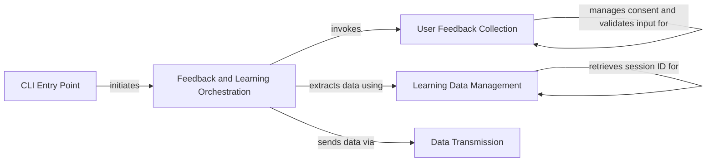

## Component Details

This subsystem manages the collection of human feedback on generated code to facilitate continuous improvement of the AI model. It handles user consent, gathers review data, extracts learning insights from user interactions, and transmits this data to an analytics platform. The main flow starts from the CLI entry point, which orchestrates the feedback collection, data structuring, and transmission processes.

### User Feedback Collection
This component is responsible for interactively gathering human review input from the user. It manages user consent for data collection and validates the input provided by the user regarding the performance and usefulness of the generated code. It utilizes the 'Review' dataclass to structure the collected feedback.

**Related Classes/Methods**:

- <a href="https://github.com/gpt-engineer-org/gpt-engineer/blob/master/gpt_engineer/applications/cli/learning.py#L122-L174" target="_blank" rel="noopener noreferrer">`gpt_engineer.applications.cli.learning:human_review_input` (122:174)</a>
- <a href="https://github.com/gpt-engineer-org/gpt-engineer/blob/master/gpt_engineer/applications/cli/learning.py#L183-L198" target="_blank" rel="noopener noreferrer">`gpt_engineer.applications.cli.learning:check_collection_consent` (183:198)</a>
- <a href="https://github.com/gpt-engineer-org/gpt-engineer/blob/master/gpt_engineer/applications/cli/learning.py#L177-L180" target="_blank" rel="noopener noreferrer">`gpt_engineer.applications.cli.learning.ask_for_valid_input` (177:180)</a>
- <a href="https://github.com/gpt-engineer-org/gpt-engineer/blob/master/gpt_engineer/applications/cli/learning.py#L201-L234" target="_blank" rel="noopener noreferrer">`gpt_engineer.applications.cli.learning.ask_collection_consent` (201:234)</a>
- <a href="https://github.com/gpt-engineer-org/gpt-engineer/blob/master/gpt_engineer/applications/cli/learning.py#L48-L70" target="_blank" rel="noopener noreferrer">`gpt_engineer.applications.cli.learning.Review` (48:70)</a>

### Learning Data Management
This component focuses on extracting and structuring comprehensive learning data from a GPT Engineer session. It encapsulates details such as the prompt, model used, temperature settings, configuration, logs, and the user's review. It also handles the generation or retrieval of a unique session identifier for tracking purposes, utilizing the 'Learning' dataclass for data representation.

**Related Classes/Methods**:

- <a href="https://github.com/gpt-engineer-org/gpt-engineer/blob/master/gpt_engineer/applications/cli/learning.py#L237-L276" target="_blank" rel="noopener noreferrer">`gpt_engineer.applications.cli.learning:extract_learning` (237:276)</a>
- <a href="https://github.com/gpt-engineer-org/gpt-engineer/blob/master/gpt_engineer/applications/cli/learning.py#L75-L109" target="_blank" rel="noopener noreferrer">`gpt_engineer.applications.cli.learning.Learning` (75:109)</a>
- <a href="https://github.com/gpt-engineer-org/gpt-engineer/blob/master/gpt_engineer/applications/cli/learning.py#L279-L301" target="_blank" rel="noopener noreferrer">`gpt_engineer.applications.cli.learning.get_session` (279:301)</a>

### Data Transmission
This component is dedicated to securely sending the collected learning data to an external analytics platform, specifically RudderStack. It includes mechanisms to handle potential data size limitations by truncating logs if the learning data exceeds the maximum allowed event size, ensuring successful transmission for analysis.

**Related Classes/Methods**:

- <a href="https://github.com/gpt-engineer-org/gpt-engineer/blob/master/gpt_engineer/applications/cli/collect.py#L37-L62" target="_blank" rel="noopener noreferrer">`gpt_engineer.applications.cli.collect:send_learning` (37:62)</a>

### Feedback and Learning Orchestration
This component orchestrates the entire workflow of collecting human review and learning data. It initiates the human review process, then gathers all relevant session data, and finally triggers the transmission of this data to the analytics platform. It acts as a central coordinator for the feedback and learning data pipeline.

**Related Classes/Methods**:

- <a href="https://github.com/gpt-engineer-org/gpt-engineer/blob/master/gpt_engineer/applications/cli/collect.py#L65-L124" target="_blank" rel="noopener noreferrer">`gpt_engineer.applications.cli.collect:collect_learnings` (65:124)</a>
- <a href="https://github.com/gpt-engineer-org/gpt-engineer/blob/master/gpt_engineer/applications/cli/collect.py#L141-L177" target="_blank" rel="noopener noreferrer">`gpt_engineer.applications.cli.collect:collect_and_send_human_review` (141:177)</a>

### CLI Entry Point
This component serves as the primary entry point for the GPT Engineer command-line interface. It is responsible for initializing the application, parsing command-line arguments, setting up the AI model, and ultimately initiating the process of collecting and sending human review data as part of the overall project generation or improvement flow.

**Related Classes/Methods**:

- <a href="https://github.com/gpt-engineer-org/gpt-engineer/blob/master/gpt_engineer/applications/cli/main.py#L281-L557" target="_blank" rel="noopener noreferrer">`gpt_engineer.applications.cli.main:main` (281:557)</a>

### [FAQ](https://github.com/CodeBoarding/GeneratedOnBoardings/tree/main?tab=readme-ov-file#faq)