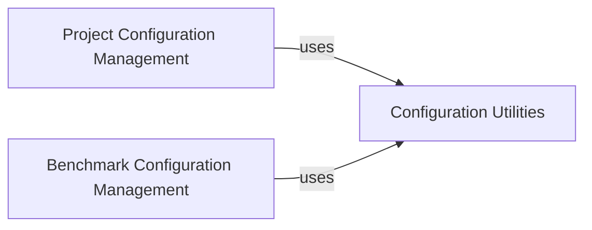

## Component Details

This graph illustrates the configuration management subsystem, which is divided into project-specific, benchmark-specific, and general utility components. The core functionality revolves around reading, writing, and converting configuration settings, primarily from and to TOML files. Both project and benchmark configuration components rely on shared utility functions for common tasks like reading TOML and filtering data.

### Project Configuration Management
This component is responsible for managing the core project configuration settings for the GPT Engineer CLI and gptengineer.app. It handles reading from and writing to TOML files, and converting configuration data between dictionary and TOML formats. It encapsulates various project-specific settings such as paths, execution commands, and application-specific configurations like project IDs and OpenAPI schemas.

**Related Classes/Methods**:

- `gpt_engineer.gpt_engineer.core.project_config.Config` (73:151)
- `gpt_engineer.gpt_engineer.core.project_config.Config.from_toml` (81:85)
- `gpt_engineer.gpt_engineer.core.project_config.Config.from_dict` (88:109)
- `gpt_engineer.gpt_engineer.core.project_config.Config.to_dict` (111:120)
- `gpt_engineer.gpt_engineer.core.project_config.Config.to_toml` (122:151)
- `gpt_engineer.gpt_engineer.core.project_config._RunConfig` (41:45)
- `gpt_engineer.gpt_engineer.core.project_config._PathsConfig` (35:37)
- `gpt_engineer.gpt_engineer.core.project_config._GptEngineerAppConfig` (54:56)
- `gpt_engineer.gpt_engineer.core.project_config._OpenApiConfig` (49:50)

### Benchmark Configuration Management
This component specifically handles benchmark-related configurations for the GPT Engineer project. It provides functionalities to load benchmark settings from TOML files and dictionaries, and to serialize them back into dictionaries. It manages configurations for different benchmark types, including apps, mbpp, and gptme.

**Related Classes/Methods**:

- `gpt_engineer.gpt_engineer.benchmark.bench_config.BenchConfig` (full file reference)
- `gpt_engineer.gpt_engineer.benchmark.bench_config.BenchConfig.from_toml` (full file reference)
- `gpt_engineer.gpt_engineer.benchmark.bench_config.BenchConfig.from_dict` (full file reference)
- `gpt_engineer.gpt_engineer.benchmark.bench_config.BenchConfig.to_dict` (full file reference)
- `gpt_engineer.gpt_engineer.benchmark.bench_config.AppsConfig` (full file reference)
- `gpt_engineer.gpt_engineer.benchmark.bench_config.MbppConfig` (full file reference)
- `gpt_engineer.gpt_engineer.benchmark.bench_config.GptmeConfig` (full file reference)

### Configuration Utilities
This component provides general utility functions for reading TOML files and for data manipulation, specifically filtering out `None` values and empty dictionaries from nested data structures. These utilities are foundational and are utilized by both project and benchmark configuration management components.

**Related Classes/Methods**:

- `gpt_engineer.gpt_engineer.core.project_config.read_config` (154:158)
- `gpt_engineer.gpt_engineer.core.project_config.filter_none` (59:69)

### [FAQ](https://github.com/CodeBoarding/GeneratedOnBoardings/tree/main?tab=readme-ov-file#faq)