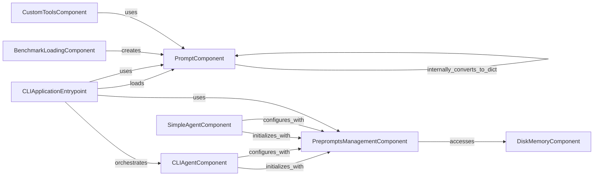

## Component Details

This subsystem is responsible for managing prompts and preprompts within the gpt-engineer project. It handles the creation, loading, and serialization of prompts, as well as the retrieval of predefined preprompt templates. Various agents and the CLI application interact with these components to guide the AI model and ensure consistent behavior.

### PromptComponent
Manages the creation, representation, and serialization of prompts, which can include text and image URLs. It provides methods to convert prompt data to dictionary and JSON formats, making prompts easily transferable and storable.

**Related Classes/Methods**:

- <a href="https://github.com/gpt-engineer-org/gpt-engineer/blob/master/gpt_engineer/core/prompt.py#L6-L44" target="_blank" rel="noopener noreferrer">`gpt_engineer.core.prompt.Prompt` (6:44)</a>
- <a href="https://github.com/gpt-engineer-org/gpt-engineer/blob/master/gpt_engineer/core/prompt.py#L43-L44" target="_blank" rel="noopener noreferrer">`gpt_engineer.core.prompt.Prompt:to_json` (43:44)</a>
- <a href="https://github.com/gpt-engineer-org/gpt-engineer/blob/master/gpt_engineer/core/prompt.py#L36-L41" target="_blank" rel="noopener noreferrer">`gpt_engineer.core.prompt.Prompt:to_dict` (36:41)</a>

### PrepromptsManagementComponent
Handles the loading and retrieval of predefined prompt templates (preprompts) from disk. It relies on a DiskMemory instance to access the stored preprompt files, ensuring that agents can access consistent and reusable instructions.

**Related Classes/Methods**:

- <a href="https://github.com/gpt-engineer-org/gpt-engineer/blob/master/gpt_engineer/core/preprompts_holder.py#L7-L29" target="_blank" rel="noopener noreferrer">`gpt_engineer.core.preprompts_holder.PrepromptsHolder` (7:29)</a>
- <a href="https://github.com/gpt-engineer-org/gpt-engineer/blob/master/gpt_engineer/core/preprompts_holder.py#L27-L29" target="_blank" rel="noopener noreferrer">`gpt_engineer.core.preprompts_holder.PrepromptsHolder:get_preprompts` (27:29)</a>

### DiskMemoryComponent
Provides a file-based key-value store, allowing for CRUD operations on files within a specified directory. It's a foundational component used for storing various data, including preprompts and project files, enabling persistence across sessions.

**Related Classes/Methods**:

- <a href="https://github.com/gpt-engineer-org/gpt-engineer/blob/master/gpt_engineer/core/default/disk_memory.py#L36-L326" target="_blank" rel="noopener noreferrer">`gpt_engineer.core.default.disk_memory.DiskMemory` (36:326)</a>

### CLIAgentComponent
Orchestrates the code generation and improvement lifecycle for the command-line interface. It initializes with memory, execution environment, AI, and preprompts, and uses various functions for code generation and processing.

**Related Classes/Methods**:

- <a href="https://github.com/gpt-engineer-org/gpt-engineer/blob/master/gpt_engineer/applications/cli/cli_agent.py#L36-L232" target="_blank" rel="noopener noreferrer">`gpt_engineer.applications.cli.cli_agent.CliAgent` (36:232)</a>
- <a href="https://github.com/gpt-engineer-org/gpt-engineer/blob/master/gpt_engineer/applications/cli/cli_agent.py#L84-L100" target="_blank" rel="noopener noreferrer">`gpt_engineer.applications.cli.cli_agent.CliAgent.__init__` (84:100)</a>
- <a href="https://github.com/gpt-engineer-org/gpt-engineer/blob/master/gpt_engineer/applications/cli/cli_agent.py#L103-L150" target="_blank" rel="noopener noreferrer">`gpt_engineer.applications.cli.cli_agent.CliAgent.with_default_config` (103:150)</a>

### SimpleAgentComponent
A more basic agent responsible for generating and improving code using an AI model, memory, and an execution environment. It provides a simplified interface for code creation, often used in scenarios requiring less complex orchestration.

**Related Classes/Methods**:

- <a href="https://github.com/gpt-engineer-org/gpt-engineer/blob/master/gpt_engineer/core/default/simple_agent.py#L27-L88" target="_blank" rel="noopener noreferrer">`gpt_engineer.core.default.simple_agent.SimpleAgent` (27:88)</a>
- <a href="https://github.com/gpt-engineer-org/gpt-engineer/blob/master/gpt_engineer/core/default/simple_agent.py#L47-L57" target="_blank" rel="noopener noreferrer">`gpt_engineer.core.default.simple_agent.SimpleAgent.__init__` (47:57)</a>
- <a href="https://github.com/gpt-engineer-org/gpt-engineer/blob/master/gpt_engineer/core/default/simple_agent.py#L60-L68" target="_blank" rel="noopener noreferrer">`gpt_engineer.core.default.simple_agent.SimpleAgent.with_default_config` (60:68)</a>

### CLIApplicationEntrypoint
The main entry point for the `gpt-engineer` command-line application. It handles argument parsing, environment setup, prompt loading, and orchestrates the interaction with the agent components for code generation or improvement.

**Related Classes/Methods**:

- <a href="https://github.com/gpt-engineer-org/gpt-engineer/blob/master/gpt_engineer/applications/cli/main.py#L281-L557" target="_blank" rel="noopener noreferrer">`gpt_engineer.applications.cli.main` (281:557)</a>
- <a href="https://github.com/gpt-engineer-org/gpt-engineer/blob/master/gpt_engineer/applications/cli/main.py#L105-L170" target="_blank" rel="noopener noreferrer">`gpt_engineer.applications.cli.main.load_prompt` (105:170)</a>
- <a href="https://github.com/gpt-engineer-org/gpt-engineer/blob/master/gpt_engineer/applications/cli/main.py#L281-L557" target="_blank" rel="noopener noreferrer">`gpt_engineer.applications.cli.main.main` (281:557)</a>

### BenchmarkLoadingComponent
Contains functions responsible for loading benchmark-specific prompts and configurations for various benchmark datasets like `apps`, `gptme`, and `mbpp`. This component ensures that the system can be tested against standardized tasks.

**Related Classes/Methods**:

- `gpt_engineer.gpt_engineer.benchmark.benchmarks.apps.load:load_apps` (full file reference)
- `gpt_engineer.gpt_engineer.benchmark.benchmarks.gptme.load:load_gptme` (full file reference)
- `gpt_engineer.gpt_engineer.benchmark.benchmarks.mbpp.load:load_mbpp` (full file reference)

### CustomToolsComponent
Provides specialized functions or 'steps' that can be integrated into the code generation workflow, such as self-healing mechanisms. These tools extend the agent's capabilities beyond basic code generation.

**Related Classes/Methods**:

- `gpt_engineer.gpt_engineer.tools.custom_steps:self_heal` (full file reference)

### [FAQ](https://github.com/CodeBoarding/GeneratedOnBoardings/tree/main?tab=readme-ov-file#faq)