```mermaid
graph LR
    Application_Orchestration["Application Orchestration"]
    AI_Communication["AI Communication"]
    File_and_Environment_Management["File and Environment Management"]
    Code_Generation_and_Improvement["Code Generation and Improvement"]
    Prompt_Management["Prompt Management"]
    Benchmarking_System["Benchmarking System"]
    Human_Feedback_and_Learning["Human Feedback and Learning"]
    Project_Configuration["Project Configuration"]
    Application_Orchestration -- "orchestrates" --> AI_Communication
    Application_Orchestration -- "orchestrates" --> Code_Generation_and_Improvement
    Application_Orchestration -- "orchestrates" --> File_and_Environment_Management
    Application_Orchestration -- "orchestrates" --> Prompt_Management
    Application_Orchestration -- "orchestrates" --> Human_Feedback_and_Learning
    Application_Orchestration -- "uses" --> Project_Configuration
    Code_Generation_and_Improvement -- "uses" --> AI_Communication
    Code_Generation_and_Improvement -- "uses" --> File_and_Environment_Management
    Code_Generation_and_Improvement -- "uses" --> Prompt_Management
    File_and_Environment_Management -- "provides services to" --> Application_Orchestration
    File_and_Environment_Management -- "provides services to" --> Code_Generation_and_Improvement
    File_and_Environment_Management -- "provides services to" --> Prompt_Management
    File_and_Environment_Management -- "provides services to" --> Human_Feedback_and_Learning
    File_and_Environment_Management -- "provides services to" --> Benchmarking_System
    AI_Communication -- "provides services to" --> Application_Orchestration
    AI_Communication -- "provides services to" --> Code_Generation_and_Improvement
    AI_Communication -- "provides services to" --> Benchmarking_System
    Prompt_Management -- "is used by" --> Application_Orchestration
    Prompt_Management -- "is used by" --> Code_Generation_and_Improvement
    Prompt_Management -- "is used by" --> Benchmarking_System
    Prompt_Management -- "is used by" --> Human_Feedback_and_Learning
    Benchmarking_System -- "uses" --> AI_Communication
    Benchmarking_System -- "uses" --> File_and_Environment_Management
    Benchmarking_System -- "uses" --> Prompt_Management
    Benchmarking_System -- "uses" --> Project_Configuration
    Human_Feedback_and_Learning -- "uses" --> File_and_Environment_Management
    Human_Feedback_and_Learning -- "uses" --> Prompt_Management
    Project_Configuration -- "is used by" --> Application_Orchestration
    Project_Configuration -- "is used by" --> Benchmarking_System
    click Application_Orchestration href "https://github.com/CodeBoarding/GeneratedOnBoardings/blob/main/gpt-engineer/Application Orchestration.md" "Details"
    click AI_Communication href "https://github.com/CodeBoarding/GeneratedOnBoardings/blob/main/gpt-engineer/AI Communication.md" "Details"
    click File_and_Environment_Management href "https://github.com/CodeBoarding/GeneratedOnBoardings/blob/main/gpt-engineer/File and Environment Management.md" "Details"
    click Code_Generation_and_Improvement href "https://github.com/CodeBoarding/GeneratedOnBoardings/blob/main/gpt-engineer/Code Generation and Improvement.md" "Details"
    click Prompt_Management href "https://github.com/CodeBoarding/GeneratedOnBoardings/blob/main/gpt-engineer/Prompt Management.md" "Details"
    click Benchmarking_System href "https://github.com/CodeBoarding/GeneratedOnBoardings/blob/main/gpt-engineer/Benchmarking System.md" "Details"
    click Human_Feedback_and_Learning href "https://github.com/CodeBoarding/GeneratedOnBoardings/blob/main/gpt-engineer/Human Feedback and Learning.md" "Details"
    click Project_Configuration href "https://github.com/CodeBoarding/GeneratedOnBoardings/blob/main/gpt-engineer/Project Configuration.md" "Details"
```

## Component Details

The `gpt-engineer` project is a command-line interface (CLI) tool designed to generate and improve software projects using AI models. Its main flow involves orchestrating interactions between the user, AI models, and the local file system to iteratively produce and refine code. The system supports various modes of operation, including initial code generation, iterative improvement, self-healing, and clarification, all while managing project configurations, handling human feedback, and providing a benchmarking framework for evaluation.

### Application Orchestration
Manages the overall flow of the GPT-Engineer CLI application, including user interaction, project setup, AI agent initialization, and orchestrating code generation and improvement steps. It integrates various core functionalities and handles different operational modes (e.g., clarify, lite, self-heal).

**Related Classes/Methods**:

- <a href="https://github.com/gpt-engineer-org/gpt-engineer/blob/master/gpt_engineer/applications/cli/main.py#L281-L557" target="_blank" rel="noopener noreferrer">`gpt-engineer.gpt_engineer.applications.cli.main:main` (281:557)</a>
- <a href="https://github.com/gpt-engineer-org/gpt-engineer/blob/master/gpt_engineer/applications/cli/main.py#L105-L170" target="_blank" rel="noopener noreferrer">`gpt-engineer.gpt_engineer.applications.cli.main:load_prompt` (105:170)</a>
- <a href="https://github.com/gpt-engineer-org/gpt-engineer/blob/master/gpt_engineer/applications/cli/main.py#L203-L229" target="_blank" rel="noopener noreferrer">`gpt-engineer.gpt_engineer.applications.cli.main:compare` (203:229)</a>
- <a href="https://github.com/gpt-engineer-org/gpt-engineer/blob/master/gpt_engineer/applications/cli/main.py#L243-L251" target="_blank" rel="noopener noreferrer">`gpt-engineer.gpt_engineer.applications.cli.main:get_system_info` (243:251)</a>
- <a href="https://github.com/gpt-engineer-org/gpt-engineer/blob/master/gpt_engineer/applications/cli/cli_agent.py#L84-L100" target="_blank" rel="noopener noreferrer">`gpt-engineer.gpt_engineer.applications.cli.cli_agent.CliAgent:__init__` (84:100)</a>
- <a href="https://github.com/gpt-engineer-org/gpt-engineer/blob/master/gpt_engineer/applications/cli/cli_agent.py#L103-L150" target="_blank" rel="noopener noreferrer">`gpt-engineer.gpt_engineer.applications.cli.cli_agent.CliAgent:with_default_config` (103:150)</a>
- <a href="https://github.com/gpt-engineer-org/gpt-engineer/blob/master/gpt_engineer/applications/cli/cli_agent.py#L152-L183" target="_blank" rel="noopener noreferrer">`gpt-engineer.gpt_engineer.applications.cli.cli_agent.CliAgent:init` (152:183)</a>
- <a href="https://github.com/gpt-engineer-org/gpt-engineer/blob/master/gpt_engineer/applications/cli/cli_agent.py#L185-L232" target="_blank" rel="noopener noreferrer">`gpt-engineer.gpt_engineer.applications.cli.cli_agent.CliAgent:improve` (185:232)</a>
- <a href="https://github.com/gpt-engineer-org/gpt-engineer/blob/master/gpt_engineer/applications/cli/main.py#L232-L240" target="_blank" rel="noopener noreferrer">`gpt-engineer.gpt_engineer.applications.cli.main:prompt_yesno` (232:240)</a>
- <a href="https://github.com/gpt-engineer-org/gpt-engineer/blob/master/gpt_engineer/applications/cli/main.py#L254-L264" target="_blank" rel="noopener noreferrer">`gpt-engineer.gpt_engineer.applications.cli.main:get_installed_packages` (254:264)</a>
- <a href="https://github.com/gpt-engineer-org/gpt-engineer/blob/master/gpt_engineer/applications/cli/main.py#L267-L268" target="_blank" rel="noopener noreferrer">`gpt-engineer.gpt_engineer.applications.cli.main:format_installed_packages` (267:268)</a>

### AI Communication
Handles all interactions with external AI models, including message formatting, API calls, token usage tracking, and retry mechanisms. It provides a consistent interface for the application to communicate with different LLM providers.

**Related Classes/Methods**:

- <a href="https://github.com/gpt-engineer-org/gpt-engineer/blob/master/gpt_engineer/core/ai.py#L88-L118" target="_blank" rel="noopener noreferrer">`gpt-engineer.gpt_engineer.core.ai.AI:__init__` (88:118)</a>
- <a href="https://github.com/gpt-engineer-org/gpt-engineer/blob/master/gpt_engineer/core/ai.py#L120-L143" target="_blank" rel="noopener noreferrer">`gpt-engineer.gpt_engineer.core.ai.AI:start` (120:143)</a>
- <a href="https://github.com/gpt-engineer-org/gpt-engineer/blob/master/gpt_engineer/core/ai.py#L165-L204" target="_blank" rel="noopener noreferrer">`gpt-engineer.gpt_engineer.core.ai.AI:_collapse_text_messages` (165:204)</a>
- <a href="https://github.com/gpt-engineer-org/gpt-engineer/blob/master/gpt_engineer/core/ai.py#L206-L251" target="_blank" rel="noopener noreferrer">`gpt-engineer.gpt_engineer.core.ai.AI:next` (206:251)</a>
- <a href="https://github.com/gpt-engineer-org/gpt-engineer/blob/master/gpt_engineer/core/ai.py#L382-L383" target="_blank" rel="noopener noreferrer">`gpt-engineer.gpt_engineer.core.ai:serialize_messages` (382:383)</a>
- <a href="https://github.com/gpt-engineer-org/gpt-engineer/blob/master/gpt_engineer/core/ai.py#L388-L390" target="_blank" rel="noopener noreferrer">`gpt-engineer.gpt_engineer.core.ai.ClipboardAI:__init__` (388:390)</a>
- <a href="https://github.com/gpt-engineer-org/gpt-engineer/blob/master/gpt_engineer/core/ai.py#L408-L437" target="_blank" rel="noopener noreferrer">`gpt-engineer.gpt_engineer.core.ai.ClipboardAI:next` (408:437)</a>
- <a href="https://github.com/gpt-engineer-org/gpt-engineer/blob/master/gpt_engineer/core/ai.py#L254-L287" target="_blank" rel="noopener noreferrer">`gpt-engineer.gpt_engineer.core.ai.AI:backoff_inference` (254:287)</a>
- <a href="https://github.com/gpt-engineer-org/gpt-engineer/blob/master/gpt_engineer/core/token_usage.py#L142-L177" target="_blank" rel="noopener noreferrer">`gpt-engineer.gpt_engineer.core.token_usage.Tokenizer:num_tokens_from_messages` (142:177)</a>
- <a href="https://github.com/gpt-engineer-org/gpt-engineer/blob/master/gpt_engineer/core/token_usage.py#L185-L191" target="_blank" rel="noopener noreferrer">`gpt-engineer.gpt_engineer.core.token_usage.TokenUsageLog:__init__` (185:191)</a>
- <a href="https://github.com/gpt-engineer-org/gpt-engineer/blob/master/gpt_engineer/core/token_usage.py#L193-L224" target="_blank" rel="noopener noreferrer">`gpt-engineer.gpt_engineer.core.token_usage.TokenUsageLog:update_log` (193:224)</a>
- <a href="https://github.com/gpt-engineer-org/gpt-engineer/blob/master/gpt_engineer/core/token_usage.py#L273-L297" target="_blank" rel="noopener noreferrer">`gpt-engineer.gpt_engineer.core.token_usage.TokenUsageLog:usage_cost` (273:297)</a>
- <a href="https://github.com/gpt-engineer-org/gpt-engineer/blob/master/gpt_engineer/core/token_usage.py#L251-L260" target="_blank" rel="noopener noreferrer">`gpt-engineer.gpt_engineer.core.token_usage.TokenUsageLog.is_openai_model` (251:260)</a>
- <a href="https://github.com/gpt-engineer-org/gpt-engineer/blob/master/gpt_engineer/core/token_usage.py#L262-L271" target="_blank" rel="noopener noreferrer">`gpt-engineer.gpt_engineer.core.token_usage.TokenUsageLog.total_tokens` (262:271)</a>
- <a href="https://github.com/gpt-engineer-org/gpt-engineer/blob/master/gpt_engineer/core/token_usage.py#L180-L297" target="_blank" rel="noopener noreferrer">`gpt-engineer.gpt_engineer.core.token_usage.TokenUsageLog` (180:297)</a>

### File and Environment Management
Provides comprehensive functionalities for managing files, directories, and the execution environment. This includes representing files, reading/writing to disk, applying code differences, interacting with Git, and executing generated code within a controlled environment. It also includes utilities for file selection and linting.

**Related Classes/Methods**:

- <a href="https://github.com/gpt-engineer-org/gpt-engineer/blob/master/gpt_engineer/core/files_dict.py#L19-L89" target="_blank" rel="noopener noreferrer">`gpt-engineer.gpt_engineer.core.files_dict.FilesDict` (19:89)</a>
- <a href="https://github.com/gpt-engineer-org/gpt-engineer/blob/master/gpt_engineer/core/files_dict.py#L55-L72" target="_blank" rel="noopener noreferrer">`gpt-engineer.gpt_engineer.core.files_dict.FilesDict:to_chat` (55:72)</a>
- <a href="https://github.com/gpt-engineer-org/gpt-engineer/blob/master/gpt_engineer/core/files_dict.py#L92-L115" target="_blank" rel="noopener noreferrer">`gpt-engineer.gpt_engineer.core.files_dict.file_to_lines_dict` (92:115)</a>
- <a href="https://github.com/gpt-engineer-org/gpt-engineer/blob/master/gpt_engineer/core/default/file_store.py#L10-L62" target="_blank" rel="noopener noreferrer">`gpt-engineer.gpt_engineer.core.default.file_store.FileStore` (10:62)</a>
- <a href="https://github.com/gpt-engineer-org/gpt-engineer/blob/master/gpt_engineer/core/default/file_store.py#L47-L50" target="_blank" rel="noopener noreferrer">`gpt-engineer.gpt_engineer.core.default.file_store.FileStore:linting` (47:50)</a>
- <a href="https://github.com/gpt-engineer-org/gpt-engineer/blob/master/gpt_engineer/core/default/file_store.py#L52-L62" target="_blank" rel="noopener noreferrer">`gpt-engineer.gpt_engineer.core.default.file_store.FileStore:pull` (52:62)</a>
- <a href="https://github.com/gpt-engineer-org/gpt-engineer/blob/master/gpt_engineer/core/default/file_store.py#L39-L45" target="_blank" rel="noopener noreferrer">`gpt-engineer.gpt_engineer.core.default.file_store.FileStore:push` (39:45)</a>
- <a href="https://github.com/gpt-engineer-org/gpt-engineer/blob/master/gpt_engineer/core/default/disk_memory.py#L36-L326" target="_blank" rel="noopener noreferrer">`gpt-engineer.gpt_engineer.core.default.disk_memory.DiskMemory` (36:326)</a>
- <a href="https://github.com/gpt-engineer-org/gpt-engineer/blob/master/gpt_engineer/core/default/disk_memory.py#L116-L142" target="_blank" rel="noopener noreferrer">`gpt-engineer.gpt_engineer.core.default.disk_memory.DiskMemory:get` (116:142)</a>
- <a href="https://github.com/gpt-engineer-org/gpt-engineer/blob/master/gpt_engineer/core/default/disk_memory.py#L216-L226" target="_blank" rel="noopener noreferrer">`gpt-engineer.gpt_engineer.core.default.disk_memory.DiskMemory:__len__` (216:226)</a>
- <a href="https://github.com/gpt-engineer-org/gpt-engineer/blob/master/gpt_engineer/core/default/disk_memory.py#L243-L262" target="_blank" rel="noopener noreferrer">`gpt-engineer.gpt_engineer.core.default.disk_memory.DiskMemory:to_path_list_string` (243:262)</a>
- <a href="https://github.com/gpt-engineer-org/gpt-engineer/blob/master/gpt_engineer/core/default/disk_memory.py#L276-L286" target="_blank" rel="noopener noreferrer">`gpt-engineer.gpt_engineer.core.default.disk_memory.DiskMemory:to_json` (276:286)</a>
- <a href="https://github.com/gpt-engineer-org/gpt-engineer/blob/master/gpt_engineer/core/default/disk_memory.py#L318-L326" target="_blank" rel="noopener noreferrer">`gpt-engineer.gpt_engineer.core.default.disk_memory.DiskMemory.archive_logs` (318:326)</a>
- <a href="https://github.com/gpt-engineer-org/gpt-engineer/blob/master/gpt_engineer/core/default/disk_execution_env.py#L36-L111" target="_blank" rel="noopener noreferrer">`gpt-engineer.gpt_engineer.core.default.disk_execution_env.DiskExecutionEnv` (36:111)</a>
- <a href="https://github.com/gpt-engineer-org/gpt-engineer/blob/master/gpt_engineer/core/default/disk_execution_env.py#L52-L53" target="_blank" rel="noopener noreferrer">`gpt-engineer.gpt_engineer.core.default.disk_execution_env.DiskExecutionEnv:__init__` (52:53)</a>
- <a href="https://github.com/gpt-engineer-org/gpt-engineer/blob/master/gpt_engineer/core/default/disk_execution_env.py#L55-L57" target="_blank" rel="noopener noreferrer">`gpt-engineer.gpt_engineer.core.default.disk_execution_env.DiskExecutionEnv:upload` (55:57)</a>
- <a href="https://github.com/gpt-engineer-org/gpt-engineer/blob/master/gpt_engineer/core/default/disk_execution_env.py#L59-L60" target="_blank" rel="noopener noreferrer">`gpt-engineer.gpt_engineer.core.default.disk_execution_env.DiskExecutionEnv:download` (59:60)</a>
- <a href="https://github.com/gpt-engineer-org/gpt-engineer/blob/master/gpt_engineer/core/default/disk_execution_env.py#L62-L70" target="_blank" rel="noopener noreferrer">`gpt-engineer.gpt_engineer.core.default.disk_execution_env.DiskExecutionEnv.popen` (62:70)</a>
- <a href="https://github.com/gpt-engineer-org/gpt-engineer/blob/master/gpt_engineer/core/chat_to_files.py#L38-L66" target="_blank" rel="noopener noreferrer">`gpt-engineer.gpt_engineer.core.chat_to_files:chat_to_files_dict` (38:66)</a>
- <a href="https://github.com/gpt-engineer-org/gpt-engineer/blob/master/gpt_engineer/core/chat_to_files.py#L69-L120" target="_blank" rel="noopener noreferrer">`gpt-engineer.gpt_engineer.core.chat_to_files:apply_diffs` (69:120)</a>
- <a href="https://github.com/gpt-engineer-org/gpt-engineer/blob/master/gpt_engineer/core/chat_to_files.py#L123-L161" target="_blank" rel="noopener noreferrer">`gpt-engineer.gpt_engineer.core.chat_to_files:parse_diffs` (123:161)</a>
- <a href="https://github.com/gpt-engineer-org/gpt-engineer/blob/master/gpt_engineer/core/chat_to_files.py#L164-L218" target="_blank" rel="noopener noreferrer">`gpt-engineer.gpt_engineer.core.chat_to_files:parse_diff_block` (164:218)</a>
- <a href="https://github.com/gpt-engineer-org/gpt-engineer/blob/master/gpt_engineer/core/chat_to_files.py#L221-L245" target="_blank" rel="noopener noreferrer">`gpt-engineer.gpt_engineer.core.chat_to_files.parse_hunk_header` (221:245)</a>
- <a href="https://github.com/gpt-engineer-org/gpt-engineer/blob/master/gpt_engineer/core/diff.py#L44-L309" target="_blank" rel="noopener noreferrer">`gpt-engineer.gpt_engineer.core.diff.Hunk` (44:309)</a>
- <a href="https://github.com/gpt-engineer-org/gpt-engineer/blob/master/gpt_engineer/core/diff.py#L58-L78" target="_blank" rel="noopener noreferrer">`gpt-engineer.gpt_engineer.core.diff.Hunk:__init__` (58:78)</a>
- <a href="https://github.com/gpt-engineer-org/gpt-engineer/blob/master/gpt_engineer/core/diff.py#L122-L131" target="_blank" rel="noopener noreferrer">`gpt-engineer.gpt_engineer.core.diff.Hunk:check_start_line` (122:131)</a>
- <a href="https://github.com/gpt-engineer-org/gpt-engineer/blob/master/gpt_engineer/core/diff.py#L133-L198" target="_blank" rel="noopener noreferrer">`gpt-engineer.gpt_engineer.core.diff.Hunk:find_start_line` (133:198)</a>
- <a href="https://github.com/gpt-engineer-org/gpt-engineer/blob/master/gpt_engineer/core/diff.py#L200-L286" target="_blank" rel="noopener noreferrer">`gpt-engineer.gpt_engineer.core.diff.Hunk:validate_lines` (200:286)</a>
- <a href="https://github.com/gpt-engineer-org/gpt-engineer/blob/master/gpt_engineer/core/diff.py#L288-L309" target="_blank" rel="noopener noreferrer">`gpt-engineer.gpt_engineer.core.diff.Hunk:validate_and_correct` (288:309)</a>
- <a href="https://github.com/gpt-engineer-org/gpt-engineer/blob/master/gpt_engineer/core/diff.py#L98-L102" target="_blank" rel="noopener noreferrer">`gpt-engineer.gpt_engineer.core.diff.Hunk.add_lines` (98:102)</a>
- <a href="https://github.com/gpt-engineer-org/gpt-engineer/blob/master/gpt_engineer/core/diff.py#L104-L112" target="_blank" rel="noopener noreferrer">`gpt-engineer.gpt_engineer.core.diff.Hunk.hunk_to_string` (104:112)</a>
- <a href="https://github.com/gpt-engineer-org/gpt-engineer/blob/master/gpt_engineer/core/diff.py#L80-L83" target="_blank" rel="noopener noreferrer">`gpt-engineer.gpt_engineer.core.diff.Hunk.add_retained_line` (80:83)</a>
- <a href="https://github.com/gpt-engineer-org/gpt-engineer/blob/master/gpt_engineer/core/diff.py#L85-L90" target="_blank" rel="noopener noreferrer">`gpt-engineer.gpt_engineer.core.diff.Hunk.relabel_line` (85:90)</a>
- <a href="https://github.com/gpt-engineer-org/gpt-engineer/blob/master/gpt_engineer/core/diff.py#L114-L120" target="_blank" rel="noopener noreferrer">`gpt-engineer.gpt_engineer.core.diff.Hunk.make_forward_block` (114:120)</a>
- <a href="https://github.com/gpt-engineer-org/gpt-engineer/blob/master/gpt_engineer/core/diff.py#L92-L96" target="_blank" rel="noopener noreferrer">`gpt-engineer.gpt_engineer.core.diff.Hunk.pop_line` (92:96)</a>
- <a href="https://github.com/gpt-engineer-org/gpt-engineer/blob/master/gpt_engineer/core/diff.py#L312-L378" target="_blank" rel="noopener noreferrer">`gpt-engineer.gpt_engineer.core.diff.Diff` (312:378)</a>
- <a href="https://github.com/gpt-engineer-org/gpt-engineer/blob/master/gpt_engineer/core/diff.py#L381-L398" target="_blank" rel="noopener noreferrer">`gpt-engineer.gpt_engineer.core.diff:is_similar` (381:398)</a>
- <a href="https://github.com/gpt-engineer-org/gpt-engineer/blob/master/gpt_engineer/core/diff.py#L401-L419" target="_blank" rel="noopener noreferrer">`gpt-engineer.gpt_engineer.core.diff:count_ratio` (401:419)</a>
- <a href="https://github.com/gpt-engineer-org/gpt-engineer/blob/master/gpt_engineer/core/git.py#L71-L85" target="_blank" rel="noopener noreferrer">`gpt-engineer.gpt_engineer.core.git:stage_uncommitted_to_git` (71:85)</a>
- <a href="https://github.com/gpt-engineer-org/gpt-engineer/blob/master/gpt_engineer/core/git.py#L10-L11" target="_blank" rel="noopener noreferrer">`gpt-engineer.gpt_engineer.core.git.is_git_installed` (10:11)</a>
- <a href="https://github.com/gpt-engineer-org/gpt-engineer/blob/master/gpt_engineer/core/git.py#L14-L23" target="_blank" rel="noopener noreferrer">`gpt-engineer.gpt_engineer.core.git.is_git_repo` (14:23)</a>
- <a href="https://github.com/gpt-engineer-org/gpt-engineer/blob/master/gpt_engineer/core/git.py#L26-L27" target="_blank" rel="noopener noreferrer">`gpt-engineer.gpt_engineer.core.git.init_git_repo` (26:27)</a>
- <a href="https://github.com/gpt-engineer-org/gpt-engineer/blob/master/gpt_engineer/core/git.py#L41-L51" target="_blank" rel="noopener noreferrer">`gpt-engineer.gpt_engineer.core.git.filter_files_with_uncommitted_changes` (41:51)</a>
- <a href="https://github.com/gpt-engineer-org/gpt-engineer/blob/master/gpt_engineer/core/git.py#L54-L55" target="_blank" rel="noopener noreferrer">`gpt-engineer.gpt_engineer.core.git.stage_files` (54:55)</a>
- <a href="https://github.com/gpt-engineer-org/gpt-engineer/blob/master/gpt_engineer/core/git.py#L58-L68" target="_blank" rel="noopener noreferrer">`gpt-engineer.gpt_engineer.core.git.filter_by_gitignore` (58:68)</a>
- <a href="https://github.com/gpt-engineer-org/gpt-engineer/blob/master/gpt_engineer/applications/cli/file_selector.py#L35-L416" target="_blank" rel="noopener noreferrer">`gpt-engineer.gpt_engineer.applications.cli.file_selector.FileSelector` (35:416)</a>
- <a href="https://github.com/gpt-engineer-org/gpt-engineer/blob/master/gpt_engineer/applications/cli/file_selector.py#L66-L77" target="_blank" rel="noopener noreferrer">`gpt-engineer.gpt_engineer.applications.cli.file_selector.FileSelector:__init__` (66:77)</a>
- <a href="https://github.com/gpt-engineer-org/gpt-engineer/blob/master/gpt_engineer/applications/cli/file_selector.py#L79-L121" target="_blank" rel="noopener noreferrer">`gpt-engineer.gpt_engineer.applications.cli.file_selector.FileSelector:ask_for_files` (79:121)</a>
- <a href="https://github.com/gpt-engineer-org/gpt-engineer/blob/master/gpt_engineer/applications/cli/file_selector.py#L123-L210" target="_blank" rel="noopener noreferrer">`gpt-engineer.gpt_engineer.applications.cli.file_selector.FileSelector:editor_file_selector` (123:210)</a>
- <a href="https://github.com/gpt-engineer-org/gpt-engineer/blob/master/gpt_engineer/applications/cli/file_selector.py#L271-L342" target="_blank" rel="noopener noreferrer">`gpt-engineer.gpt_engineer.applications.cli.file_selector.FileSelector:get_files_from_toml` (271:342)</a>
- <a href="https://github.com/gpt-engineer-org/gpt-engineer/blob/master/gpt_engineer/applications/cli/file_selector.py#L379-L416" target="_blank" rel="noopener noreferrer">`gpt-engineer.gpt_engineer.applications.cli.file_selector.FileSelector:get_current_files` (379:416)</a>
- <a href="https://github.com/gpt-engineer-org/gpt-engineer/blob/master/gpt_engineer/applications/cli/file_selector.py#L212-L247" target="_blank" rel="noopener noreferrer">`gpt-engineer.gpt_engineer.applications.cli.file_selector.FileSelector:open_with_default_editor` (212:247)</a>
- <a href="https://github.com/gpt-engineer-org/gpt-engineer/blob/master/gpt_engineer/applications/cli/file_selector.py#L464-L502" target="_blank" rel="noopener noreferrer">`gpt-engineer.gpt_engineer.applications.cli.file_selector.DisplayablePath:make_tree` (464:502)</a>
- <a href="https://github.com/gpt-engineer-org/gpt-engineer/blob/master/gpt_engineer/applications/cli/file_selector.py#L419-L540" target="_blank" rel="noopener noreferrer">`gpt-engineer.gpt_engineer.applications.cli.file_selector.DisplayablePath` (419:540)</a>
- <a href="https://github.com/gpt-engineer-org/gpt-engineer/blob/master/gpt_engineer/applications/cli/file_selector.py#L505-L509" target="_blank" rel="noopener noreferrer">`gpt-engineer.gpt_engineer.applications.cli.file_selector.DisplayablePath._default_criteria` (505:509)</a>
- <a href="https://github.com/gpt-engineer-org/gpt-engineer/blob/master/gpt_engineer/core/linting.py#L6-L64" target="_blank" rel="noopener noreferrer">`gpt-engineer.gpt_engineer.core.linting.Linting` (6:64)</a>
- <a href="https://github.com/gpt-engineer-org/gpt-engineer/blob/master/gpt_engineer/core/linting.py#L31-L64" target="_blank" rel="noopener noreferrer">`gpt-engineer.gpt_engineer.core.linting.Linting.lint_files` (31:64)</a>

### Code Generation and Improvement
Encapsulates the core logic for generating initial code, creating entry points, and iteratively improving existing codebases. It defines the sequence of operations an AI agent performs to produce or refine software, including specialized steps like self-healing or clarified generation.

**Related Classes/Methods**:

- <a href="https://github.com/gpt-engineer-org/gpt-engineer/blob/master/gpt_engineer/core/default/steps.py#L121-L150" target="_blank" rel="noopener noreferrer">`gpt-engineer.gpt_engineer.core.default.steps:gen_code` (121:150)</a>
- <a href="https://github.com/gpt-engineer-org/gpt-engineer/blob/master/gpt_engineer/core/default/steps.py#L153-L202" target="_blank" rel="noopener noreferrer">`gpt-engineer.gpt_engineer.core.default.steps:gen_entrypoint` (153:202)</a>
- <a href="https://github.com/gpt-engineer-org/gpt-engineer/blob/master/gpt_engineer/core/default/steps.py#L271-L312" target="_blank" rel="noopener noreferrer">`gpt-engineer.gpt_engineer.core.default.steps:improve_fn` (271:312)</a>
- <a href="https://github.com/gpt-engineer-org/gpt-engineer/blob/master/gpt_engineer/core/default/steps.py#L315-L338" target="_blank" rel="noopener noreferrer">`gpt-engineer.gpt_engineer.core.default.steps:_improve_loop` (315:338)</a>
- <a href="https://github.com/gpt-engineer-org/gpt-engineer/blob/master/gpt_engineer/core/default/steps.py#L341-L360" target="_blank" rel="noopener noreferrer">`gpt-engineer.gpt_engineer.core.default.steps:salvage_correct_hunks` (341:360)</a>
- <a href="https://github.com/gpt-engineer-org/gpt-engineer/blob/master/gpt_engineer/core/default/steps.py#L376-L397" target="_blank" rel="noopener noreferrer">`gpt-engineer.gpt_engineer.core.default.steps:handle_improve_mode` (376:397)</a>
- <a href="https://github.com/gpt-engineer-org/gpt-engineer/blob/master/gpt_engineer/core/default/steps.py#L205-L268" target="_blank" rel="noopener noreferrer">`gpt-engineer.gpt_engineer.core.default.steps:execute_entrypoint` (205:268)</a>
- <a href="https://github.com/gpt-engineer-org/gpt-engineer/blob/master/gpt_engineer/core/default/simple_agent.py#L47-L57" target="_blank" rel="noopener noreferrer">`gpt-engineer.gpt_engineer.core.default.simple_agent.SimpleAgent:__init__` (47:57)</a>
- <a href="https://github.com/gpt-engineer-org/gpt-engineer/blob/master/gpt_engineer/core/default/simple_agent.py#L60-L68" target="_blank" rel="noopener noreferrer">`gpt-engineer.gpt_engineer.core.default.simple_agent.SimpleAgent:with_default_config` (60:68)</a>
- <a href="https://github.com/gpt-engineer-org/gpt-engineer/blob/master/gpt_engineer/core/default/simple_agent.py#L70-L77" target="_blank" rel="noopener noreferrer">`gpt-engineer.gpt_engineer.core.default.simple_agent.SimpleAgent:init` (70:77)</a>
- <a href="https://github.com/gpt-engineer-org/gpt-engineer/blob/master/gpt_engineer/core/default/simple_agent.py#L79-L88" target="_blank" rel="noopener noreferrer">`gpt-engineer.gpt_engineer.core.default.simple_agent.SimpleAgent:improve` (79:88)</a>
- <a href="https://github.com/gpt-engineer-org/gpt-engineer/blob/master/gpt_engineer/core/default/simple_agent.py#L91-L100" target="_blank" rel="noopener noreferrer">`gpt-engineer.gpt_engineer.core.default.simple_agent:default_config_agent` (91:100)</a>
- <a href="https://github.com/gpt-engineer-org/gpt-engineer/blob/master/gpt_engineer/tools/custom_steps.py#L40-L119" target="_blank" rel="noopener noreferrer">`gpt-engineer.gpt_engineer.tools.custom_steps:self_heal` (40:119)</a>
- <a href="https://github.com/gpt-engineer-org/gpt-engineer/blob/master/gpt_engineer/tools/custom_steps.py#L122-L195" target="_blank" rel="noopener noreferrer">`gpt-engineer.gpt_engineer.tools.custom_steps:clarified_gen` (122:195)</a>
- <a href="https://github.com/gpt-engineer-org/gpt-engineer/blob/master/gpt_engineer/tools/custom_steps.py#L198-L233" target="_blank" rel="noopener noreferrer">`gpt-engineer.gpt_engineer.tools.custom_steps:lite_gen` (198:233)</a>

### Prompt Management
Handles the creation, loading, and serialization of prompts used to guide the AI model. It also manages preprompts, which are predefined instructions or context provided to the AI.

**Related Classes/Methods**:

- <a href="https://github.com/gpt-engineer-org/gpt-engineer/blob/master/gpt_engineer/core/prompt.py#L6-L44" target="_blank" rel="noopener noreferrer">`gpt-engineer.gpt_engineer.core.prompt.Prompt` (6:44)</a>
- <a href="https://github.com/gpt-engineer-org/gpt-engineer/blob/master/gpt_engineer/core/prompt.py#L43-L44" target="_blank" rel="noopener noreferrer">`gpt-engineer.gpt_engineer.core.prompt.Prompt:to_json` (43:44)</a>
- <a href="https://github.com/gpt-engineer-org/gpt-engineer/blob/master/gpt_engineer/core/preprompts_holder.py#L7-L29" target="_blank" rel="noopener noreferrer">`gpt-engineer.gpt_engineer.core.preprompts_holder.PrepromptsHolder` (7:29)</a>
- <a href="https://github.com/gpt-engineer-org/gpt-engineer/blob/master/gpt_engineer/core/preprompts_holder.py#L27-L29" target="_blank" rel="noopener noreferrer">`gpt-engineer.gpt_engineer.core.preprompts_holder.PrepromptsHolder:get_preprompts` (27:29)</a>

### Benchmarking System
Provides a framework for evaluating the performance of AI agents in code generation tasks. It includes functionalities for running benchmark tasks, loading various datasets, configuring benchmark parameters, and reporting results.

**Related Classes/Methods**:

- <a href="https://github.com/gpt-engineer-org/gpt-engineer/blob/master/gpt_engineer/benchmark/run.py#L26-L87" target="_blank" rel="noopener noreferrer">`gpt-engineer.gpt_engineer.benchmark.run:run` (26:87)</a>
- <a href="https://github.com/gpt-engineer-org/gpt-engineer/blob/master/gpt_engineer/benchmark/run.py#L90-L136" target="_blank" rel="noopener noreferrer">`gpt-engineer.gpt_engineer.benchmark.run:print_results` (90:136)</a>
- <a href="https://github.com/gpt-engineer-org/gpt-engineer/blob/master/gpt_engineer/benchmark/run.py#L139-L150" target="_blank" rel="noopener noreferrer">`gpt-engineer.gpt_engineer.benchmark.run.export_yaml_results` (139:150)</a>
- <a href="https://github.com/gpt-engineer-org/gpt-engineer/blob/master/gpt_engineer/benchmark/__main__.py#L71-L150" target="_blank" rel="noopener noreferrer">`gpt-engineer.gpt_engineer.benchmark.__main__:main` (71:150)</a>
- <a href="https://github.com/gpt-engineer-org/gpt-engineer/blob/master/gpt_engineer/benchmark/__main__.py#L43-L60" target="_blank" rel="noopener noreferrer">`gpt-engineer.gpt_engineer.benchmark.__main__.get_agent` (43:60)</a>
- <a href="https://github.com/gpt-engineer-org/gpt-engineer/blob/master/gpt_engineer/benchmark/types.py#L33-L49" target="_blank" rel="noopener noreferrer">`gpt-engineer.gpt_engineer.benchmark.types.Assertable` (33:49)</a>
- <a href="https://github.com/gpt-engineer-org/gpt-engineer/blob/master/gpt_engineer/benchmark/types.py#L74-L94" target="_blank" rel="noopener noreferrer">`gpt-engineer.gpt_engineer.benchmark.types.TaskResult` (74:94)</a>
- <a href="https://github.com/gpt-engineer-org/gpt-engineer/blob/master/gpt_engineer/benchmark/types.py#L56-L61" target="_blank" rel="noopener noreferrer">`gpt-engineer.gpt_engineer.benchmark.types.Task` (56:61)</a>
- <a href="https://github.com/gpt-engineer-org/gpt-engineer/blob/master/gpt_engineer/benchmark/types.py#L65-L70" target="_blank" rel="noopener noreferrer">`gpt-engineer.gpt_engineer.benchmark.types.Benchmark` (65:70)</a>
- <a href="https://github.com/gpt-engineer-org/gpt-engineer/blob/master/gpt_engineer/benchmark/bench_config.py#L32-L69" target="_blank" rel="noopener noreferrer">`gpt-engineer.gpt_engineer.benchmark.bench_config.BenchConfig` (32:69)</a>
- <a href="https://github.com/gpt-engineer-org/gpt-engineer/blob/master/gpt_engineer/benchmark/bench_config.py#L40-L44" target="_blank" rel="noopener noreferrer">`gpt-engineer.gpt_engineer.benchmark.bench_config.BenchConfig:from_toml` (40:44)</a>
- <a href="https://github.com/gpt-engineer-org/gpt-engineer/blob/master/gpt_engineer/benchmark/bench_config.py#L47-L52" target="_blank" rel="noopener noreferrer">`gpt-engineer.gpt_engineer.benchmark.bench_config.BenchConfig:from_dict` (47:52)</a>
- <a href="https://github.com/gpt-engineer-org/gpt-engineer/blob/master/gpt_engineer/benchmark/bench_config.py#L55-L60" target="_blank" rel="noopener noreferrer">`gpt-engineer.gpt_engineer.benchmark.bench_config.BenchConfig:recursive_resolve` (55:60)</a>
- <a href="https://github.com/gpt-engineer-org/gpt-engineer/blob/master/gpt_engineer/benchmark/bench_config.py#L62-L69" target="_blank" rel="noopener noreferrer">`gpt-engineer.gpt_engineer.benchmark.bench_config.BenchConfig:to_dict` (62:69)</a>
- <a href="https://github.com/gpt-engineer-org/gpt-engineer/blob/master/gpt_engineer/benchmark/bench_config.py#L10-L16" target="_blank" rel="noopener noreferrer">`gpt-engineer.gpt_engineer.benchmark.bench_config.AppsConfig` (10:16)</a>
- <a href="https://github.com/gpt-engineer-org/gpt-engineer/blob/master/gpt_engineer/benchmark/bench_config.py#L20-L23" target="_blank" rel="noopener noreferrer">`gpt-engineer.gpt_engineer.benchmark.bench_config.MbppConfig` (20:23)</a>
- <a href="https://github.com/gpt-engineer-org/gpt-engineer/blob/master/gpt_engineer/benchmark/bench_config.py#L27-L28" target="_blank" rel="noopener noreferrer">`gpt-engineer.gpt_engineer.benchmark.bench_config.GptmeConfig` (27:28)</a>
- <a href="https://github.com/gpt-engineer-org/gpt-engineer/blob/master/gpt_engineer/benchmark/benchmarks/apps/load.py#L64-L118" target="_blank" rel="noopener noreferrer">`gpt-engineer.gpt_engineer.benchmark.benchmarks.apps.load:load_apps` (64:118)</a>
- <a href="https://github.com/gpt-engineer-org/gpt-engineer/blob/master/gpt_engineer/benchmark/benchmarks/apps/load.py#L30-L32" target="_blank" rel="noopener noreferrer">`gpt-engineer.gpt_engineer.benchmark.benchmarks.apps.load.AppsAssertion:__init__` (30:32)</a>
- <a href="https://github.com/gpt-engineer-org/gpt-engineer/blob/master/gpt_engineer/benchmark/benchmarks/apps/load.py#L34-L46" target="_blank" rel="noopener noreferrer">`gpt-engineer.gpt_engineer.benchmark.benchmarks.apps.load.AppsAssertion:evaluate` (34:46)</a>
- <a href="https://github.com/gpt-engineer-org/gpt-engineer/blob/master/gpt_engineer/benchmark/benchmarks/apps/load.py#L48-L49" target="_blank" rel="noopener noreferrer">`gpt-engineer.gpt_engineer.benchmark.benchmarks.apps.load.AppsAssertion._format` (48:49)</a>
- <a href="https://github.com/gpt-engineer-org/gpt-engineer/blob/master/gpt_engineer/benchmark/benchmarks/apps/load.py#L52-L61" target="_blank" rel="noopener noreferrer">`gpt-engineer.gpt_engineer.benchmark.benchmarks.apps.load._get_dataset` (52:61)</a>
- <a href="https://github.com/gpt-engineer-org/gpt-engineer/blob/master/gpt_engineer/benchmark/benchmarks/gptme/load.py#L19-L104" target="_blank" rel="noopener noreferrer">`gpt-engineer.gpt_engineer.benchmark.benchmarks.gptme.load:load_gptme` (19:104)</a>
- <a href="https://github.com/gpt-engineer-org/gpt-engineer/blob/master/gpt_engineer/benchmark/benchmarks/mbpp/load.py#L33-L49" target="_blank" rel="noopener noreferrer">`gpt-engineer.gpt_engineer.benchmark.benchmarks.mbpp.load.MbppAssertion:evaluate` (33:49)</a>
- <a href="https://github.com/gpt-engineer-org/gpt-engineer/blob/master/gpt_engineer/benchmark/benchmarks/mbpp/load.py#L64-L114" target="_blank" rel="noopener noreferrer">`gpt-engineer.gpt_engineer.benchmark.benchmarks.mbpp.load:load_mbpp` (64:114)</a>
- <a href="https://github.com/gpt-engineer-org/gpt-engineer/blob/master/gpt_engineer/benchmark/benchmarks/mbpp/load.py#L52-L61" target="_blank" rel="noopener noreferrer">`gpt-engineer.gpt_engineer.benchmark.benchmarks.mbpp.load._get_dataset` (52:61)</a>
- <a href="https://github.com/gpt-engineer-org/gpt-engineer/blob/master/gpt_engineer/benchmark/benchmarks/mbpp/load.py#L29-L49" target="_blank" rel="noopener noreferrer">`gpt-engineer.gpt_engineer.benchmark.benchmarks.mbpp.load.MbppAssertion` (29:49)</a>

### Human Feedback and Learning
Manages the collection of human feedback on generated code to facilitate continuous improvement of the AI model. It handles user consent, gathers review data, and extracts learning insights from user interactions.

**Related Classes/Methods**:

- <a href="https://github.com/gpt-engineer-org/gpt-engineer/blob/master/gpt_engineer/applications/cli/learning.py#L122-L174" target="_blank" rel="noopener noreferrer">`gpt-engineer.gpt_engineer.applications.cli.learning:human_review_input` (122:174)</a>
- <a href="https://github.com/gpt-engineer-org/gpt-engineer/blob/master/gpt_engineer/applications/cli/learning.py#L183-L198" target="_blank" rel="noopener noreferrer">`gpt-engineer.gpt_engineer.applications.cli.learning:check_collection_consent` (183:198)</a>
- <a href="https://github.com/gpt-engineer-org/gpt-engineer/blob/master/gpt_engineer/applications/cli/learning.py#L237-L276" target="_blank" rel="noopener noreferrer">`gpt-engineer.gpt_engineer.applications.cli.learning:extract_learning` (237:276)</a>
- <a href="https://github.com/gpt-engineer-org/gpt-engineer/blob/master/gpt_engineer/applications/cli/learning.py#L177-L180" target="_blank" rel="noopener noreferrer">`gpt-engineer.gpt_engineer.applications.cli.learning.ask_for_valid_input` (177:180)</a>
- <a href="https://github.com/gpt-engineer-org/gpt-engineer/blob/master/gpt_engineer/applications/cli/learning.py#L201-L234" target="_blank" rel="noopener noreferrer">`gpt-engineer.gpt_engineer.applications.cli.learning.ask_collection_consent` (201:234)</a>
- <a href="https://github.com/gpt-engineer-org/gpt-engineer/blob/master/gpt_engineer/applications/cli/learning.py#L48-L70" target="_blank" rel="noopener noreferrer">`gpt-engineer.gpt_engineer.applications.cli.learning.Review` (48:70)</a>
- <a href="https://github.com/gpt-engineer-org/gpt-engineer/blob/master/gpt_engineer/applications/cli/learning.py#L75-L109" target="_blank" rel="noopener noreferrer">`gpt-engineer.gpt_engineer.applications.cli.learning.Learning` (75:109)</a>
- <a href="https://github.com/gpt-engineer-org/gpt-engineer/blob/master/gpt_engineer/applications/cli/learning.py#L279-L301" target="_blank" rel="noopener noreferrer">`gpt-engineer.gpt_engineer.applications.cli.learning.get_session` (279:301)</a>
- <a href="https://github.com/gpt-engineer-org/gpt-engineer/blob/master/gpt_engineer/applications/cli/collect.py#L65-L124" target="_blank" rel="noopener noreferrer">`gpt-engineer.gpt_engineer.applications.cli.collect:collect_learnings` (65:124)</a>
- <a href="https://github.com/gpt-engineer-org/gpt-engineer/blob/master/gpt_engineer/applications/cli/collect.py#L141-L177" target="_blank" rel="noopener noreferrer">`gpt-engineer.gpt_engineer.applications.cli.collect:collect_and_send_human_review` (141:177)</a>
- <a href="https://github.com/gpt-engineer-org/gpt-engineer/blob/master/gpt_engineer/applications/cli/collect.py#L37-L62" target="_blank" rel="noopener noreferrer">`gpt-engineer.gpt_engineer.applications.cli.collect:send_learning` (37:62)</a>

### Project Configuration
Handles the reading, writing, and management of project-specific configuration settings, typically stored in TOML files. It provides methods for converting configurations between different formats.

**Related Classes/Methods**:

- <a href="https://github.com/gpt-engineer-org/gpt-engineer/blob/master/gpt_engineer/core/project_config.py#L59-L69" target="_blank" rel="noopener noreferrer">`gpt-engineer.gpt_engineer.core.project_config:filter_none` (59:69)</a>
- <a href="https://github.com/gpt-engineer-org/gpt-engineer/blob/master/gpt_engineer/core/project_config.py#L73-L151" target="_blank" rel="noopener noreferrer">`gpt-engineer.gpt_engineer.core.project_config.Config` (73:151)</a>
- <a href="https://github.com/gpt-engineer-org/gpt-engineer/blob/master/gpt_engineer/core/project_config.py#L81-L85" target="_blank" rel="noopener noreferrer">`gpt-engineer.gpt_engineer.core.project_config.Config:from_toml` (81:85)</a>
- <a href="https://github.com/gpt-engineer-org/gpt-engineer/blob/master/gpt_engineer/core/project_config.py#L88-L109" target="_blank" rel="noopener noreferrer">`gpt-engineer.gpt_engineer.core.project_config.Config:from_dict` (88:109)</a>
- <a href="https://github.com/gpt-engineer-org/gpt-engineer/blob/master/gpt_engineer/core/project_config.py#L111-L120" target="_blank" rel="noopener noreferrer">`gpt-engineer.gpt_engineer.core.project_config.Config:to_dict` (111:120)</a>
- <a href="https://github.com/gpt-engineer-org/gpt-engineer/blob/master/gpt_engineer/core/project_config.py#L122-L151" target="_blank" rel="noopener noreferrer">`gpt-engineer.gpt_engineer.core.project_config.Config:to_toml` (122:151)</a>
- <a href="https://github.com/gpt-engineer-org/gpt-engineer/blob/master/gpt_engineer/core/project_config.py#L154-L158" target="_blank" rel="noopener noreferrer">`gpt-engineer.gpt_engineer.core.project_config.read_config` (154:158)</a>
- <a href="https://github.com/gpt-engineer-org/gpt-engineer/blob/master/gpt_engineer/core/project_config.py#L41-L45" target="_blank" rel="noopener noreferrer">`gpt-engineer.gpt_engineer.core.project_config._RunConfig` (41:45)</a>
- <a href="https://github.com/gpt-engineer-org/gpt-engineer/blob/master/gpt_engineer/core/project_config.py#L35-L37" target="_blank" rel="noopener noreferrer">`gpt-engineer.gpt_engineer.core.project_config._PathsConfig` (35:37)</a>
- <a href="https://github.com/gpt-engineer-org/gpt-engineer/blob/master/gpt_engineer/core/project_config.py#L54-L56" target="_blank" rel="noopener noreferrer">`gpt-engineer.gpt_engineer.core.project_config._GptEngineerAppConfig` (54:56)</a>
- <a href="https://github.com/gpt-engineer-org/gpt-engineer/blob/master/gpt_engineer/core/project_config.py#L49-L50" target="_blank" rel="noopener noreferrer">`gpt-engineer.gpt_engineer.core.project_config._OpenApiConfig` (49:50)</a>

### [FAQ](https://github.com/CodeBoarding/GeneratedOnBoardings/tree/main?tab=readme-ov-file#faq)