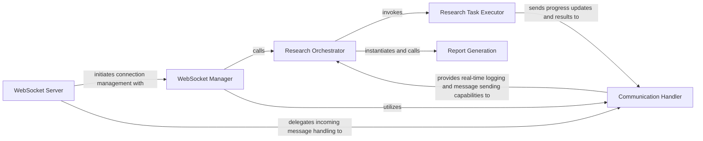

## Component Details

This section provides a detailed overview of the API & Communication Layer subsystem, outlining its core components, their responsibilities, and how they interact to facilitate real-time communication and research task orchestration. These components are fundamental because they collectively manage the entire lifecycle of a user's request, from initial connection to the delivery of the final research report and continuous updates.

### WebSocket Server
This component serves as the initial entry point for all client-side real-time interactions. It is responsible for establishing and managing WebSocket connections, accepting incoming requests, and delegating the subsequent handling of these connections and messages to specialized managers and handlers.

**Related Classes/Methods**:

- <a href="https://github.com/assafelovic/gpt-researcher/blob/master/backend/server/server.py#L199-L204" target="_blank" rel="noopener noreferrer">`backend.server.server:websocket_endpoint` (199:204)</a>

### WebSocket Manager
Manages the pool of active WebSocket connections, including connecting, disconnecting, and queuing messages for asynchronous sending. It acts as an orchestrator, receiving requests from the WebSocket Server and initiating the appropriate research workflow by invoking the Research Orchestrator.

**Related Classes/Methods**:

- <a href="https://github.com/assafelovic/gpt-researcher/blob/master/backend/server/websocket_manager.py#L15-L98" target="_blank" rel="noopener noreferrer">`backend.server.websocket_manager:WebSocketManager` (15:98)</a>

### Communication Handler
This component is responsible for processing incoming WebSocket messages (e.g., "start", "chat", "human_feedback") and dispatching them to the correct internal functions. It also provides a custom logging mechanism (CustomLogsHandler) to stream real-time progress updates and final results back to the connected clients, ensuring transparency and responsiveness.

**Related Classes/Methods**:

- <a href="https://github.com/assafelovic/gpt-researcher/blob/master/backend/server/server_utils.py#L267-L324" target="_blank" rel="noopener noreferrer">`backend.server.server_utils:handle_websocket_communication` (267:324)</a>
- <a href="https://github.com/assafelovic/gpt-researcher/blob/master/backend/server/server_utils.py#L20-L67" target="_blank" rel="noopener noreferrer">`backend.server.server_utils:CustomLogsHandler` (20:67)</a>

### Research Orchestrator
This component is the brain of the research initiation process. It receives a research task request, determines the specific type of report required (e.g., multi-agent, detailed, basic), and then orchestrates the execution of the corresponding research or report generation logic. It also integrates with the Communication Handler to provide real-time logging during the research process.

**Related Classes/Methods**:

- <a href="https://github.com/assafelovic/gpt-researcher/blob/master/backend/server/websocket_manager.py#L100-L171" target="_blank" rel="noopener noreferrer">`backend.server.websocket_manager:run_agent` (100:171)</a>

### Research Task Executor
This component is responsible for executing the core multi-agent research task. It typically involves coordinating various AI agents (e.g., a Chief Editor Agent) to gather, process, and synthesize information based on the given query. It sends progress updates back through the Communication Handler.

**Related Classes/Methods**:

- <a href="https://github.com/assafelovic/gpt-researcher/blob/master/multi_agents/main.py#L39-L49" target="_blank" rel="noopener noreferrer">`multi_agents.main:run_research_task` (39:49)</a>

### Report Generation
This component encompasses the logic for formatting and generating the final research report in various predefined styles (e.g., basic, detailed). It takes the processed research data and structures it into a coherent and presentable document.

**Related Classes/Methods**:

- <a href="https://github.com/assafelovic/gpt-researcher/blob/master/backend/report_type/detailed_report/detailed_report.py#L7-L158" target="_blank" rel="noopener noreferrer">`backend.report_type.detailed_report.detailed_report:DetailedReport` (7:158)</a>
- <a href="https://github.com/assafelovic/gpt-researcher/blob/master/backend/report_type/basic_report/basic_report.py#L6-L58" target="_blank" rel="noopener noreferrer">`backend.report_type.basic_report.basic_report:BasicReport` (6:58)</a>

### [FAQ](https://github.com/CodeBoarding/GeneratedOnBoardings/tree/main?tab=readme-ov-file#faq)