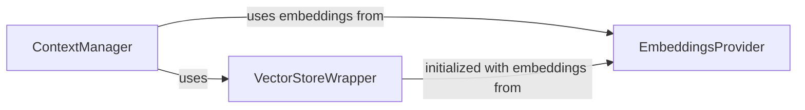

## Component Details

This subsystem is crucial for maintaining the coherence and relevance of the research by managing the storage, retrieval, and organization of research context and memory. It leverages vector databases and embeddings to efficiently store and retrieve information.

### VectorStoreWrapper
This component serves as the primary interface for interacting with the underlying vector database. Its crucial role involves preparing raw data for storage, which includes converting documents into a suitable format (Langchain documents), splitting them into manageable chunks, and then handling their efficient storage. It also facilitates their retrieval based on similarity queries. This component is essential for transforming unstructured information into a format suitable for rapid and accurate semantic searches.

**Related Classes/Methods**:

- `VectorStoreWrapper:load` (0:0)
- `VectorStoreWrapper:_create_langchain_documents` (0:0)
- `VectorStoreWrapper:_split_documents` (0:0)
- `VectorStoreWrapper:asimilarity_search` (0:0)

### ContextManager
This component is responsible for actively managing and retrieving contextual information to ensure the research process is always informed by the most relevant data. It orchestrates similarity searches by formulating queries and utilizing the VectorStoreWrapper (via VectorstoreCompressor) or other compression mechanisms (via ContextCompressor and WrittenContentCompressor) to fetch pertinent content from the stored memory. This allows the research agent to maintain a coherent understanding of the ongoing research by accessing related information.

**Related Classes/Methods**:

- <a href="https://github.com/assafelovic/gpt-researcher/blob/master/gpt_researcher/skills/context_manager.py#L13-L30" target="_blank" rel="noopener noreferrer">`ContextManager:get_similar_content_by_query` (13:30)</a>
- <a href="https://github.com/assafelovic/gpt-researcher/blob/master/gpt_researcher/skills/context_manager.py#L32-L44" target="_blank" rel="noopener noreferrer">`ContextManager:get_similar_content_by_query_with_vectorstore` (32:44)</a>
- <a href="https://github.com/assafelovic/gpt-researcher/blob/master/gpt_researcher/skills/context_manager.py#L46-L62" target="_blank" rel="noopener noreferrer">`ContextManager:get_similar_written_contents_by_draft_section_titles` (46:62)</a>
- <a href="https://github.com/assafelovic/gpt-researcher/blob/master/gpt_researcher/skills/context_manager.py#L64-L86" target="_blank" rel="noopener noreferrer">`ContextManager:__get_similar_written_contents_by_query` (64:86)</a>

### EmbeddingsProvider
This component is critical for the "memory" aspect of the system, as it handles the generation of embeddings. Embeddings are numerical vector representations of text that capture semantic meaning, enabling the vector store to perform similarity comparisons. This component interfaces with an LLM provider to convert textual data into these high-dimensional vectors, which are then used by the VectorStoreWrapper and ContextManager for semantic operations.

**Related Classes/Methods**:

- `EmbeddingsProvider:get_embeddings` (0:0)

### [FAQ](https://github.com/CodeBoarding/GeneratedOnBoardings/tree/main?tab=readme-ov-file#faq)