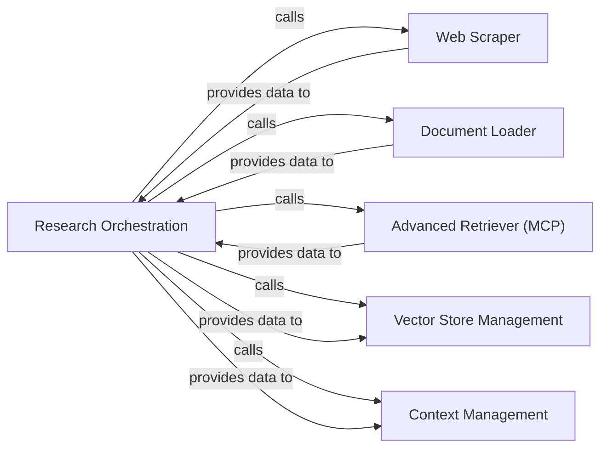

## Component Details

This component is responsible for gathering raw information from various external and internal sources, including web content, local documents, and specialized knowledge bases. It encompasses web scraping, document loading, and advanced retrieval mechanisms. The processed data is then made available for contextualization and further analysis by other components.

### Research Orchestration
This component acts as the central control unit for the entire data acquisition and processing pipeline. It plans research sub-queries, directs data retrieval from various sources (web, local documents, MCP), and coordinates the integration and initial processing of the gathered information. It is fundamental because it dictates the overall research strategy and flow, ensuring that data is acquired efficiently and relevantly.

**Related Classes/Methods**:

- <a href="https://github.com/assafelovic/gpt-researcher/blob/master/gpt_researcher/skills/researcher.py#L1-L1" target="_blank" rel="noopener noreferrer">`gpt_researcher.skills.researcher` (1:1)</a>

### Web Scraper
Specializes in fetching and extracting structured and unstructured content from web pages. It is crucial for gathering real-time, publicly available information from the internet, serving as a primary external data source.

**Related Classes/Methods**:

- <a href="https://github.com/assafelovic/gpt-researcher/blob/master/gpt_researcher/scraper/scraper.py#L1-L1" target="_blank" rel="noopener noreferrer">`gpt_researcher.scraper.scraper` (1:1)</a>

### Document Loader
Responsible for loading and parsing content from various local document formats (e.g., PDF, TXT, DOCX). It enables the system to incorporate private or pre-existing knowledge bases into the research, expanding the scope of data acquisition beyond web sources.

**Related Classes/Methods**:

- <a href="https://github.com/assafelovic/gpt-researcher/blob/master/gpt_researcher/document/document.py#L1-L1" target="_blank" rel="noopener noreferrer">`gpt_researcher.document.document` (1:1)</a>

### Advanced Retriever (MCP)
Facilitates intelligent, multi-stage information retrieval from specialized Model Context Protocol (MCP) servers. This component is vital for accessing curated or domain-specific knowledge, allowing for more sophisticated and focused data acquisition beyond standard web searches.

**Related Classes/Methods**:

- <a href="https://github.com/assafelovic/gpt-researcher/blob/master/gpt_researcher/retrievers/mcp/retriever.py#L1-L1" target="_blank" rel="noopener noreferrer">`gpt_researcher.retrievers.mcp.retriever` (1:1)</a>

### Vector Store Management
Manages the storage and indexing of acquired raw content into a vector store. This is essential for enabling efficient semantic search and retrieval of relevant information later in the process, optimizing subsequent context generation and analysis.

**Related Classes/Methods**:

- <a href="https://github.com/assafelovic/gpt-researcher/blob/master/gpt_researcher/vector_store/vector_store.py#L1-L1" target="_blank" rel="noopener noreferrer">`gpt_researcher.vector_store.vector_store` (1:1)</a>

### Context Management
Processes the raw data acquired from various sources, identifying relevant snippets, summarizing content, and preparing it for contextualization and further analysis by other components. It transforms raw, disparate data into actionable and concise information.

**Related Classes/Methods**:

- <a href="https://github.com/assafelovic/gpt-researcher/blob/master/gpt_researcher/skills/context_manager.py#L1-L1" target="_blank" rel="noopener noreferrer">`gpt_researcher.skills.context_manager` (1:1)</a>

### [FAQ](https://github.com/CodeBoarding/GeneratedOnBoardings/tree/main?tab=readme-ov-file#faq)