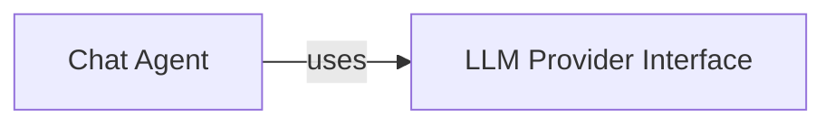

## Component Details

These two components are fundamental to the `LLM & AI Core` subsystem because they collectively provide the essential capabilities for intelligent interaction and decision-making within the project.

1.  **LLM Provider Interface**: This component is crucial because it establishes a **single, unified point of interaction** with diverse Large Language Models. In a system that relies heavily on LLMs, abstracting this interaction is paramount. It prevents vendor lock-in, allows for easy switching between different LLM providers (e.g., OpenAI, Anthropic, Google), and centralizes the logic for handling API calls, error handling, and streaming. Without this abstraction, every part of the application that needs to communicate with an LLM would have to implement its own specific integration, leading to significant code duplication, increased complexity, and a brittle architecture that would be difficult to maintain or extend with new LLM technologies. It ensures the system remains flexible and adaptable to the rapidly evolving LLM landscape.

2.  **Chat Agent**: This component is fundamental as it embodies the **conversational intelligence and memory** of the system. While the `LLM Provider Interface` handles the raw communication with LLMs, the `Chat Agent` is responsible for giving that communication context and continuity. It manages the history of interactions, integrates external knowledge (like research reports via the vector store), and orchestrates the flow of dialogue to provide coherent and contextually relevant responses. It transforms raw LLM outputs into meaningful conversational turns. Without the `Chat Agent`, the system would lack the ability to maintain ongoing, intelligent conversations, making it incapable of supporting continuous user interactions or leveraging past dialogue for better responses. It's the component that brings the "AI" aspect to the "LLM & AI Core" by enabling intelligent, stateful interactions.

### LLM Provider Interface
This fundamental component provides a standardized and abstracted interface for interacting with various Large Language Models (LLMs). It encapsulates the core logic for making API calls to LLMs, handling chat completions, and text generation. By abstracting the underlying LLM implementations, it ensures that the rest of the system remains LLM-agnostic, promoting flexibility and extensibility.

**Related Classes/Methods**:

- <a href="https://github.com/assafelovic/gpt-researcher/blob/master/gpt_researcher/llm_provider/generic/base.py#L84-L277" target="_blank" rel="noopener noreferrer">`gpt_researcher.llm_provider.generic.base.GenericLLMProvider` (84:277)</a>
- <a href="https://github.com/assafelovic/gpt-researcher/blob/master/gpt_researcher/utils/llm.py#L22-L94" target="_blank" rel="noopener noreferrer">`gpt_researcher.utils.llm.create_chat_completion` (22:94)</a>

### Chat Agent
This component is specifically responsible for managing conversational memory for ongoing interactions and orchestrating intelligent dialogue within a chat context. It leverages the `LLM Provider Interface` to generate responses, process user input, and maintain a coherent conversational state, enabling a continuous and context-aware interaction experience. It also integrates a vector store to retrieve relevant information from a research report, enhancing the quality and relevance of its responses.

**Related Classes/Methods**:

- <a href="https://github.com/assafelovic/gpt-researcher/blob/master/backend/chat/chat.py#L14-L105" target="_blank" rel="noopener noreferrer">`backend.chat.chat.ChatAgentWithMemory` (14:105)</a>

### [FAQ](https://github.com/CodeBoarding/GeneratedOnBoardings/tree/main?tab=readme-ov-file#faq)