```mermaid
graph LR
    multi_agents_main_run_research_task["multi_agents.main.run_research_task"]
    multi_agents_agents_orchestrator_ChiefEditorAgent["multi_agents.agents.orchestrator.ChiefEditorAgent"]
    multi_agents_agents_researcher_ResearchAgent["multi_agents.agents.researcher.ResearchAgent"]
    gpt_researcher_agent_GPTResearcher["gpt_researcher.agent.GPTResearcher"]
    multi_agents_main_run_research_task -- "initiates" --> multi_agents_agents_orchestrator_ChiefEditorAgent
    multi_agents_agents_orchestrator_ChiefEditorAgent -- "manages & initializes" --> multi_agents_agents_researcher_ResearchAgent
    multi_agents_agents_researcher_ResearchAgent -- "delegates research to" --> gpt_researcher_agent_GPTResearcher
    gpt_researcher_agent_GPTResearcher -- "provides research capabilities for" --> multi_agents_agents_researcher_ResearchAgent
```

## Component Details

This specialized framework provides a higher-level orchestration for complex research workflows that necessitate coordination among multiple AI agents. It acts as a meta-orchestrator, delegating specific, often intricate, research tasks to instances of the core Research Orchestrator, enabling more sophisticated and collaborative research endeavors.

### multi_agents.main.run_research_task
This function serves as the primary entry point for initiating a multi-agent research task. It is responsible for setting up the initial research query and delegating the overall orchestration to the ChiefEditorAgent.

**Related Classes/Methods**:

- <a href="https://github.com/assafelovic/gpt-researcher/blob/master/multi_agents/main.py#L39-L49" target="_blank" rel="noopener noreferrer">`multi_agents.main.run_research_task` (39:49)</a>

### multi_agents.agents.orchestrator.ChiefEditorAgent
This agent acts as the central orchestrator and manager of the entire multi-agent research workflow. It initializes a team of specialized agents (including the ResearchAgent), defines the research workflow graph using StateGraph, and oversees the progression of the research task from inception to completion. It delegates specific tasks to other agents as per the defined workflow.

**Related Classes/Methods**:

- <a href="https://github.com/assafelovic/gpt-researcher/blob/master/multi_agents/agents/orchestrator.py#L18-L117" target="_blank" rel="noopener noreferrer">`multi_agents.agents.orchestrator.ChiefEditorAgent` (18:117)</a>

### multi_agents.agents.researcher.ResearchAgent
This specialized agent is responsible for conducting the core research activities, including initial data gathering, subtopic exploration, and in-depth analysis. It acts as an intermediary, leveraging an underlying research engine (gpt_researcher.agent.GPTResearcher) to perform its tasks and then processing the results for the overall workflow.

**Related Classes/Methods**:

- <a href="https://github.com/assafelovic/gpt-researcher/blob/master/multi_agents/agents/researcher.py#L5-L57" target="_blank" rel="noopener noreferrer">`multi_agents.agents.researcher.ResearchAgent` (5:57)</a>

### gpt_researcher.agent.GPTResearcher
This is an external, foundational research engine that provides the core capability for performing web searches, information extraction, and report generation. It is the underlying tool that the ResearchAgent utilizes to execute its research queries and gather data.

**Related Classes/Methods**:

- <a href="https://github.com/assafelovic/gpt-researcher/blob/master/gpt_researcher/agent.py#L30-L466" target="_blank" rel="noopener noreferrer">`gpt_researcher.agent.GPTResearcher` (30:466)</a>

### [FAQ](https://github.com/CodeBoarding/GeneratedOnBoardings/tree/main?tab=readme-ov-file#faq)