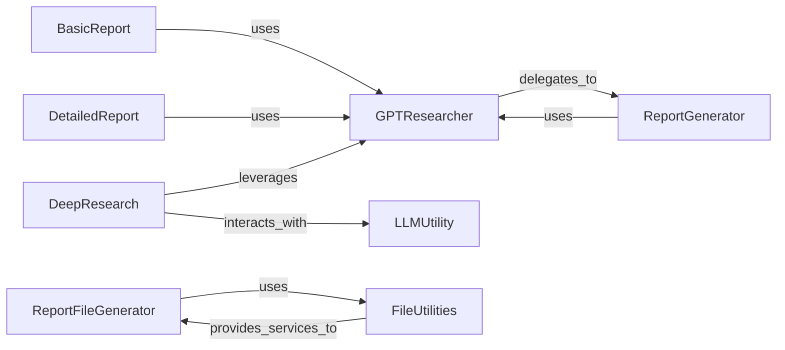

## Component Details

This subsystem is responsible for transforming gathered research data into structured reports and delivering them in various user-friendly formats. It encompasses the core logic for content generation, different report types with their specific workflows, and the final file conversion utilities.

### GPTResearcher
The central orchestrator of the entire research process. It initializes and manages various sub-components, including the `ReportGenerator`, to conduct research, gather context, and prepare for report creation. It acts as the primary interface for initiating different research and report generation workflows.

**Related Classes/Methods**:

- <a href="https://github.com/assafelovic/gpt-researcher/blob/master/gpt_researcher/agent.py#L1-L1" target="_blank" rel="noopener noreferrer">`gpt_researcher.agent` (1:1)</a>

### ReportGenerator
This component, instantiated within `GPTResearcher`, is specifically tasked with generating the textual content of the research report. It handles the creation of report introductions, main body sections, conclusions, and the outlining of subtopics and draft section titles based on the research context.

**Related Classes/Methods**:

- <a href="https://github.com/assafelovic/gpt-researcher/blob/master/gpt_researcher/skills/writer.py#L1-L1" target="_blank" rel="noopener noreferrer">`gpt_researcher.skills.writer` (1:1)</a>

### BasicReport
Defines a straightforward, high-level workflow for generating a basic research report. Its primary role is to initialize and utilize the `GPTResearcher` agent to conduct the necessary research and then produce the final report content.

**Related Classes/Methods**:

- <a href="https://github.com/assafelovic/gpt-researcher/blob/master/backend/report_type/basic_report/basic_report.py#L1-L1" target="_blank" rel="noopener noreferrer">`backend.report_type.basic_report.basic_report` (1:1)</a>

### DetailedReport
Manages the generation of complex, multi-section research reports. It orchestrates a multi-step process that includes initial broad research, identifying and researching subtopics, generating individual reports for each subtopic, and finally assembling a cohesive main report with a table of contents and conclusion.

**Related Classes/Methods**:

- <a href="https://github.com/assafelovic/gpt-researcher/blob/master/backend/report_type/detailed_report/detailed_report.py#L1-L1" target="_blank" rel="noopener noreferrer">`backend.report_type.detailed_report.detailed_report` (1:1)</a>

### DeepResearch
A specialized report type designed for iterative and in-depth research. It leverages `GPTResearcher` for core research and directly interacts with the `LLM Utility` for tasks like generating search queries, processing results, and refining research through feedback loops, enabling a more nuanced and detailed investigation.

**Related Classes/Methods**:

- <a href="https://github.com/assafelovic/gpt-researcher/blob/master/backend/report_type/deep_research/example.py#L1-L1" target="_blank" rel="noopener noreferrer">`backend.report_type.deep_research.example` (1:1)</a>

### ReportFileGenerator
This utility component, typically invoked at the server level, is responsible for handling the final output and conversion of generated research reports. It takes the report content (usually in markdown format) and orchestrates its transformation into various user-consumable file formats.

**Related Classes/Methods**:

- <a href="https://github.com/assafelovic/gpt-researcher/blob/master/backend/server/server_utils.py#L1-L1" target="_blank" rel="noopener noreferrer">`backend.server.server_utils` (1:1)</a>

### FileUtilities
A collection of low-level utility functions that perform the actual file writing and format conversion operations. They encapsulate the logic for converting markdown content into different document formats (e.g., PDF, Word) and saving text to markdown files, providing foundational services for report output.

**Related Classes/Methods**:

- <a href="https://github.com/assafelovic/gpt-researcher/blob/master/backend/utils.py#L34-L58" target="_blank" rel="noopener noreferrer">`backend.utils.write_md_to_pdf` (34:58)</a>
- <a href="https://github.com/assafelovic/gpt-researcher/blob/master/backend/utils.py#L60-L91" target="_blank" rel="noopener noreferrer">`backend.utils.write_md_to_word` (60:91)</a>
- <a href="https://github.com/assafelovic/gpt-researcher/blob/master/backend/utils.py#L21-L32" target="_blank" rel="noopener noreferrer">`backend.utils.write_text_to_md` (21:32)</a>

### LLMUtility
A foundational utility that provides an interface for interacting with large language models (LLMs). It is used by components like `DeepResearch` for tasks such as generating feedback questions, crafting search queries, and processing research results.

**Related Classes/Methods**:

- <a href="https://github.com/assafelovic/gpt-researcher/blob/master/gpt_researcher/utils/llm.py#L1-L1" target="_blank" rel="noopener noreferrer">`gpt_researcher.utils.llm` (1:1)</a>

### [FAQ](https://github.com/CodeBoarding/GeneratedOnBoardings/tree/main?tab=readme-ov-file#faq)