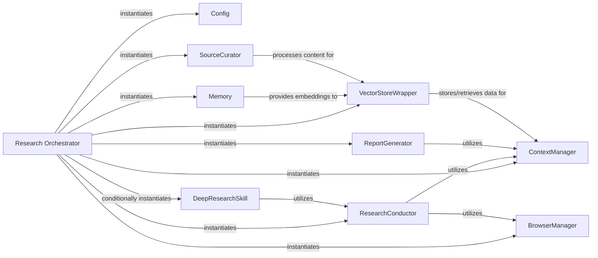

## Component Details

The `Research Orchestrator` subsystem, centered around the `GPTResearcher` class, is the core intelligence and control unit of the `gpt-researcher` system. It orchestrates the entire research process, from defining the research task to delegating sub-tasks to specialized components, managing the overall workflow, and ensuring effective information gathering, processing, and synthesis.

### Research Orchestrator
The `GPTResearcher` class is the central intelligence and control unit. It initializes and manages various specialized sub-components (skills and managers) responsible for different stages of the research process. It defines the overall research workflow, delegates tasks, and aggregates results to achieve the research objective.

**Related Classes/Methods**:

- `GPTResearcher` (1:1)

### Config
This component is responsible for loading and providing configuration settings for the `gpt-researcher` system. It's crucial for `GPTResearcher` to retrieve various settings, including LLM and embedding provider details, and general system parameters, ensuring the system operates with the correct environment and parameters.

**Related Classes/Methods**:

- <a href="https://github.com/assafelovic/gpt-researcher/blob/master/gpt_researcher/config/config.py#L10-L277" target="_blank" rel="noopener noreferrer">`Config` (10:277)</a>

### Memory
This component handles the creation and retrieval of embeddings, which are numerical representations of text used for semantic search and similarity comparisons within the vector store. It acts as the interface for embedding generation, crucial for efficient information retrieval.

**Related Classes/Methods**:

- `Memory` (1:1)

### VectorStoreWrapper
This component provides an abstraction layer for interacting with various vector store implementations. It manages the storage and retrieval of document chunks and their embeddings, enabling efficient semantic search within the research context. It's the persistent storage for processed information.

**Related Classes/Methods**:

- `VectorStoreWrapper` (1:1)

### ResearchConductor
This component is a core skill responsible for executing the main research loop. It orchestrates the process of gathering information, processing it, and building the research context based on the initial query and agent's role. It leverages retrievers and other skills to perform its task.

**Related Classes/Methods**:

- `ResearchConductor` (1:1)

### ReportGenerator
This component is a skill responsible for synthesizing the gathered research context into a structured report. It handles tasks like generating report sections, writing introductions and conclusions, and extracting headers, transforming raw data into a consumable output.

**Related Classes/Methods**:

- `ReportGenerator` (1:1)

### ContextManager
This component is a skill that manages and optimizes the research context. It helps in retrieving relevant information from the accumulated research data, ensuring that the LLM receives focused and pertinent context for its tasks, preventing information overload.

**Related Classes/Methods**:

- <a href="https://github.com/assafelovic/gpt-researcher/blob/master/gpt_researcher/skills/context_manager.py#L7-L86" target="_blank" rel="noopener noreferrer">`ContextManager` (7:86)</a>

### BrowserManager
This component is responsible for managing web scraping operations. It provides an interface for interacting with various web scraping tools and ensures efficient and robust data extraction from URLs, acting as the gateway to external web content.

**Related Classes/Methods**:

- `BrowserManager` (1:1)

### SourceCurator
This component is a skill focused on curating and processing raw source content obtained from retrievers and scrapers. It likely involves cleaning, filtering, and structuring the information before it's added to the research context or stored in the vector store.

**Related Classes/Methods**:

- `SourceCurator` (1:1)

### DeepResearchSkill
This component is a specialized skill for conducting in-depth, iterative research. It manages complex research workflows that might involve multiple layers of inquiry and information synthesis, allowing for more thorough investigations.

**Related Classes/Methods**:

- `DeepResearchSkill` (1:1)

### [FAQ](https://github.com/CodeBoarding/GeneratedOnBoardings/tree/main?tab=readme-ov-file#faq)