```mermaid
graph LR
    Research_Orchestrator["Research Orchestrator"]
    Data_Acquisition_Processing["Data Acquisition & Processing"]
    LLM_AI_Core["LLM & AI Core"]
    Context_Memory_Management["Context & Memory Management"]
    Report_Generation_Output["Report Generation & Output"]
    API_Communication_Layer["API & Communication Layer"]
    Multi_Agent_Orchestration["Multi-Agent Orchestration"]
    Research_Orchestrator -- "Delegates tasks to" --> Data_Acquisition_Processing
    Research_Orchestrator -- "Delegates tasks to" --> Context_Memory_Management
    Research_Orchestrator -- "Utilizes" --> LLM_AI_Core
    Research_Orchestrator -- "Delegates final output generation to" --> Report_Generation_Output
    Data_Acquisition_Processing -- "Provides raw data to" --> Context_Memory_Management
    Data_Acquisition_Processing -- "Utilizes" --> LLM_AI_Core
    LLM_AI_Core -- "Supports" --> Research_Orchestrator
    LLM_AI_Core -- "Supports" --> Data_Acquisition_Processing
    LLM_AI_Core -- "Supports" --> Context_Memory_Management
    LLM_AI_Core -- "Supports" --> Report_Generation_Output
    Context_Memory_Management -- "Receives processed data from" --> Data_Acquisition_Processing
    Context_Memory_Management -- "Provides contextual information to" --> Research_Orchestrator
    Context_Memory_Management -- "Provides contextual information to" --> Report_Generation_Output
    Report_Generation_Output -- "Receives context from" --> Context_Memory_Management
    Report_Generation_Output -- "Utilizes" --> LLM_AI_Core
    Report_Generation_Output -- "Sends generated reports to" --> API_Communication_Layer
    API_Communication_Layer -- "Sends research requests to" --> Research_Orchestrator
    API_Communication_Layer -- "Receives final reports from" --> Report_Generation_Output
    Multi_Agent_Orchestration -- "Delegates complex research tasks to" --> Research_Orchestrator
    click Research_Orchestrator href "https://github.com/CodeBoarding/GeneratedOnBoardings/blob/main//gpt-researcher/Research_Orchestrator.md" "Details"
    click Data_Acquisition_Processing href "https://github.com/CodeBoarding/GeneratedOnBoardings/blob/main//gpt-researcher/Data_Acquisition_Processing.md" "Details"
    click LLM_AI_Core href "https://github.com/CodeBoarding/GeneratedOnBoardings/blob/main//gpt-researcher/LLM_AI_Core.md" "Details"
    click Context_Memory_Management href "https://github.com/CodeBoarding/GeneratedOnBoardings/blob/main//gpt-researcher/Context_Memory_Management.md" "Details"
    click Report_Generation_Output href "https://github.com/CodeBoarding/GeneratedOnBoardings/blob/main//gpt-researcher/Report_Generation_Output.md" "Details"
    click API_Communication_Layer href "https://github.com/CodeBoarding/GeneratedOnBoardings/blob/main//gpt-researcher/API_Communication_Layer.md" "Details"
    click Multi_Agent_Orchestration href "https://github.com/CodeBoarding/GeneratedOnBoardings/blob/main//gpt-researcher/Multi_Agent_Orchestration.md" "Details"
```

## Component Details

The `gpt-researcher` project is designed around a modular architecture, enabling flexible and extensible research capabilities. The analysis of its Control Flow Graph (CFG) and source code reveals a clear separation of concerns, with distinct components handling orchestration, data acquisition, LLM interactions, context management, report generation, and communication.

### Research Orchestrator
This is the central intelligence and control unit of the `gpt-researcher` system. It orchestrates the entire research process, from defining the research task to delegating sub-tasks to specialized components. It manages the overall workflow, ensuring that information is gathered, processed, and synthesized effectively to achieve the research objective. It also implicitly leverages the system's configuration.

**Related Classes/Methods**:

- <a href="https://github.com/assafelovic/gpt-researcher/blob/master/gpt_researcher/agent.py#L30-L466" target="_blank" rel="noopener noreferrer">`gpt_researcher.agent.GPTResearcher` (30:466)</a>

### Data Acquisition & Processing
This component is responsible for gathering raw information from various external and internal sources. It encompasses web scraping, document loading, and advanced retrieval mechanisms. It processes the retrieved data, making it available for contextualization and further analysis by other components.

**Related Classes/Methods**:

- <a href="https://github.com/assafelovic/gpt-researcher/blob/master/gpt_researcher/skills/researcher.py#L12-L964" target="_blank" rel="noopener noreferrer">`gpt_researcher.skills.researcher.ResearchConductor` (12:964)</a>
- <a href="https://github.com/assafelovic/gpt-researcher/blob/master/gpt_researcher/scraper/scraper.py#L23-L193" target="_blank" rel="noopener noreferrer">`gpt_researcher.scraper.scraper.Scraper` (23:193)</a>
- <a href="https://github.com/assafelovic/gpt-researcher/blob/master/gpt_researcher/document/document.py#L15-L91" target="_blank" rel="noopener noreferrer">`gpt_researcher.document.document.DocumentLoader` (15:91)</a>
- <a href="https://github.com/assafelovic/gpt-researcher/blob/master/gpt_researcher/retrievers/mcp/retriever.py#L0-L0" target="_blank" rel="noopener noreferrer">`gpt_researcher.retrievers.mcp.retriever.MCPRetriever` (0:0)</a>

### LLM & AI Core
This fundamental component provides a standardized and abstracted interface for interacting with various Large Language Models (LLMs). It handles chat completions, text generation, and supports intelligent decision-making across all stages of the research process. It also manages conversational memory for ongoing interactions.

**Related Classes/Methods**:

- <a href="https://github.com/assafelovic/gpt-researcher/blob/master/gpt_researcher/utils/llm.py#L22-L94" target="_blank" rel="noopener noreferrer">`gpt_researcher.utils.llm.create_chat_completion` (22:94)</a>
- <a href="https://github.com/assafelovic/gpt-researcher/blob/master/gpt_researcher/llm_provider/generic/base.py#L84-L277" target="_blank" rel="noopener noreferrer">`gpt_researcher.llm_provider.generic.base.GenericLLMProvider` (84:277)</a>
- <a href="https://github.com/assafelovic/gpt-researcher/blob/master/backend/chat/chat.py#L14-L105" target="_blank" rel="noopener noreferrer">`backend.chat.chat.ChatAgentWithMemory` (14:105)</a>

### Context & Memory Management
This component is crucial for maintaining the coherence and relevance of the research. It manages the storage, retrieval, and organization of research context and memory. By leveraging vector databases, it efficiently stores embeddings of gathered information, allowing for quick and accurate retrieval of relevant content as the research progresses.

**Related Classes/Methods**:

- <a href="https://github.com/assafelovic/gpt-researcher/blob/master/gpt_researcher/vector_store/vector_store.py#L0-L0" target="_blank" rel="noopener noreferrer">`gpt_researcher.vector_store.vector_store.VectorStoreWrapper` (0:0)</a>
- <a href="https://github.com/assafelovic/gpt-researcher/blob/master/gpt_researcher/skills/context_manager.py#L7-L86" target="_blank" rel="noopener noreferrer">`gpt_researcher.skills.context_manager.ContextManager` (7:86)</a>

### Report Generation & Output
This component is responsible for synthesizing the gathered information and context into a structured and coherent research report. It supports the generation of various report types (basic, detailed, deep research) and handles the conversion of the final report into different file formats for user consumption.

**Related Classes/Methods**:

- `gpt_researcher.report_generator.report_generator.ReportGenerator` (0:0)
- <a href="https://github.com/assafelovic/gpt-researcher/blob/master/backend/report_type/basic_report/basic_report.py#L6-L58" target="_blank" rel="noopener noreferrer">`backend.report_type.basic_report.basic_report.BasicReport` (6:58)</a>
- <a href="https://github.com/assafelovic/gpt-researcher/blob/master/backend/report_type/detailed_report/detailed_report.py#L7-L158" target="_blank" rel="noopener noreferrer">`backend.report_type.detailed_report.detailed_report.DetailedReport` (7:158)</a>
- <a href="https://github.com/assafelovic/gpt-researcher/blob/master/backend/report_type/deep_research/example.py#L26-L324" target="_blank" rel="noopener noreferrer">`backend.report_type.deep_research.example.DeepResearch` (26:324)</a>
- <a href="https://github.com/assafelovic/gpt-researcher/blob/master/backend/server/server_utils.py#L196-L200" target="_blank" rel="noopener noreferrer">`backend.server.server_utils.generate_report_files` (196:200)</a>

### API & Communication Layer
This component serves as the primary interface for real-time communication between the frontend user interface and the backend research system. It receives research requests from clients, orchestrates the initiation of research tasks via the Research Orchestrator, and streams progress updates and final results back to the client.

**Related Classes/Methods**:

- <a href="https://github.com/assafelovic/gpt-researcher/blob/master/backend/server/server.py#L199-L204" target="_blank" rel="noopener noreferrer">`backend.server.server.websocket_endpoint` (199:204)</a>
- <a href="https://github.com/assafelovic/gpt-researcher/blob/master/backend/server/websocket_manager.py#L100-L171" target="_blank" rel="noopener noreferrer">`backend.server.websocket_manager.run_agent` (100:171)</a>

### Multi-Agent Orchestration
This specialized framework provides a higher-level orchestration for complex research workflows that necessitate coordination among multiple AI agents. It acts as a meta-orchestrator, delegating specific, often intricate, research tasks to instances of the core Research Orchestrator, enabling more sophisticated and collaborative research endeavors.

**Related Classes/Methods**:

- <a href="https://github.com/assafelovic/gpt-researcher/blob/master/multi_agents/agents/orchestrator.py#L18-L117" target="_blank" rel="noopener noreferrer">`multi_agents.agents.orchestrator.ChiefEditorAgent` (18:117)</a>
- <a href="https://github.com/assafelovic/gpt-researcher/blob/master/multi_agents/agents/researcher.py#L5-L57" target="_blank" rel="noopener noreferrer">`multi_agents.agents.researcher.ResearchAgent` (5:57)</a>
- <a href="https://github.com/assafelovic/gpt-researcher/blob/master/multi_agents/main.py#L39-L49" target="_blank" rel="noopener noreferrer">`multi_agents.main.run_research_task` (39:49)</a>

### [FAQ](https://github.com/CodeBoarding/GeneratedOnBoardings/tree/main?tab=readme-ov-file#faq)