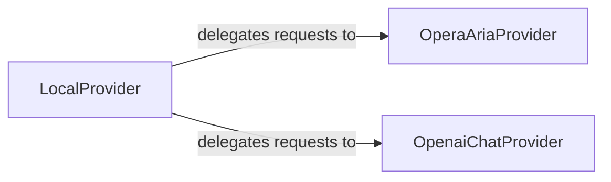

## Details

The `g4f` project's `Provider` subsystem is designed to offer a unified and extensible interface for interacting with diverse AI models, whether hosted remotely or locally. It achieves this through a set of specialized provider components, each encapsulating the unique communication protocols, authentication mechanisms, and data handling requirements of a specific AI service. For instance, `OperaAriaProvider` manages token-based authentication and media uploads for Opera's proprietary APIs, while `OpenaiChatProvider` handles more complex browser-based authentication flows and multimodal content for OpenAI services. Complementing these, `LocalProvider` acts as an adapter, enabling seamless integration with locally hosted AI models by delegating requests to a dedicated local model handler. This modular architecture ensures that the core application can interact with various AI backends through a consistent API, abstracting away the underlying complexities of each provider.

### OperaAriaProvider
Manages authentication (token generation/refresh) and conversation state for the OperaAria service. It handles media uploads and text generation by interacting with OperaAria's specific API endpoints.

**Related Classes/Methods**: _None_

### OpenaiChatProvider
Handles complex authentication flows (e.g., browser-based login), manages API keys and cookies, formats messages, processes image uploads, and parses streamed responses, including extracting sources and references for OpenAI-like chat services.

**Related Classes/Methods**: _None_

### LocalProvider
Manages the discovery, storage, and access of local AI models. It provides a `create_completion` method, indicating its role in serving AI requests using locally available models or potentially orchestrating calls to other providers.

**Related Classes/Methods**: _None_

### [FAQ](https://github.com/CodeBoarding/GeneratedOnBoardings/tree/main?tab=readme-ov-file#faq)