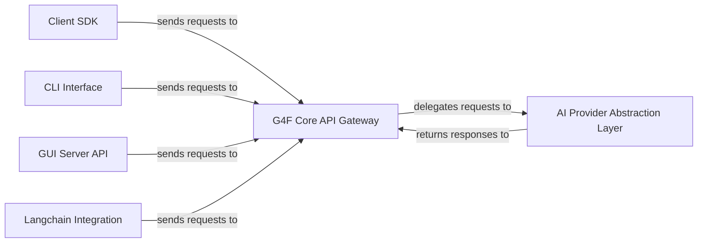

## Details

The `gpt4free` project is structured around a central `G4F Core API Gateway` that acts as the primary orchestrator for all external and internal interactions. This gateway receives requests from various client-facing components, including the `Client SDK`, `CLI Interface`, `GUI Server API`, and `Langchain Integration`. Upon receiving a request, the `G4F Core API Gateway` intelligently delegates the processing to the `AI Provider Abstraction Layer`. This layer is responsible for encapsulating the specific logic required to interact with diverse AI model providers, ensuring a uniform interface for the gateway. After processing, the `AI Provider Abstraction Layer` returns the responses back to the `G4F Core API Gateway`, which then formats and sends them back to the originating client. This architecture promotes modularity, allowing for easy integration of new AI providers and client interfaces without significant changes to the core logic.

### G4F Core API Gateway
The primary entry point and orchestration layer for all interactions. It handles request routing, response formatting, and delegates tasks to appropriate backend services. It embodies the API Gateway pattern.

**Related Classes/Methods**:

- <a href="https://github.com/xtekky/gpt4free/blob/main/g4f/api" target="_blank" rel="noopener noreferrer">`g4f.api`</a>

### Client SDK
Provides a programmatic interface (SDK) for developers to interact with the G4F Core API. It abstracts the underlying API calls, offering a user-friendly Python interface.

**Related Classes/Methods**:

- <a href="https://github.com/xtekky/gpt4free/blob/main/g4f/client" target="_blank" rel="noopener noreferrer">`g4f.client`</a>

### CLI Interface
Offers a command-line interface for direct user interaction with the G4F functionalities, allowing users to perform operations without writing code.

**Related Classes/Methods**:

- <a href="https://github.com/xtekky/gpt4free/blob/main/g4f/cli" target="_blank" rel="noopener noreferrer">`g4f.cli`</a>

### GUI Server API
The backend API specifically designed to serve the g4f.gui (Web Interface/GUI) component. It translates web requests into calls understood by the G4F Core API Gateway.

**Related Classes/Methods**:

- <a href="https://github.com/xtekky/gpt4free/blob/main/g4f/gui/server/api.py" target="_blank" rel="noopener noreferrer">`g4f.gui.server.api`</a>

### Langchain Integration
An adapter layer that allows the gpt4free functionalities to be seamlessly integrated and used within the Langchain framework, demonstrating the system's extensibility.

**Related Classes/Methods**:

- <a href="https://github.com/xtekky/gpt4free/blob/main/g4f/integration/langchain.py" target="_blank" rel="noopener noreferrer">`g4f.integration.langchain`</a>

### AI Provider Abstraction Layer
This conceptual layer represents the various modules responsible for interacting with different underlying AI model providers. It encapsulates provider-specific logic, allowing the G4F Core API Gateway to interact with diverse models uniformly.

**Related Classes/Methods**:

- <a href="https://github.com/xtekky/gpt4free/blob/main/g4f/Provider/local/Local.py" target="_blank" rel="noopener noreferrer">`g4f.Provider.local.Local`</a>
- <a href="https://github.com/xtekky/gpt4free/blob/main/g4f/Provider/OperaAria.py" target="_blank" rel="noopener noreferrer">`g4f.Provider.OperaAria`</a>
- <a href="https://github.com/xtekky/gpt4free/blob/main/g4f/Provider/needs_auth/OpenaiChat.py" target="_blank" rel="noopener noreferrer">`g4f.Provider.needs_auth.OpenaiChat`</a>

### [FAQ](https://github.com/CodeBoarding/GeneratedOnBoardings/tree/main?tab=readme-ov-file#faq)