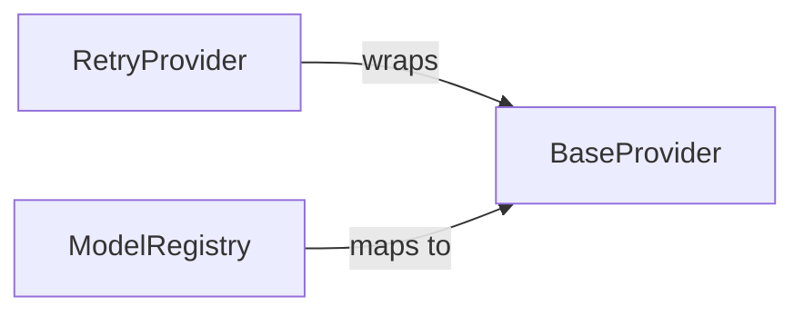

## Details

The `Provider Abstraction Layer` is a core subsystem responsible for standardizing interactions with various AI service providers. Its boundaries encompass the mechanisms for selecting, routing, and ensuring the reliability of these interactions, including the management of available AI models.

### BaseProvider
This component defines the abstract interface or contract that all concrete AI service providers must adhere to. It acts as the foundational adapter, ensuring a consistent API for interacting with diverse LLMs, regardless of their underlying vendor-specific implementations. This is crucial for the "API Wrapper" aspect, enabling interoperability.

**Related Classes/Methods**:

- <a href="https://github.com/xtekky/gpt4free/blob/main/g4f/providers/base_provider.py" target="_blank" rel="noopener noreferrer">`g4f.providers.base_provider.BaseProvider`</a>

### RetryProvider
A concrete implementation or wrapper that enhances the robustness of AI service interactions. It encapsulates retry logic, automatically re-attempting failed or timed-out requests to improve the reliability and fault tolerance of the system. This aligns with the "API Gateway" pattern's focus on resilience.

**Related Classes/Methods**:

- <a href="https://github.com/xtekky/gpt4free/blob/main/g4f/providers/retry_provider.py#L321-L418" target="_blank" rel="noopener noreferrer">`g4f.providers.retry_provider.RetryProvider`:321-418</a>

### ModelRegistry
This component serves as a central repository for managing and looking up available AI models. It stores metadata, capabilities, and mappings to specific `BaseProvider` implementations, facilitating dynamic model selection and intelligent routing of requests to the appropriate backend AI service. This is vital for the "API Gateway" and "Modular Design" patterns, enabling extensibility and discoverability of models.

**Related Classes/Methods**:

- <a href="https://github.com/xtekky/gpt4free/blob/main/g4f/models.py#L55-L109" target="_blank" rel="noopener noreferrer">`g4f.models.ModelRegistry`:55-109</a>

### [FAQ](https://github.com/CodeBoarding/GeneratedOnBoardings/tree/main?tab=readme-ov-file#faq)