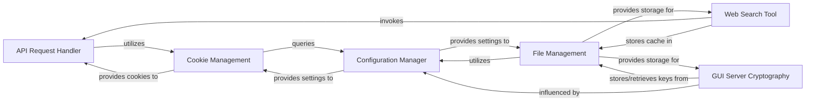

## Details

The `g4f` project's core architecture is built around a set of interconnected components that manage external interactions, configuration, and data persistence. The `API Request Handler` is central to all outbound communications, relying on the `Cookie Management` component to handle session-specific data. The `Configuration Manager` provides essential, centralized settings that dictate the behavior and locations for data storage across the system. The `Web Search Tool` extends the system's intelligence by integrating real-time web data, leveraging `File Management` for efficient caching of search results. `File Management` itself is a foundational component, offering secure and organized file system operations, which are also critical for the `GUI Server Cryptography` component to securely store and retrieve its cryptographic keys, ensuring the integrity and confidentiality of GUI server operations.

### API Request Handler
Orchestrates all outgoing HTTP/HTTPS requests to external services, potentially leveraging browser automation for advanced interactions and managing session-level details, including streaming data. This component is fundamental for any API wrapper, enabling communication with external LLM providers.

**Related Classes/Methods**:

- <a href="https://github.com/xtekky/gpt4free/blob/main/g4f/requests" target="_blank" rel="noopener noreferrer">`g4f.requests`</a>

### Cookie Management
Provides a robust mechanism for handling and persisting cookies, crucial for maintaining authenticated sessions and state across interactions with various web services. Essential for managing sessions with providers that rely on cookie-based authentication. It can load cookies from various browsers and handle HAR/JSON cookie files.

**Related Classes/Methods**:

- <a href="https://github.com/xtekky/gpt4free/blob/main/g4f/cookies.py" target="_blank" rel="noopener noreferrer">`g4f.cookies`</a>

### Configuration Manager
Acts as the central repository for all application-wide settings, ensuring that various components can access consistent configuration data for their operations. This is a cornerstone for modular design, allowing flexible and centralized management of application behavior, including defining paths for data storage.

**Related Classes/Methods**:

- <a href="https://github.com/xtekky/gpt4free/blob/main/g4f/config.py" target="_blank" rel="noopener noreferrer">`g4f.config`</a>

### Web Search Tool
Extends the capabilities of the AI/ML system by providing real-time information retrieval from the web, processing search results, and extracting relevant content. This component enhances the LLM's utility by providing up-to-date external data and includes a caching mechanism for efficiency.

**Related Classes/Methods**:

- <a href="https://github.com/xtekky/gpt4free/blob/main/g4f/tools/web_search.py" target="_blank" rel="noopener noreferrer">`g4f.tools.web_search`</a>

### GUI Server Cryptography
Ensures the security of data and sessions within the web application by handling key generation, encryption, and decryption processes. Critical for the Web Application component, ensuring secure communication and data handling, and stores keys persistently.

**Related Classes/Methods**:

- <a href="https://github.com/xtekky/gpt4free/blob/main/g4f/gui/server/crypto.py" target="_blank" rel="noopener noreferrer">`g4f.gui.server.crypto`</a>

### File Management
Handles file-system related operations, including reading, writing, and managing local files, which might be used for caching, data persistence, or temporary storage. Provides essential persistence capabilities for various parts of the system, including secure filename sanitization and directory management.

**Related Classes/Methods**:

- <a href="https://github.com/xtekky/gpt4free/blob/main/g4f/files.py" target="_blank" rel="noopener noreferrer">`g4f.files`</a>

### [FAQ](https://github.com/CodeBoarding/GeneratedOnBoardings/tree/main?tab=readme-ov-file#faq)