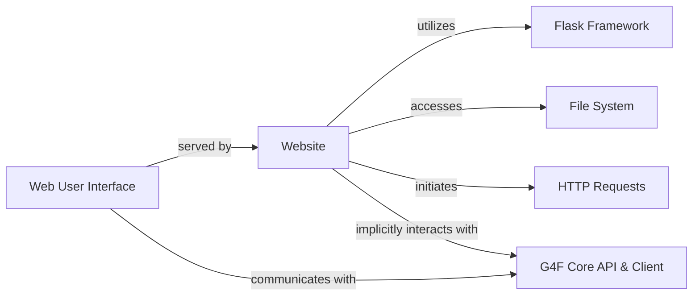

## Details

The `g4f` project's graphical user interface is primarily managed by the `Website` component, which serves as the concrete implementation of the `Web User Interface`. This component, built upon the `Flask Framework`, is responsible for defining web routes, serving static assets, and dynamically managing web content. It interacts with the `File System` for caching purposes and initiates `HTTP Requests` to fetch updated UI elements. The `Web User Interface`, facilitated by the `Website` component, communicates with the `G4F Core API & Client` to access backend functionalities, forming the core interaction pathway for user operations within the system.

### Web User Interface [[Expand]](./Web_User_Interface.md)
Provides the visual and interactive frontend for users.

**Related Classes/Methods**: _None_

### Website
Initializes and manages the Flask web application, serves static assets, handles content caching, and fetches dynamic content.

**Related Classes/Methods**:

- <a href="https://github.com/xtekky/gpt4free/blob/main/g4f/gui/server/website.py#L56-L104" target="_blank" rel="noopener noreferrer">`g4f.gui.server.website.Website`:56-104</a>

### G4F Core API & Client [[Expand]](./G4F_Core_API_Client.md)
Represents the backend API and client-side interactions.

**Related Classes/Methods**: _None_

### Flask Framework
The web framework used by the `Website` component.

**Related Classes/Methods**: _None_

### File System
The underlying system for storing and retrieving files.

**Related Classes/Methods**: _None_

### HTTP Requests
The mechanism for fetching web content from external URLs.

**Related Classes/Methods**: _None_

### [FAQ](https://github.com/CodeBoarding/GeneratedOnBoardings/tree/main?tab=readme-ov-file#faq)