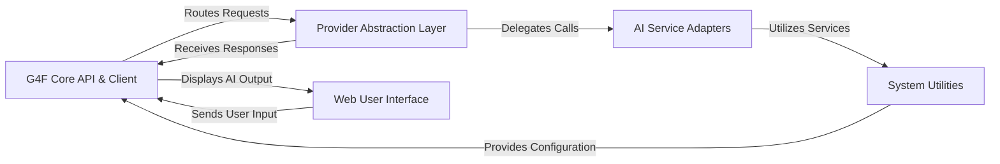

## Details

The `gpt4free` architecture is centered around a G4F Core API & Client that serves as the primary interface for all interactions, whether from a Python SDK, CLI, or the integrated Web User Interface. This core component intelligently routes AI-related requests to the Provider Abstraction Layer, which acts as a smart orchestrator, selecting the optimal AI Service Adapters to communicate with various third-party or local AI models. All external communications, file operations, and essential configurations are handled by the System Utilities layer, providing a robust and secure foundation for the entire application. This modular design ensures high interoperability, extensibility, and a clear separation of concerns, facilitating both development and deployment of diverse AI capabilities.

### G4F Core API & Client [[Expand]](./G4F_Core_API_Client.md)
The central gateway for all interactions, providing a unified API for programmatic clients (SDK, CLI) and external integrations. It handles request routing, response formatting, and overall orchestration.

**Related Classes/Methods**:

- <a href="https://github.com/xtekky/gpt4free/blob/main/g4f/client/__init__.py" target="_blank" rel="noopener noreferrer">`g4f.client.__init__`</a>
- <a href="https://github.com/xtekky/gpt4free/blob/main/g4f/gui/server/api.py" target="_blank" rel="noopener noreferrer">`g4f.gui.server.api`</a>
- <a href="https://github.com/xtekky/gpt4free/blob/main/g4f/cli/__init__.py" target="_blank" rel="noopener noreferrer">`g4f.cli.__init__`</a>
- <a href="https://github.com/xtekky/gpt4free/blob/main/g4f/integration/langchain.py" target="_blank" rel="noopener noreferrer">`g4f.integration.langchain`</a>

### Provider Abstraction Layer [[Expand]](./Provider_Abstraction_Layer.md)
Manages the selection, routing, and standardization of interactions with various AI service providers. It includes the model registry and retry mechanisms.

**Related Classes/Methods**:

- <a href="https://github.com/xtekky/gpt4free/blob/main/g4f/providers/base_provider.py" target="_blank" rel="noopener noreferrer">`g4f.providers.base_provider`</a>
- <a href="https://github.com/xtekky/gpt4free/blob/main/g4f/providers/retry_provider.py" target="_blank" rel="noopener noreferrer">`g4f.providers.retry_provider`</a>
- <a href="https://github.com/xtekky/gpt4free/blob/main/g4f/models.py" target="_blank" rel="noopener noreferrer">`g4f.models`</a>

### AI Service Adapters [[Expand]](./AI_Service_Adapters.md)
Specific implementations for interacting with individual third-party AI APIs (e.g., OpenAI, Gemini) and local models, translating generic requests into provider-specific calls.

**Related Classes/Methods**:

- <a href="https://github.com/xtekky/gpt4free/blob/main/g4f/Provider/OperaAria.py" target="_blank" rel="noopener noreferrer">`g4f.Provider.OperaAria`</a>
- <a href="https://github.com/xtekky/gpt4free/blob/main/g4f/Provider/needs_auth/OpenaiChat.py" target="_blank" rel="noopener noreferrer">`g4f.Provider.needs_auth.OpenaiChat`</a>
- <a href="https://github.com/xtekky/gpt4free/blob/main/g4f/locals/provider.py" target="_blank" rel="noopener noreferrer">`g4f.locals.provider`</a>

### Web User Interface [[Expand]](./Web_User_Interface.md)
The browser-based application providing a visual and interactive experience for users to engage with the `g4f` system, communicating with the `G4F Core API & Client` backend.

**Related Classes/Methods**:

- <a href="https://github.com/xtekky/gpt4free/blob/main/g4f/gui/__init__.py" target="_blank" rel="noopener noreferrer">`g4f.gui.__init__`</a>
- <a href="https://github.com/xtekky/gpt4free/blob/main/g4f/gui/server/website.py" target="_blank" rel="noopener noreferrer">`g4f.gui.server.website`</a>

### System Utilities [[Expand]](./System_Utilities.md)
A foundational layer providing common services such as HTTP communication, file management, cookie handling, web search tools, configuration management, and cryptographic operations.

**Related Classes/Methods**:

- <a href="https://github.com/xtekky/gpt4free/blob/main/g4f/requests/__init__.py" target="_blank" rel="noopener noreferrer">`g4f.requests.__init__`</a>
- <a href="https://github.com/xtekky/gpt4free/blob/main/g4f/cookies.py" target="_blank" rel="noopener noreferrer">`g4f.cookies`</a>
- <a href="https://github.com/xtekky/gpt4free/blob/main/g4f/tools/web_search.py" target="_blank" rel="noopener noreferrer">`g4f.tools.web_search`</a>
- <a href="https://github.com/xtekky/gpt4free/blob/main/g4f/files.py" target="_blank" rel="noopener noreferrer">`g4f.files`</a>
- <a href="https://github.com/xtekky/gpt4free/blob/main/g4f/config.py" target="_blank" rel="noopener noreferrer">`g4f.config`</a>
- <a href="https://github.com/xtekky/gpt4free/blob/main/g4f/gui/server/crypto.py" target="_blank" rel="noopener noreferrer">`g4f.gui.server.crypto`</a>

### [FAQ](https://github.com/CodeBoarding/GeneratedOnBoardings/tree/main?tab=readme-ov-file#faq)