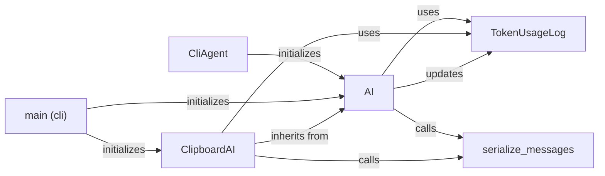

## Component Details

The AI Core component orchestrates the code generation process by interacting with a language model based on user prompts. It manages token usage, serializes messages for the language model, and provides specialized implementations for different input sources, such as the clipboard. The core flow involves initializing the AI with a language model, processing user input to generate prompts, interacting with the language model to obtain code, and updating the token usage log.

### CliAgent
The `CliAgent` class is responsible for handling interactions in a command-line interface environment. It takes user input, orchestrates the AI to generate code based on that input, and displays the generated code to the user.
**Related Classes/Methods**:

- <a href="https://github.com/AntonOsika/gpt-engineer/blob/master/gpt_engineer/applications/cli/cli_agent.py#L36-L232" target="_blank" rel="noopener noreferrer">`gpt_engineer.applications.cli.cli_agent.CliAgent` (36:232)</a>

### main (cli)
The `main` function in `gpt_engineer.applications.cli.main` serves as the entry point for the command-line application. It initializes the necessary components, such as `ClipboardAI` and `AI`, and starts the code generation process based on user input.
**Related Classes/Methods**:

- <a href="https://github.com/AntonOsika/gpt-engineer/blob/master/gpt_engineer/applications/cli/main.py#L281-L557" target="_blank" rel="noopener noreferrer">`gpt_engineer.applications.cli.main:main` (281:557)</a>

### AI
The `AI` class is a core component responsible for generating code based on prompts. It manages the interaction with the language model, including token usage tracking and message serialization. It provides methods for starting the code generation process and retrieving the next code block from the language model.
**Related Classes/Methods**:

- <a href="https://github.com/AntonOsika/gpt-engineer/blob/master/gpt_engineer/core/ai.py#L50-L379" target="_blank" rel="noopener noreferrer">`gpt_engineer.core.ai.AI` (50:379)</a>
- <a href="https://github.com/AntonOsika/gpt-engineer/blob/master/gpt_engineer/core/ai.py#L88-L118" target="_blank" rel="noopener noreferrer">`gpt_engineer.core.ai.AI.__init__` (88:118)</a>
- <a href="https://github.com/AntonOsika/gpt-engineer/blob/master/gpt_engineer/core/ai.py#L120-L143" target="_blank" rel="noopener noreferrer">`gpt_engineer.core.ai.AI.start` (120:143)</a>
- <a href="https://github.com/AntonOsika/gpt-engineer/blob/master/gpt_engineer/core/ai.py#L206-L251" target="_blank" rel="noopener noreferrer">`gpt_engineer.core.ai.AI.next` (206:251)</a>
- <a href="https://github.com/AntonOsika/gpt-engineer/blob/master/gpt_engineer/core/ai.py#L165-L204" target="_blank" rel="noopener noreferrer">`gpt_engineer.core.ai.AI._collapse_text_messages` (165:204)</a>

### serialize_messages
The `serialize_messages` function is responsible for converting messages into a format suitable for the language model. It takes a list of messages as input and returns a serialized string representation of the messages.
**Related Classes/Methods**:

- <a href="https://github.com/AntonOsika/gpt-engineer/blob/master/gpt_engineer/core/ai.py#L382-L383" target="_blank" rel="noopener noreferrer">`gpt_engineer.core.ai:serialize_messages` (382:383)</a>

### ClipboardAI
The `ClipboardAI` class is a specialized version of `AI` that takes input from the clipboard. It handles the interaction with the language model and manages the input from the clipboard. It inherits from the AI class and overrides the next method to fetch input from the clipboard.
**Related Classes/Methods**:

- <a href="https://github.com/AntonOsika/gpt-engineer/blob/master/gpt_engineer/core/ai.py#L386-L437" target="_blank" rel="noopener noreferrer">`gpt_engineer.core.ai.ClipboardAI` (386:437)</a>
- <a href="https://github.com/AntonOsika/gpt-engineer/blob/master/gpt_engineer/core/ai.py#L388-L390" target="_blank" rel="noopener noreferrer">`gpt_engineer.core.ai.ClipboardAI.__init__` (388:390)</a>
- <a href="https://github.com/AntonOsika/gpt-engineer/blob/master/gpt_engineer/core/ai.py#L408-L437" target="_blank" rel="noopener noreferrer">`gpt_engineer.core.ai.ClipboardAI.next` (408:437)</a>

### TokenUsageLog
The `TokenUsageLog` class is responsible for tracking token usage during the code generation process. It interacts with the `Tokenizer` to count tokens and calculate costs. It provides methods for updating the log and calculating the total usage cost.
**Related Classes/Methods**:

- <a href="https://github.com/AntonOsika/gpt-engineer/blob/master/gpt_engineer/core/token_usage.py#L180-L297" target="_blank" rel="noopener noreferrer">`gpt_engineer.core.token_usage.TokenUsageLog` (180:297)</a>
- <a href="https://github.com/AntonOsika/gpt-engineer/blob/master/gpt_engineer/core/token_usage.py#L185-L191" target="_blank" rel="noopener noreferrer">`gpt_engineer.core.token_usage.TokenUsageLog.__init__` (185:191)</a>
- <a href="https://github.com/AntonOsika/gpt-engineer/blob/master/gpt_engineer/core/token_usage.py#L193-L224" target="_blank" rel="noopener noreferrer">`gpt_engineer.core.token_usage.TokenUsageLog.update_log` (193:224)</a>
- <a href="https://github.com/AntonOsika/gpt-engineer/blob/master/gpt_engineer/core/token_usage.py#L273-L297" target="_blank" rel="noopener noreferrer">`gpt_engineer.core.token_usage.TokenUsageLog.usage_cost` (273:297)</a>