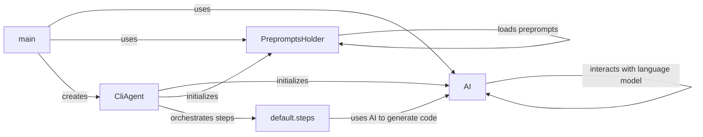

## Component Details

The Agent Orchestrator manages the overall code generation and improvement process. It initializes the AI, loads prompts, interacts with the file system, and executes the generated code. The core flow involves the `CliAgent` receiving instructions from the `main` function, initializing the `AI` and `PrepromptsHolder`, orchestrating the code generation/improvement steps defined in `default.steps`, and utilizing the `AI` to interact with the language model. The `PrepromptsHolder` ensures the correct prompts are loaded, guiding the AI's behavior. The `default.steps` module defines the specific actions taken during each step of the process.

### CliAgent
The CliAgent orchestrates the execution of the gpt-engineer workflow from the command line. It initializes the AI, loads preprompts, and manages the execution environment. It also handles improvements to existing codebases.
**Related Classes/Methods**:

- <a href="https://github.com/AntonOsika/gpt-engineer/blob/master/gpt_engineer/applications/cli/cli_agent.py#L36-L232" target="_blank" rel="noopener noreferrer">`gpt_engineer.applications.cli.cli_agent.CliAgent` (36:232)</a>
- <a href="https://github.com/AntonOsika/gpt-engineer/blob/master/gpt_engineer/applications/cli/cli_agent.py#L84-L100" target="_blank" rel="noopener noreferrer">`gpt_engineer.applications.cli.cli_agent.CliAgent.__init__` (84:100)</a>
- <a href="https://github.com/AntonOsika/gpt-engineer/blob/master/gpt_engineer/applications/cli/cli_agent.py#L103-L150" target="_blank" rel="noopener noreferrer">`gpt_engineer.applications.cli.cli_agent.CliAgent.with_default_config` (103:150)</a>
- <a href="https://github.com/AntonOsika/gpt-engineer/blob/master/gpt_engineer/applications/cli/cli_agent.py#L152-L183" target="_blank" rel="noopener noreferrer">`gpt_engineer.applications.cli.cli_agent.CliAgent.init` (152:183)</a>
- <a href="https://github.com/AntonOsika/gpt-engineer/blob/master/gpt_engineer/applications/cli/cli_agent.py#L185-L232" target="_blank" rel="noopener noreferrer">`gpt_engineer.applications.cli.cli_agent.CliAgent.improve` (185:232)</a>

### main
The main function serves as the entry point for the CLI application. It parses command-line arguments, loads necessary configurations, initializes the AI, and orchestrates the code generation or improvement process. It also handles user interactions, such as prompting for confirmation and displaying token usage.
**Related Classes/Methods**:

- <a href="https://github.com/AntonOsika/gpt-engineer/blob/master/gpt_engineer/applications/cli/main.py#L281-L557" target="_blank" rel="noopener noreferrer">`gpt_engineer.applications.cli.main:main` (281:557)</a>

### AI
The AI class encapsulates the interaction with the language model. It initializes the chat model, manages the conversation history, and handles token usage logging. It provides methods for sending prompts to the model and receiving responses.
**Related Classes/Methods**:

- <a href="https://github.com/AntonOsika/gpt-engineer/blob/master/gpt_engineer/core/ai.py#L50-L379" target="_blank" rel="noopener noreferrer">`gpt_engineer.core.ai.AI` (50:379)</a>
- <a href="https://github.com/AntonOsika/gpt-engineer/blob/master/gpt_engineer/core/ai.py#L88-L118" target="_blank" rel="noopener noreferrer">`gpt_engineer.core.ai.AI.__init__` (88:118)</a>
- <a href="https://github.com/AntonOsika/gpt-engineer/blob/master/gpt_engineer/core/ai.py#L120-L143" target="_blank" rel="noopener noreferrer">`gpt_engineer.core.ai.AI.start` (120:143)</a>
- <a href="https://github.com/AntonOsika/gpt-engineer/blob/master/gpt_engineer/core/ai.py#L165-L204" target="_blank" rel="noopener noreferrer">`gpt_engineer.core.ai.AI._collapse_text_messages` (165:204)</a>
- <a href="https://github.com/AntonOsika/gpt-engineer/blob/master/gpt_engineer/core/ai.py#L206-L251" target="_blank" rel="noopener noreferrer">`gpt_engineer.core.ai.AI.next` (206:251)</a>

### PrepromptsHolder
The PrepromptsHolder class manages the loading and retrieval of preprompts, which are used to guide the language model's behavior. It interacts with the DiskMemory to load preprompts from disk.
**Related Classes/Methods**:

- <a href="https://github.com/AntonOsika/gpt-engineer/blob/master/gpt_engineer/core/preprompts_holder.py#L7-L29" target="_blank" rel="noopener noreferrer">`gpt_engineer.core.preprompts_holder.PrepromptsHolder` (7:29)</a>
- <a href="https://github.com/AntonOsika/gpt-engineer/blob/master/gpt_engineer/core/preprompts_holder.py#L27-L29" target="_blank" rel="noopener noreferrer">`gpt_engineer.core.preprompts_holder.PrepromptsHolder.get_preprompts` (27:29)</a>

### default.steps
The `default.steps` module contains functions that define the individual steps in the code generation and improvement workflows. These steps include generating code, generating entrypoints, and improving existing code. They use the AI class to interact with the language model and the FilesDict class to manage the generated files.
**Related Classes/Methods**:

- <a href="https://github.com/AntonOsika/gpt-engineer/blob/master/gpt_engineer/core/default/steps.py#L121-L150" target="_blank" rel="noopener noreferrer">`gpt_engineer.core.default.steps:gen_code` (121:150)</a>
- <a href="https://github.com/AntonOsika/gpt-engineer/blob/master/gpt_engineer/core/default/steps.py#L153-L202" target="_blank" rel="noopener noreferrer">`gpt_engineer.core.default.steps:gen_entrypoint` (153:202)</a>
- <a href="https://github.com/AntonOsika/gpt-engineer/blob/master/gpt_engineer/core/default/steps.py#L271-L312" target="_blank" rel="noopener noreferrer">`gpt_engineer.core.default.steps:improve_fn` (271:312)</a>
- <a href="https://github.com/AntonOsika/gpt-engineer/blob/master/gpt_engineer/core/default/steps.py#L315-L338" target="_blank" rel="noopener noreferrer">`gpt_engineer.core.default.steps:_improve_loop` (315:338)</a>