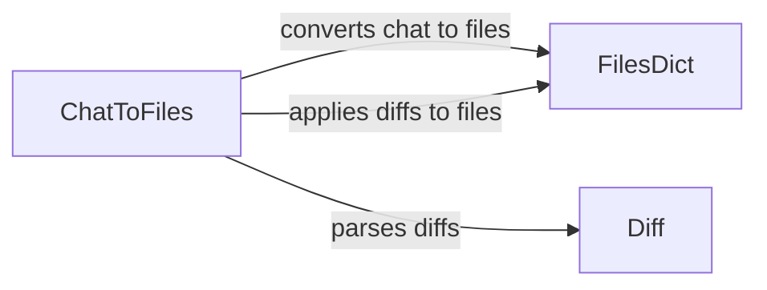

## Component Details

The Code Transformation Engine is responsible for taking chat messages, parsing them as code diffs, and applying those diffs to a virtual file system represented by a FilesDict. This process allows the system to modify and update code based on instructions received in a chat format, effectively enabling AI-driven code changes.

### ChatToFiles
The ChatToFiles component orchestrates the conversion of chat messages into a structured file system representation. It receives chat input, parses it for code diffs, and applies these diffs to a FilesDict, effectively translating natural language instructions into code modifications.
**Related Classes/Methods**:

- <a href="https://github.com/AntonOsika/gpt-engineer/blob/master/gpt_engineer/core/chat_to_files.py#L38-L66" target="_blank" rel="noopener noreferrer">`gpt_engineer.core.chat_to_files.chat_to_files_dict` (38:66)</a>
- <a href="https://github.com/AntonOsika/gpt-engineer/blob/master/gpt_engineer/core/chat_to_files.py#L69-L120" target="_blank" rel="noopener noreferrer">`gpt_engineer.core.chat_to_files.apply_diffs` (69:120)</a>
- <a href="https://github.com/AntonOsika/gpt-engineer/blob/master/gpt_engineer/core/chat_to_files.py#L123-L161" target="_blank" rel="noopener noreferrer">`gpt_engineer.core.chat_to_files.parse_diffs` (123:161)</a>
- <a href="https://github.com/AntonOsika/gpt-engineer/blob/master/gpt_engineer/core/chat_to_files.py#L164-L218" target="_blank" rel="noopener noreferrer">`gpt_engineer.core.chat_to_files.parse_diff_block` (164:218)</a>

### FilesDict
The FilesDict component acts as an in-memory file system, storing and managing file content. It provides an interface for reading, writing, and modifying files, allowing the system to apply code changes and maintain a consistent representation of the codebase.
**Related Classes/Methods**:

- <a href="https://github.com/AntonOsika/gpt-engineer/blob/master/gpt_engineer/core/files_dict.py#L19-L89" target="_blank" rel="noopener noreferrer">`gpt_engineer.core.files_dict.FilesDict` (19:89)</a>

### Diff
The Diff component represents a set of changes to be applied to a file. It contains one or more Hunks, each representing a contiguous block of changes. The Diff component is responsible for parsing, validating, and applying these changes to the FilesDict.
**Related Classes/Methods**:

- <a href="https://github.com/AntonOsika/gpt-engineer/blob/master/gpt_engineer/core/diff.py#L58-L78" target="_blank" rel="noopener noreferrer">`gpt_engineer.core.diff.Hunk.__init__` (58:78)</a>
- <a href="https://github.com/AntonOsika/gpt-engineer/blob/master/gpt_engineer/core/diff.py#L122-L131" target="_blank" rel="noopener noreferrer">`gpt_engineer.core.diff.Hunk.check_start_line` (122:131)</a>
- <a href="https://github.com/AntonOsika/gpt-engineer/blob/master/gpt_engineer/core/diff.py#L133-L198" target="_blank" rel="noopener noreferrer">`gpt_engineer.core.diff.Hunk.find_start_line` (133:198)</a>
- <a href="https://github.com/AntonOsika/gpt-engineer/blob/master/gpt_engineer/core/diff.py#L200-L286" target="_blank" rel="noopener noreferrer">`gpt_engineer.core.diff.Hunk.validate_lines` (200:286)</a>
- <a href="https://github.com/AntonOsika/gpt-engineer/blob/master/gpt_engineer/core/diff.py#L288-L309" target="_blank" rel="noopener noreferrer">`gpt_engineer.core.diff.Hunk.validate_and_correct` (288:309)</a>
- <a href="https://github.com/AntonOsika/gpt-engineer/blob/master/gpt_engineer/core/diff.py#L381-L398" target="_blank" rel="noopener noreferrer">`gpt_engineer.core.diff.is_similar` (381:398)</a>