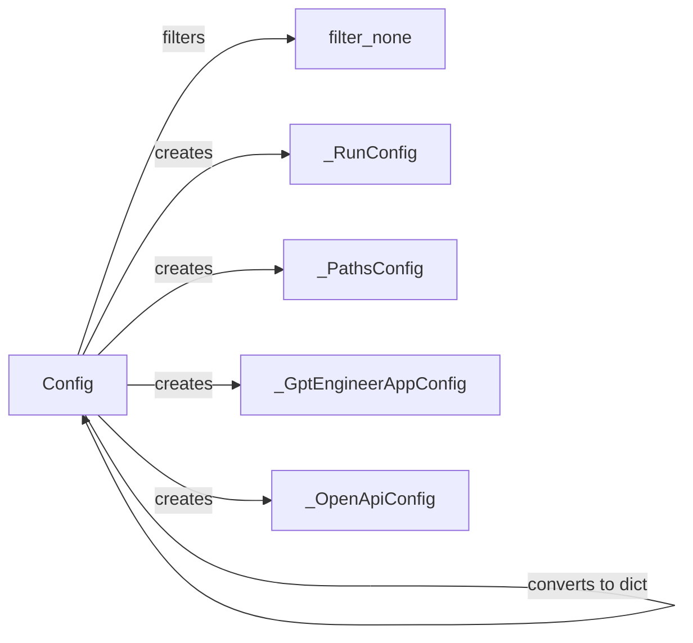

## Component Details

The Configuration Manager component is responsible for managing the application's configuration settings. It handles loading configurations from TOML files, converting them to and from dictionaries, and filtering out null values. This allows for easy customization and persistent storage of the application's behavior.

### Config
Represents the main configuration class for the GPT Engineer application. It handles loading, saving, and managing various configuration parameters, including paths, run configurations, and API keys. It interacts with TOML files for persistent storage and provides methods for converting between dictionary and TOML representations.
**Related Classes/Methods**:

- <a href="https://github.com/AntonOsika/gpt-engineer/blob/master/gpt_engineer/core/project_config.py#L73-L151" target="_blank" rel="noopener noreferrer">`gpt_engineer.core.project_config.Config` (73:151)</a>
- <a href="https://github.com/AntonOsika/gpt-engineer/blob/master/gpt_engineer/core/project_config.py#L81-L85" target="_blank" rel="noopener noreferrer">`gpt_engineer.core.project_config.Config.from_toml` (81:85)</a>
- <a href="https://github.com/AntonOsika/gpt-engineer/blob/master/gpt_engineer/core/project_config.py#L88-L109" target="_blank" rel="noopener noreferrer">`gpt_engineer.core.project_config.Config.from_dict` (88:109)</a>
- <a href="https://github.com/AntonOsika/gpt-engineer/blob/master/gpt_engineer/core/project_config.py#L111-L120" target="_blank" rel="noopener noreferrer">`gpt_engineer.core.project_config.Config.to_dict` (111:120)</a>
- <a href="https://github.com/AntonOsika/gpt-engineer/blob/master/gpt_engineer/core/project_config.py#L122-L151" target="_blank" rel="noopener noreferrer">`gpt_engineer.core.project_config.Config.to_toml` (122:151)</a>

### filter_none
A utility function that filters out None values from a dictionary. This is used to clean up configuration dictionaries before saving them to TOML or other formats, ensuring that only valid configuration parameters are persisted.
**Related Classes/Methods**:

- <a href="https://github.com/AntonOsika/gpt-engineer/blob/master/gpt_engineer/core/project_config.py#L59-L69" target="_blank" rel="noopener noreferrer">`gpt_engineer.core.project_config.filter_none` (59:69)</a>

### _RunConfig
Represents the configuration related to the execution or 'run' of the GPT Engineer application. This includes parameters that control how the application behaves during a specific run, such as model settings or input/output configurations.
**Related Classes/Methods**:

- <a href="https://github.com/AntonOsika/gpt-engineer/blob/master/gpt_engineer/core/project_config.py#L41-L45" target="_blank" rel="noopener noreferrer">`gpt_engineer.core.project_config._RunConfig` (41:45)</a>

### _PathsConfig
Represents the configuration for file paths used by the GPT Engineer application. This includes paths to input files, output directories, and other important file system locations, allowing for flexible project organization.
**Related Classes/Methods**:

- <a href="https://github.com/AntonOsika/gpt-engineer/blob/master/gpt_engineer/core/project_config.py#L35-L37" target="_blank" rel="noopener noreferrer">`gpt_engineer.core.project_config._PathsConfig` (35:37)</a>

### _GptEngineerAppConfig
Represents the core application-level configuration for GPT Engineer. This includes settings that define the overall behavior and functionality of the application, such as the project name and version.
**Related Classes/Methods**:

- <a href="https://github.com/AntonOsika/gpt-engineer/blob/master/gpt_engineer/core/project_config.py#L54-L56" target="_blank" rel="noopener noreferrer">`gpt_engineer.core.project_config._GptEngineerAppConfig` (54:56)</a>

### _OpenApiConfig
Represents the configuration for interacting with OpenAPI specifications. This includes settings related to API endpoints, authentication, and data serialization, enabling the application to work with external APIs.
**Related Classes/Methods**:

- <a href="https://github.com/AntonOsika/gpt-engineer/blob/master/gpt_engineer/core/project_config.py#L49-L50" target="_blank" rel="noopener noreferrer">`gpt_engineer.core.project_config._OpenApiConfig` (49:50)</a>