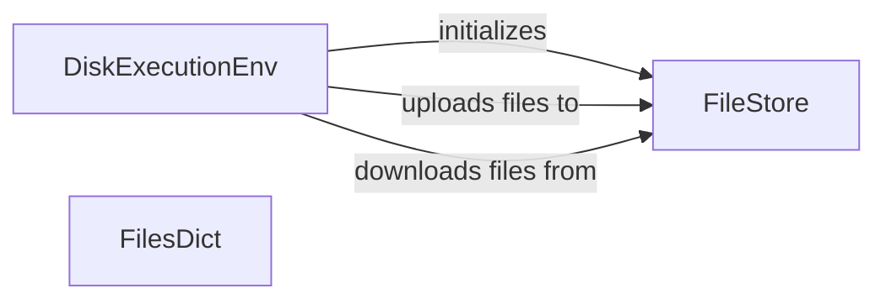

## Component Details

The Execution Environment provides a managed space for code execution, file management, and interaction with the file system. It facilitates the execution of generated code and the evaluation of its performance by providing functionalities for uploading, downloading, and executing files within an isolated environment. The core component, DiskExecutionEnv, leverages FileStore for file storage and management, while FilesDict provides a dictionary-like structure for representing file contents.

### DiskExecutionEnv
Manages the execution environment, providing functionalities for file storage, process execution, and interaction with the file system. It uses FileStore for file storage and provides methods for uploading, downloading, and executing code.
**Related Classes/Methods**:

- <a href="https://github.com/AntonOsika/gpt-engineer/blob/master/gpt_engineer/core/default/disk_execution_env.py#L36-L111" target="_blank" rel="noopener noreferrer">`gpt_engineer.core.default.disk_execution_env.DiskExecutionEnv` (36:111)</a>
- <a href="https://github.com/AntonOsika/gpt-engineer/blob/master/gpt_engineer/core/default/disk_execution_env.py#L52-L53" target="_blank" rel="noopener noreferrer">`gpt_engineer.core.default.disk_execution_env.DiskExecutionEnv.__init__` (52:53)</a>
- <a href="https://github.com/AntonOsika/gpt-engineer/blob/master/gpt_engineer/core/default/disk_execution_env.py#L55-L57" target="_blank" rel="noopener noreferrer">`gpt_engineer.core.default.disk_execution_env.DiskExecutionEnv.upload` (55:57)</a>
- <a href="https://github.com/AntonOsika/gpt-engineer/blob/master/gpt_engineer/core/default/disk_execution_env.py#L59-L60" target="_blank" rel="noopener noreferrer">`gpt_engineer.core.default.disk_execution_env.DiskExecutionEnv.download` (59:60)</a>
- <a href="https://github.com/AntonOsika/gpt-engineer/blob/master/gpt_engineer/core/default/disk_execution_env.py#L62-L70" target="_blank" rel="noopener noreferrer">`gpt_engineer.core.default.disk_execution_env.DiskExecutionEnv.popen` (62:70)</a>

### FileStore
Provides file storage functionality, allowing pushing (uploading) and pulling (downloading) files. It is used by DiskExecutionEnv to manage the files within the execution environment.
**Related Classes/Methods**:

- <a href="https://github.com/AntonOsika/gpt-engineer/blob/master/gpt_engineer/core/default/file_store.py#L10-L62" target="_blank" rel="noopener noreferrer">`gpt_engineer.core.default.file_store.FileStore` (10:62)</a>
- <a href="https://github.com/AntonOsika/gpt-engineer/blob/master/gpt_engineer/core/default/file_store.py#L39-L45" target="_blank" rel="noopener noreferrer">`gpt_engineer.core.default.file_store.FileStore.push` (39:45)</a>
- <a href="https://github.com/AntonOsika/gpt-engineer/blob/master/gpt_engineer/core/default/file_store.py#L52-L62" target="_blank" rel="noopener noreferrer">`gpt_engineer.core.default.file_store.FileStore.pull` (52:62)</a>

### FilesDict
Represents a dictionary-like structure for managing files. It is used to store and retrieve file contents.
**Related Classes/Methods**:

- <a href="https://github.com/AntonOsika/gpt-engineer/blob/master/gpt_engineer/core/files_dict.py#L19-L89" target="_blank" rel="noopener noreferrer">`gpt_engineer.core.files_dict.FilesDict` (19:89)</a>