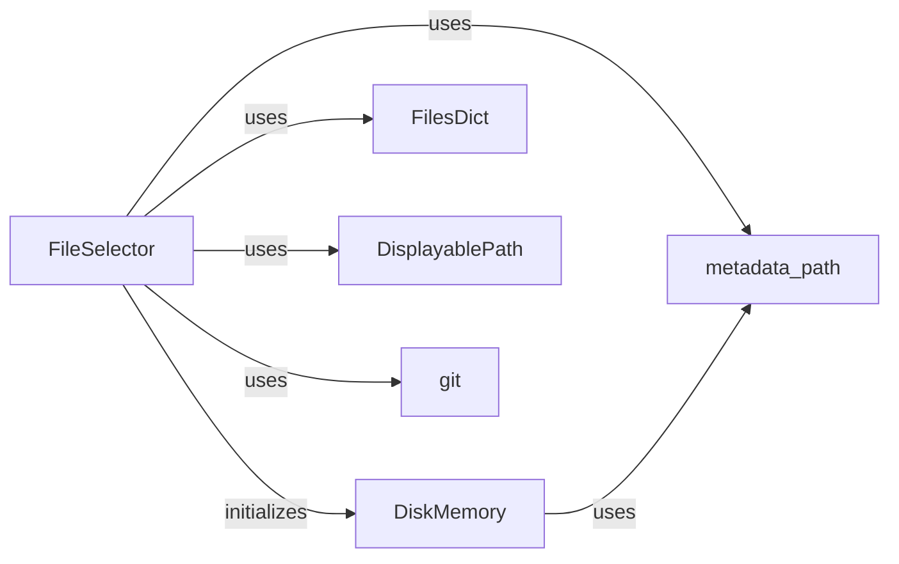

## Component Details

The File Manager component is responsible for allowing users to select and manage files that will be used in the code generation or improvement process. It provides several methods for file selection, including using a TOML file, an editor, or the current files in the project. It persists file selections and interacts with git to track changes.

### FileSelector
The FileSelector class manages the selection of files within the gpt-engineer application. It provides methods for asking the user for files, selecting files using an editor, and retrieving files from a TOML configuration. It uses DiskMemory to persist the file selection and interacts with git to determine the current files in the repository.
**Related Classes/Methods**:

- <a href="https://github.com/AntonOsika/gpt-engineer/blob/master/gpt_engineer/applications/cli/file_selector.py#L35-L416" target="_blank" rel="noopener noreferrer">`gpt_engineer.applications.cli.file_selector.FileSelector` (35:416)</a>
- <a href="https://github.com/AntonOsika/gpt-engineer/blob/master/gpt_engineer/applications/cli/file_selector.py#L66-L77" target="_blank" rel="noopener noreferrer">`gpt_engineer.applications.cli.file_selector.FileSelector.__init__` (66:77)</a>
- <a href="https://github.com/AntonOsika/gpt-engineer/blob/master/gpt_engineer/applications/cli/file_selector.py#L79-L121" target="_blank" rel="noopener noreferrer">`gpt_engineer.applications.cli.file_selector.FileSelector.ask_for_files` (79:121)</a>
- <a href="https://github.com/AntonOsika/gpt-engineer/blob/master/gpt_engineer/applications/cli/file_selector.py#L123-L210" target="_blank" rel="noopener noreferrer">`gpt_engineer.applications.cli.file_selector.FileSelector.editor_file_selector` (123:210)</a>
- <a href="https://github.com/AntonOsika/gpt-engineer/blob/master/gpt_engineer/applications/cli/file_selector.py#L271-L342" target="_blank" rel="noopener noreferrer">`gpt_engineer.applications.cli.file_selector.FileSelector.get_files_from_toml` (271:342)</a>
- <a href="https://github.com/AntonOsika/gpt-engineer/blob/master/gpt_engineer/applications/cli/file_selector.py#L379-L416" target="_blank" rel="noopener noreferrer">`gpt_engineer.applications.cli.file_selector.FileSelector.get_current_files` (379:416)</a>

### DiskMemory
DiskMemory handles reading and writing data to disk, providing persistence for the file selections made by FileSelector. It stores and retrieves the selected files and other metadata.
**Related Classes/Methods**:

- <a href="https://github.com/AntonOsika/gpt-engineer/blob/master/gpt_engineer/core/default/disk_memory.py#L36-L326" target="_blank" rel="noopener noreferrer">`gpt_engineer.core.default.disk_memory.DiskMemory` (36:326)</a>

### metadata_path
metadata_path provides the path to the metadata directory where file selection information is stored. It is used by both FileSelector and DiskMemory to locate the metadata file.
**Related Classes/Methods**:

- <a href="https://github.com/AntonOsika/gpt-engineer/blob/master/gpt_engineer/core/default/paths.py#L72-L86" target="_blank" rel="noopener noreferrer">`gpt_engineer.core.default.paths.metadata_path` (72:86)</a>

### FilesDict
FilesDict represents a dictionary of files and is used by FileSelector to store and manipulate the selected files. It provides a convenient way to manage the collection of files being used by the gpt-engineer application.
**Related Classes/Methods**:

- <a href="https://github.com/AntonOsika/gpt-engineer/blob/master/gpt_engineer/core/files_dict.py#L19-L89" target="_blank" rel="noopener noreferrer">`gpt_engineer.core.files_dict.FilesDict` (19:89)</a>

### DisplayablePath
DisplayablePath helps create a tree-like representation of files and directories for display purposes, allowing users to easily visualize and select files. It's used by FileSelector to present the file structure to the user.
**Related Classes/Methods**:

- <a href="https://github.com/AntonOsika/gpt-engineer/blob/master/gpt_engineer/applications/cli/file_selector.py#L419-L540" target="_blank" rel="noopener noreferrer">`gpt_engineer.applications.cli.file_selector.DisplayablePath` (419:540)</a>
- <a href="https://github.com/AntonOsika/gpt-engineer/blob/master/gpt_engineer/applications/cli/file_selector.py#L464-L502" target="_blank" rel="noopener noreferrer">`gpt_engineer.applications.cli.file_selector.DisplayablePath.make_tree` (464:502)</a>

### git
The git module provides functions for interacting with git repositories, such as checking if a directory is a git repository and filtering files based on .gitignore. FileSelector uses this to get the current files and filter them.
**Related Classes/Methods**:

- <a href="https://github.com/AntonOsika/gpt-engineer/blob/master/gpt_engineer/core/git.py#L14-L23" target="_blank" rel="noopener noreferrer">`gpt_engineer.core.git.is_git_repo` (14:23)</a>
- <a href="https://github.com/AntonOsika/gpt-engineer/blob/master/gpt_engineer/core/git.py#L58-L68" target="_blank" rel="noopener noreferrer">`gpt_engineer.core.git.filter_by_gitignore` (58:68)</a>