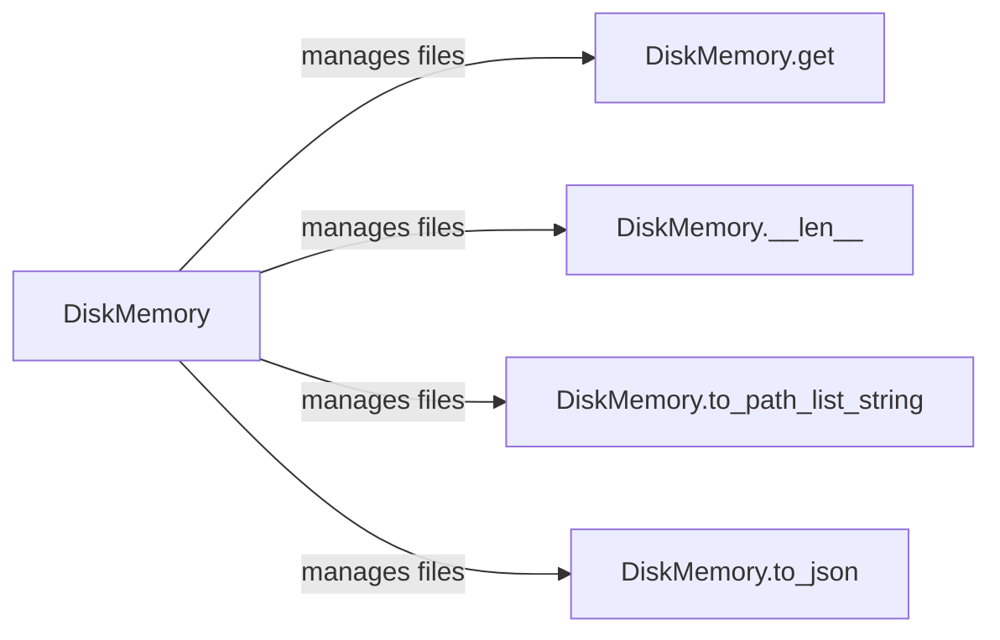

## Component Details

The Persistent Storage component, centered around the `DiskMemory` class, manages the storage and retrieval of files on disk. It provides functionalities for accessing file content, determining the number of stored files, converting the stored files to a path list string, and serializing the memory to JSON. This component serves as a persistent storage layer, enabling the project to store and retrieve data across sessions.

### DiskMemory
The DiskMemory class manages files on disk, providing methods for reading, writing, and deleting files, as well as listing files in a directory. It acts as a persistent storage mechanism for the project's data, including prompts, code, and other essential information.
**Related Classes/Methods**:

- <a href="https://github.com/AntonOsika/gpt-engineer/blob/master/gpt_engineer/core/default/disk_memory.py#L36-L326" target="_blank" rel="noopener noreferrer">`gpt_engineer.core.default.disk_memory.DiskMemory` (36:326)</a>

### DiskMemory.get
This method retrieves the content of a specified file from the disk. It allows other components to access the stored data within the persistent storage.
**Related Classes/Methods**:

- <a href="https://github.com/AntonOsika/gpt-engineer/blob/master/gpt_engineer/core/default/disk_memory.py#L116-L142" target="_blank" rel="noopener noreferrer">`gpt_engineer.core.default.disk_memory.DiskMemory.get` (116:142)</a>

### DiskMemory.__len__
This method returns the number of files currently stored within the DiskMemory instance. It provides a way to check the storage capacity and manage the stored data.
**Related Classes/Methods**:

- <a href="https://github.com/AntonOsika/gpt-engineer/blob/master/gpt_engineer/core/default/disk_memory.py#L216-L226" target="_blank" rel="noopener noreferrer">`gpt_engineer.core.default.disk_memory.DiskMemory.__len__` (216:226)</a>

### DiskMemory.to_path_list_string
This method converts the stored files into a string representation of a path list. It is useful for generating a list of file paths for other components to process or display.
**Related Classes/Methods**:

- <a href="https://github.com/AntonOsika/gpt-engineer/blob/master/gpt_engineer/core/default/disk_memory.py#L243-L262" target="_blank" rel="noopener noreferrer">`gpt_engineer.core.default.disk_memory.DiskMemory.to_path_list_string` (243:262)</a>

### DiskMemory.to_json
This method serializes the content of the DiskMemory instance into JSON format. It enables the storage and transfer of the stored data in a structured and easily parsable format.
**Related Classes/Methods**:

- <a href="https://github.com/AntonOsika/gpt-engineer/blob/master/gpt_engineer/core/default/disk_memory.py#L276-L286" target="_blank" rel="noopener noreferrer">`gpt_engineer.core.default.disk_memory.DiskMemory.to_json` (276:286)</a>