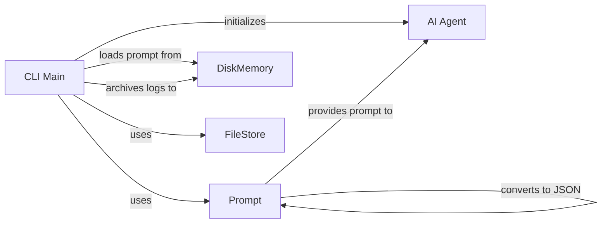

## Component Details

The gpt-engineer system revolves around orchestrating code generation using AI. The CLI Main component serves as the entry point, responsible for loading prompts, initializing the AI agent, and managing file storage. Prompts, which guide the AI's code generation, are loaded from disk and converted to JSON format. The AI Agent then uses these prompts to generate code, interacting with the FileStore to manage files and the DiskMemory to persist data and logs. The system facilitates an iterative development process where the AI generates code based on prompts, stores it in the FileStore, and archives logs to DiskMemory.

### CLI Main
The main entry point of the gpt-engineer CLI application. It orchestrates the entire process, including loading prompts, initializing the AI agent, and managing file storage.
**Related Classes/Methods**:

- <a href="https://github.com/AntonOsika/gpt-engineer/blob/master/gpt_engineer/applications/cli/main.py#L281-L557" target="_blank" rel="noopener noreferrer">`gpt_engineer.applications.cli.main.main` (281:557)</a>
- <a href="https://github.com/AntonOsika/gpt-engineer/blob/master/gpt_engineer/applications/cli/main.py#L105-L170" target="_blank" rel="noopener noreferrer">`gpt_engineer.applications.cli.main.load_prompt` (105:170)</a>

### Prompt
Represents a prompt used to guide the code generation process. It contains instructions and context for the AI agent and can be converted to JSON format.
**Related Classes/Methods**:

- <a href="https://github.com/AntonOsika/gpt-engineer/blob/master/gpt_engineer/core/prompt.py#L6-L44" target="_blank" rel="noopener noreferrer">`gpt_engineer.core.prompt.Prompt` (6:44)</a>
- <a href="https://github.com/AntonOsika/gpt-engineer/blob/master/gpt_engineer/core/prompt.py#L43-L44" target="_blank" rel="noopener noreferrer">`gpt_engineer.core.prompt.Prompt.to_json` (43:44)</a>

### DiskMemory
Provides a way to store and retrieve data from disk, including loading prompts and archiving logs.
**Related Classes/Methods**:

- <a href="https://github.com/AntonOsika/gpt-engineer/blob/master/gpt_engineer/core/default/disk_memory.py#L36-L326" target="_blank" rel="noopener noreferrer">`gpt_engineer.core.default.disk_memory.DiskMemory` (36:326)</a>
- <a href="https://github.com/AntonOsika/gpt-engineer/blob/master/gpt_engineer/core/default/disk_memory.py#L116-L142" target="_blank" rel="noopener noreferrer">`gpt_engineer.core.default.disk_memory.DiskMemory.get` (116:142)</a>
- <a href="https://github.com/AntonOsika/gpt-engineer/blob/master/gpt_engineer/core/default/disk_memory.py#L318-L326" target="_blank" rel="noopener noreferrer">`gpt_engineer.core.default.disk_memory.DiskMemory.archive_logs` (318:326)</a>

### AI Agent
The AI agent responsible for generating code based on the prompt. It interacts with the file store and execution environment.
**Related Classes/Methods**:

- <a href="https://github.com/AntonOsika/gpt-engineer/blob/master/gpt_engineer/core/ai.py#L386-L437" target="_blank" rel="noopener noreferrer">`gpt_engineer.core.ai.ClipboardAI` (386:437)</a>
- <a href="https://github.com/AntonOsika/gpt-engineer/blob/master/gpt_engineer/core/ai.py#L50-L379" target="_blank" rel="noopener noreferrer">`gpt_engineer.core.ai.AI` (50:379)</a>
- <a href="https://github.com/AntonOsika/gpt-engineer/blob/master/gpt_engineer/applications/cli/cli_agent.py#L103-L150" target="_blank" rel="noopener noreferrer">`gpt_engineer.applications.cli.cli_agent.CliAgent.with_default_config` (103:150)</a>
- <a href="https://github.com/AntonOsika/gpt-engineer/blob/master/gpt_engineer/applications/cli/cli_agent.py#L152-L183" target="_blank" rel="noopener noreferrer">`gpt_engineer.applications.cli.cli_agent.CliAgent.init` (152:183)</a>

### FileStore
Manages the storage and retrieval of files. It is used for linting, pushing changes, and other file-related operations.
**Related Classes/Methods**:

- <a href="https://github.com/AntonOsika/gpt-engineer/blob/master/gpt_engineer/core/default/file_store.py#L10-L62" target="_blank" rel="noopener noreferrer">`gpt_engineer.core.default.file_store.FileStore` (10:62)</a>
- <a href="https://github.com/AntonOsika/gpt-engineer/blob/master/gpt_engineer/core/default/file_store.py#L47-L50" target="_blank" rel="noopener noreferrer">`gpt_engineer.core.default.file_store.FileStore.linting` (47:50)</a>
- <a href="https://github.com/AntonOsika/gpt-engineer/blob/master/gpt_engineer/core/default/file_store.py#L39-L45" target="_blank" rel="noopener noreferrer">`gpt_engineer.core.default.file_store.FileStore.push` (39:45)</a>