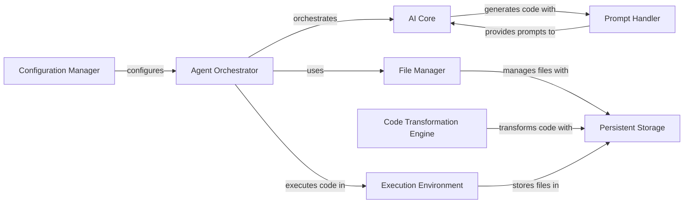

## Component Details

The gpt-engineer project automates software development by using AI to generate, improve, and execute code based on user prompts. The core flow involves the Agent Orchestrator receiving instructions, the AI Core generating code, the Code Transformation Engine applying changes, and the Execution Environment running the code. The File Manager handles file selection and management, while the Persistent Storage ensures data persistence. The Configuration Manager customizes the tool's behavior, and the Prompt Handler manages AI prompts.

### Agent Orchestrator
The Agent Orchestrator manages the overall code generation and improvement process. It initializes the AI, loads prompts, interacts with the file system, and executes the generated code. It uses the AI Core to generate code, the File Manager to manage file selection, and the Execution Environment to run the code.
**Related Classes/Methods**:

- <a href="https://github.com/AntonOsika/gpt-engineer/blob/master/gpt_engineer/applications/cli/cli_agent.py#L36-L232" target="_blank" rel="noopener noreferrer">`gpt_engineer.applications.cli.cli_agent.CliAgent` (36:232)</a>
- <a href="https://github.com/AntonOsika/gpt-engineer/blob/master/gpt_engineer/applications/cli/cli_agent.py#L84-L100" target="_blank" rel="noopener noreferrer">`gpt_engineer.applications.cli.cli_agent.CliAgent.__init__` (84:100)</a>
- <a href="https://github.com/AntonOsika/gpt-engineer/blob/master/gpt_engineer/applications/cli/cli_agent.py#L103-L150" target="_blank" rel="noopener noreferrer">`gpt_engineer.applications.cli.cli_agent.CliAgent.with_default_config` (103:150)</a>
- <a href="https://github.com/AntonOsika/gpt-engineer/blob/master/gpt_engineer/applications/cli/cli_agent.py#L152-L183" target="_blank" rel="noopener noreferrer">`gpt_engineer.applications.cli.cli_agent.CliAgent.init` (152:183)</a>
- <a href="https://github.com/AntonOsika/gpt-engineer/blob/master/gpt_engineer/applications/cli/cli_agent.py#L185-L232" target="_blank" rel="noopener noreferrer">`gpt_engineer.applications.cli.cli_agent.CliAgent.improve` (185:232)</a>

### File Manager
The File Manager component provides functionality for selecting and managing files within the project. It allows users to specify which files should be included in the code generation or improvement process, using a TOML file or an editor. It interacts with the Persistent Storage to store and retrieve file metadata and uses git to track file changes.
**Related Classes/Methods**:

- <a href="https://github.com/AntonOsika/gpt-engineer/blob/master/gpt_engineer/applications/cli/file_selector.py#L35-L416" target="_blank" rel="noopener noreferrer">`gpt_engineer.applications.cli.file_selector.FileSelector` (35:416)</a>
- <a href="https://github.com/AntonOsika/gpt-engineer/blob/master/gpt_engineer/applications/cli/file_selector.py#L66-L77" target="_blank" rel="noopener noreferrer">`gpt_engineer.applications.cli.file_selector.FileSelector.__init__` (66:77)</a>
- <a href="https://github.com/AntonOsika/gpt-engineer/blob/master/gpt_engineer/applications/cli/file_selector.py#L79-L121" target="_blank" rel="noopener noreferrer">`gpt_engineer.applications.cli.file_selector.FileSelector.ask_for_files` (79:121)</a>
- <a href="https://github.com/AntonOsika/gpt-engineer/blob/master/gpt_engineer/applications/cli/file_selector.py#L123-L210" target="_blank" rel="noopener noreferrer">`gpt_engineer.applications.cli.file_selector.FileSelector.editor_file_selector` (123:210)</a>
- <a href="https://github.com/AntonOsika/gpt-engineer/blob/master/gpt_engineer/applications/cli/file_selector.py#L271-L342" target="_blank" rel="noopener noreferrer">`gpt_engineer.applications.cli.file_selector.FileSelector.get_files_from_toml` (271:342)</a>
- <a href="https://github.com/AntonOsika/gpt-engineer/blob/master/gpt_engineer/applications/cli/file_selector.py#L379-L416" target="_blank" rel="noopener noreferrer">`gpt_engineer.applications.cli.file_selector.FileSelector.get_current_files` (379:416)</a>
- <a href="https://github.com/AntonOsika/gpt-engineer/blob/master/gpt_engineer/applications/cli/file_selector.py#L464-L502" target="_blank" rel="noopener noreferrer">`gpt_engineer.applications.cli.file_selector.DisplayablePath.make_tree` (464:502)</a>

### AI Core
The AI Core component is the core of the code generation process. It interacts with a language model to generate code based on prompts and manages token usage. It handles message serialization, backoff inference, and updates the token usage log.
**Related Classes/Methods**:

- <a href="https://github.com/AntonOsika/gpt-engineer/blob/master/gpt_engineer/core/ai.py#L50-L379" target="_blank" rel="noopener noreferrer">`gpt_engineer.core.ai.AI` (50:379)</a>
- <a href="https://github.com/AntonOsika/gpt-engineer/blob/master/gpt_engineer/core/ai.py#L88-L118" target="_blank" rel="noopener noreferrer">`gpt_engineer.core.ai.AI.__init__` (88:118)</a>
- <a href="https://github.com/AntonOsika/gpt-engineer/blob/master/gpt_engineer/core/ai.py#L120-L143" target="_blank" rel="noopener noreferrer">`gpt_engineer.core.ai.AI.start` (120:143)</a>
- <a href="https://github.com/AntonOsika/gpt-engineer/blob/master/gpt_engineer/core/ai.py#L165-L204" target="_blank" rel="noopener noreferrer">`gpt_engineer.core.ai.AI._collapse_text_messages` (165:204)</a>
- <a href="https://github.com/AntonOsika/gpt-engineer/blob/master/gpt_engineer/core/ai.py#L206-L251" target="_blank" rel="noopener noreferrer">`gpt_engineer.core.ai.AI.next` (206:251)</a>
- <a href="https://github.com/AntonOsika/gpt-engineer/blob/master/gpt_engineer/core/ai.py#L382-L383" target="_blank" rel="noopener noreferrer">`gpt_engineer.core.ai.serialize_messages` (382:383)</a>
- <a href="https://github.com/AntonOsika/gpt-engineer/blob/master/gpt_engineer/core/ai.py#L386-L437" target="_blank" rel="noopener noreferrer">`gpt_engineer.core.ai.ClipboardAI` (386:437)</a>
- <a href="https://github.com/AntonOsika/gpt-engineer/blob/master/gpt_engineer/core/ai.py#L388-L390" target="_blank" rel="noopener noreferrer">`gpt_engineer.core.ai.ClipboardAI.__init__` (388:390)</a>
- <a href="https://github.com/AntonOsika/gpt-engineer/blob/master/gpt_engineer/core/ai.py#L408-L437" target="_blank" rel="noopener noreferrer">`gpt_engineer.core.ai.ClipboardAI.next` (408:437)</a>

### Code Transformation Engine
This component focuses on transforming chat messages into files and applying diffs to existing files. It parses diffs, applies them to the file system, and handles hunks of changes. It is used to apply the changes suggested by the AI to the existing codebase.
**Related Classes/Methods**:

- <a href="https://github.com/AntonOsika/gpt-engineer/blob/master/gpt_engineer/core/chat_to_files.py#L38-L66" target="_blank" rel="noopener noreferrer">`gpt_engineer.core.chat_to_files.chat_to_files_dict` (38:66)</a>
- <a href="https://github.com/AntonOsika/gpt-engineer/blob/master/gpt_engineer/core/chat_to_files.py#L69-L120" target="_blank" rel="noopener noreferrer">`gpt_engineer.core.chat_to_files.apply_diffs` (69:120)</a>
- <a href="https://github.com/AntonOsika/gpt-engineer/blob/master/gpt_engineer/core/chat_to_files.py#L123-L161" target="_blank" rel="noopener noreferrer">`gpt_engineer.core.chat_to_files.parse_diffs` (123:161)</a>
- <a href="https://github.com/AntonOsika/gpt-engineer/blob/master/gpt_engineer/core/chat_to_files.py#L164-L218" target="_blank" rel="noopener noreferrer">`gpt_engineer.core.chat_to_files.parse_diff_block` (164:218)</a>
- <a href="https://github.com/AntonOsika/gpt-engineer/blob/master/gpt_engineer/core/diff.py#L58-L78" target="_blank" rel="noopener noreferrer">`gpt_engineer.core.diff.Hunk.__init__` (58:78)</a>
- <a href="https://github.com/AntonOsika/gpt-engineer/blob/master/gpt_engineer/core/diff.py#L122-L131" target="_blank" rel="noopener noreferrer">`gpt_engineer.core.diff.Hunk.check_start_line` (122:131)</a>
- <a href="https://github.com/AntonOsika/gpt-engineer/blob/master/gpt_engineer/core/diff.py#L133-L198" target="_blank" rel="noopener noreferrer">`gpt_engineer.core.diff.Hunk.find_start_line` (133:198)</a>
- <a href="https://github.com/AntonOsika/gpt-engineer/blob/master/gpt_engineer/core/diff.py#L200-L286" target="_blank" rel="noopener noreferrer">`gpt_engineer.core.diff.Hunk.validate_lines` (200:286)</a>
- <a href="https://github.com/AntonOsika/gpt-engineer/blob/master/gpt_engineer/core/diff.py#L288-L309" target="_blank" rel="noopener noreferrer">`gpt_engineer.core.diff.Hunk.validate_and_correct` (288:309)</a>
- <a href="https://github.com/AntonOsika/gpt-engineer/blob/master/gpt_engineer/core/diff.py#L381-L398" target="_blank" rel="noopener noreferrer">`gpt_engineer.core.diff.is_similar` (381:398)</a>

### Persistent Storage
The Persistent Storage component manages the storage and retrieval of files on disk. It provides methods for getting files, determining the length of the memory, converting the memory to a path list string, and serializing the memory to JSON. It acts as a persistent storage layer for the project's files.
**Related Classes/Methods**:

- <a href="https://github.com/AntonOsika/gpt-engineer/blob/master/gpt_engineer/core/default/disk_memory.py#L36-L326" target="_blank" rel="noopener noreferrer">`gpt_engineer.core.default.disk_memory.DiskMemory` (36:326)</a>
- <a href="https://github.com/AntonOsika/gpt-engineer/blob/master/gpt_engineer/core/default/disk_memory.py#L116-L142" target="_blank" rel="noopener noreferrer">`gpt_engineer.core.default.disk_memory.DiskMemory.get` (116:142)</a>
- <a href="https://github.com/AntonOsika/gpt-engineer/blob/master/gpt_engineer/core/default/disk_memory.py#L216-L226" target="_blank" rel="noopener noreferrer">`gpt_engineer.core.default.disk_memory.DiskMemory.__len__` (216:226)</a>
- <a href="https://github.com/AntonOsika/gpt-engineer/blob/master/gpt_engineer/core/default/disk_memory.py#L243-L262" target="_blank" rel="noopener noreferrer">`gpt_engineer.core.default.disk_memory.DiskMemory.to_path_list_string` (243:262)</a>
- <a href="https://github.com/AntonOsika/gpt-engineer/blob/master/gpt_engineer/core/default/disk_memory.py#L276-L286" target="_blank" rel="noopener noreferrer">`gpt_engineer.core.default.disk_memory.DiskMemory.to_json` (276:286)</a>

### Execution Environment
The Execution Environment component provides an environment for executing code. It handles uploading files to the environment, downloading files from the environment, and executing commands within the environment. It is used to run the generated code and evaluate its performance.
**Related Classes/Methods**:

- <a href="https://github.com/AntonOsika/gpt-engineer/blob/master/gpt_engineer/core/default/disk_execution_env.py#L36-L111" target="_blank" rel="noopener noreferrer">`gpt_engineer.core.default.disk_execution_env.DiskExecutionEnv` (36:111)</a>
- <a href="https://github.com/AntonOsika/gpt-engineer/blob/master/gpt_engineer/core/default/disk_execution_env.py#L52-L53" target="_blank" rel="noopener noreferrer">`gpt_engineer.core.default.disk_execution_env.DiskExecutionEnv.__init__` (52:53)</a>
- <a href="https://github.com/AntonOsika/gpt-engineer/blob/master/gpt_engineer/core/default/disk_execution_env.py#L55-L57" target="_blank" rel="noopener noreferrer">`gpt_engineer.core.default.disk_execution_env.DiskExecutionEnv.upload` (55:57)</a>
- <a href="https://github.com/AntonOsika/gpt-engineer/blob/master/gpt_engineer/core/default/disk_execution_env.py#L59-L60" target="_blank" rel="noopener noreferrer">`gpt_engineer.core.default.disk_execution_env.DiskExecutionEnv.download` (59:60)</a>

### Configuration Manager
The Configuration Manager component handles loading, storing, and managing project configuration settings. It reads configuration from TOML files, converts configurations to and from dictionaries, and filters out null values. It is used to customize the behavior of the gpt-engineer tool.
**Related Classes/Methods**:

- <a href="https://github.com/AntonOsika/gpt-engineer/blob/master/gpt_engineer/core/project_config.py#L81-L85" target="_blank" rel="noopener noreferrer">`gpt_engineer.core.project_config.Config.from_toml` (81:85)</a>
- <a href="https://github.com/AntonOsika/gpt-engineer/blob/master/gpt_engineer/core/project_config.py#L88-L109" target="_blank" rel="noopener noreferrer">`gpt_engineer.core.project_config.Config.from_dict` (88:109)</a>
- <a href="https://github.com/AntonOsika/gpt-engineer/blob/master/gpt_engineer/core/project_config.py#L111-L120" target="_blank" rel="noopener noreferrer">`gpt_engineer.core.project_config.Config.to_dict` (111:120)</a>
- <a href="https://github.com/AntonOsika/gpt-engineer/blob/master/gpt_engineer/core/project_config.py#L122-L151" target="_blank" rel="noopener noreferrer">`gpt_engineer.core.project_config.Config.to_toml` (122:151)</a>
- <a href="https://github.com/AntonOsika/gpt-engineer/blob/master/gpt_engineer/core/project_config.py#L59-L69" target="_blank" rel="noopener noreferrer">`gpt_engineer.core.project_config.filter_none` (59:69)</a>

### Prompt Handler
The Prompt Handler component deals with loading and managing prompts used by the AI. It loads prompts from files, converts prompts to JSON format, and provides a way to store and retrieve prompts. It is used to provide instructions to the AI model.
**Related Classes/Methods**:

- <a href="https://github.com/AntonOsika/gpt-engineer/blob/master/gpt_engineer/core/prompt.py#L43-L44" target="_blank" rel="noopener noreferrer">`gpt_engineer.core.prompt.Prompt.to_json` (43:44)</a>
- <a href="https://github.com/AntonOsika/gpt-engineer/blob/master/gpt_engineer/applications/cli/main.py#L105-L170" target="_blank" rel="noopener noreferrer">`gpt_engineer.applications.cli.main.load_prompt` (105:170)</a>